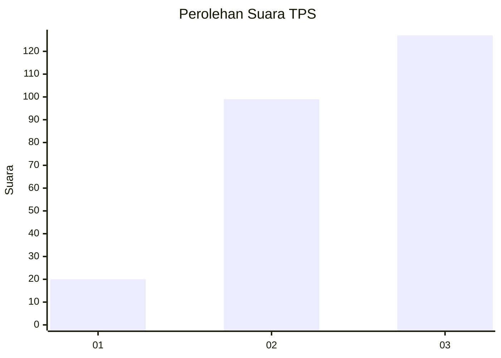
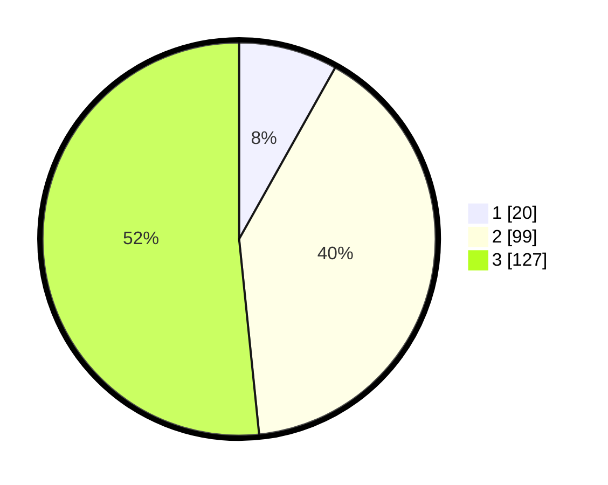

# Hasil

## Grafik

## Tabel

| No. | Nama Paslon    | Suara | Suara (raw) | Persentase |
|:--- |:-------------- | -----:| -----------:| ----------:|
| 1   | ANIES MUHAIMIN | 20    | [20][p-1]   | 8,13       |
| 2   | PRABOWO GIBRAN | 99    | [99][p-2]   | 40,24      |
| 3   | GANJAR MAHFUD  | 127   | [127][p-3]  | 51,63      |

[p-1]: https://github.com/gigit-pemilu/pemilu-2024-33-jawa-tengah/blob/main/pilpres/hitung-suara/sub/33-jawa-tengah/sub/74-kota-semarang/sub/10-tembalang/sub/1008-tandang/sub/016-tps/sub/paslon-1.txt
[p-2]: https://github.com/gigit-pemilu/pemilu-2024-33-jawa-tengah/blob/main/pilpres/hitung-suara/sub/33-jawa-tengah/sub/74-kota-semarang/sub/10-tembalang/sub/1008-tandang/sub/016-tps/sub/paslon-2.txt
[p-3]: https://github.com/gigit-pemilu/pemilu-2024-33-jawa-tengah/blob/main/pilpres/hitung-suara/sub/33-jawa-tengah/sub/74-kota-semarang/sub/10-tembalang/sub/1008-tandang/sub/016-tps/sub/paslon-3.txt

## Foto C Plano

https://sirekap-obj-formc.kpu.go.id/13b0/pemilu/ppwp/33/74/10/10/08/3374101008016-20240214-221001--f19da70f-639a-4ce0-b2b4-1a930b49cc9b.jpg

https://sirekap-obj-formc.kpu.go.id/13b0/pemilu/ppwp/33/74/10/10/08/3374101008016-20240214-221138--b70e8fb8-0a62-43bf-837d-42d51e1745ff.jpg

https://sirekap-obj-formc.kpu.go.id/13b0/pemilu/ppwp/33/74/10/10/08/3374101008016-20240214-220819--b61b08e1-690a-4087-808a-44cd0ed2c89e.jpg

## Metadata

| Key        | Value               |
| ---------- | ------------------- |
| Time Stamp | 2024-02-16 09:00:28 |

