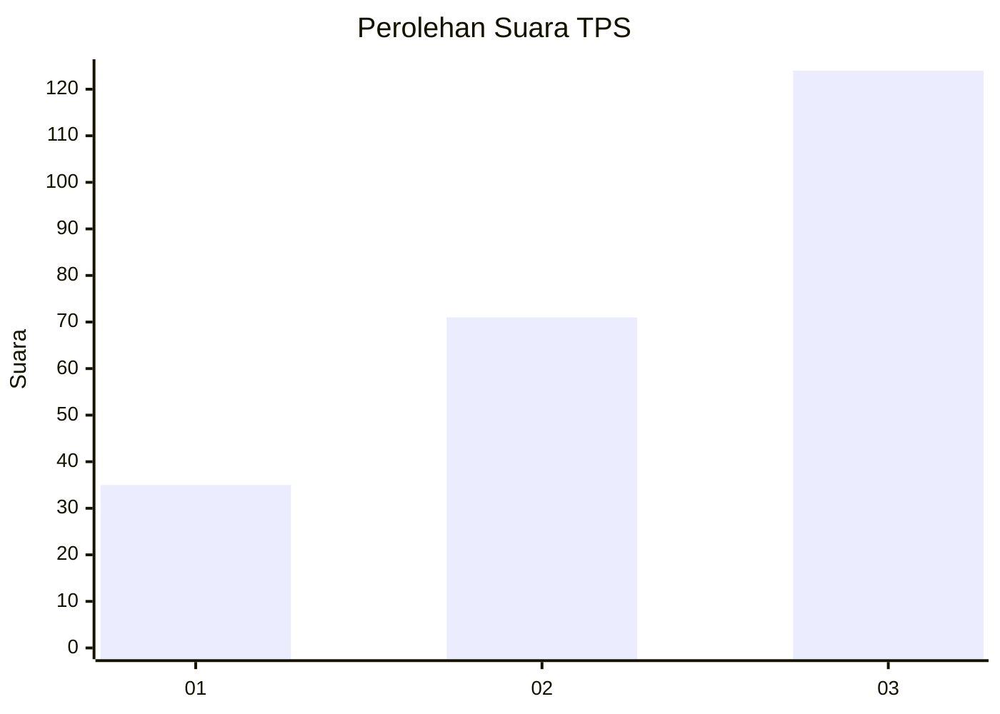
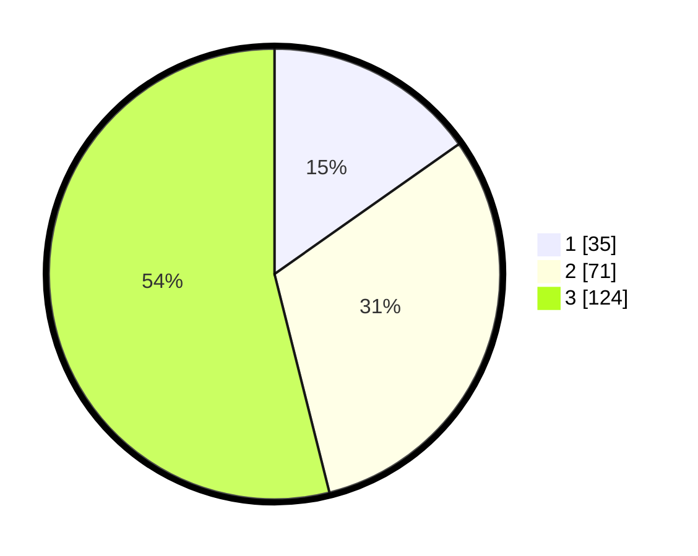

# Hasil

## Grafik

## Tabel

| No. | Nama Paslon    | Suara | Suara (raw) | Persentase |
|:--- |:-------------- | -----:| -----------:| ----------:|
| 1   | ANIES MUHAIMIN | 35    | [35][p-1]   | 15,22      |
| 2   | PRABOWO GIBRAN | 71    | [71][p-2]   | 30,87      |
| 3   | GANJAR MAHFUD  | 124   | [124][p-3]  | 53,91      |

[p-1]: https://github.com/gigit-pemilu/pemilu-2024-33-jawa-tengah/blob/main/pilpres/hitung-suara/sub/33-jawa-tengah/sub/74-kota-semarang/sub/10-tembalang/sub/1008-tandang/sub/042-tps/sub/paslon-1.txt
[p-2]: https://github.com/gigit-pemilu/pemilu-2024-33-jawa-tengah/blob/main/pilpres/hitung-suara/sub/33-jawa-tengah/sub/74-kota-semarang/sub/10-tembalang/sub/1008-tandang/sub/042-tps/sub/paslon-2.txt
[p-3]: https://github.com/gigit-pemilu/pemilu-2024-33-jawa-tengah/blob/main/pilpres/hitung-suara/sub/33-jawa-tengah/sub/74-kota-semarang/sub/10-tembalang/sub/1008-tandang/sub/042-tps/sub/paslon-3.txt

## Foto C Plano

https://sirekap-obj-formc.kpu.go.id/581c/pemilu/ppwp/33/74/10/10/08/3374101008042-20240215-152722--19b0a0fa-a8dd-4881-b1c5-928b8b0d32de.jpg

https://sirekap-obj-formc.kpu.go.id/581c/pemilu/ppwp/33/74/10/10/08/3374101008042-20240215-152802--7bfee7a7-21dd-42f3-8185-f6f641268afc.jpg

https://sirekap-obj-formc.kpu.go.id/581c/pemilu/ppwp/33/74/10/10/08/3374101008042-20240215-020557--28c5d7d8-699f-4fb8-874a-d36c2352a768.jpg

## Metadata

| Key        | Value               |
| ---------- | ------------------- |
| Time Stamp | 2024-02-16 09:00:28 |

