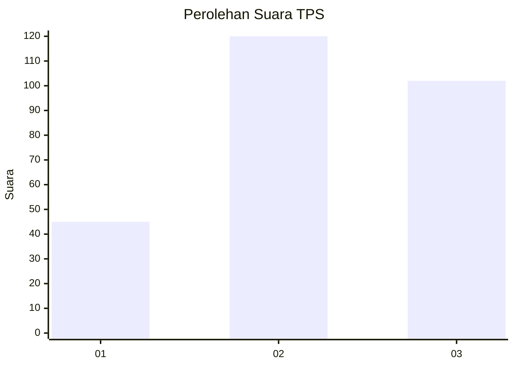
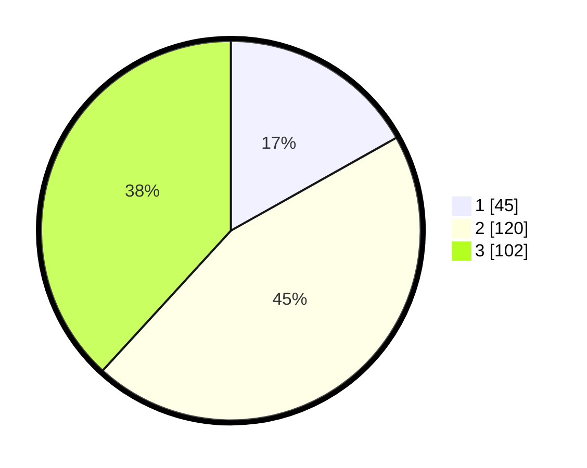

# Hasil

## Grafik

## Tabel

| No. | Nama Paslon    | Suara | Suara (raw) | Persentase |
|:--- |:-------------- | -----:| -----------:| ----------:|
| 1   | ANIES MUHAIMIN | 45    | [45][p-1]   | 16,85      |
| 2   | PRABOWO GIBRAN | 120   | [120][p-2]  | 44,94      |
| 3   | GANJAR MAHFUD  | 102   | [102][p-3]  | 38,20      |

[p-1]: https://github.com/gigit-pemilu/pemilu-2024-33-jawa-tengah/blob/main/pilpres/hitung-suara/sub/33-jawa-tengah/sub/74-kota-semarang/sub/10-tembalang/sub/1010-sendangguwo/sub/005-tps/sub/paslon-1.txt
[p-2]: https://github.com/gigit-pemilu/pemilu-2024-33-jawa-tengah/blob/main/pilpres/hitung-suara/sub/33-jawa-tengah/sub/74-kota-semarang/sub/10-tembalang/sub/1010-sendangguwo/sub/005-tps/sub/paslon-2.txt
[p-3]: https://github.com/gigit-pemilu/pemilu-2024-33-jawa-tengah/blob/main/pilpres/hitung-suara/sub/33-jawa-tengah/sub/74-kota-semarang/sub/10-tembalang/sub/1010-sendangguwo/sub/005-tps/sub/paslon-3.txt

## Foto C Plano

https://sirekap-obj-formc.kpu.go.id/85ba/pemilu/ppwp/33/74/10/10/10/3374101010005-20240301-172610--114b3138-2d3c-4363-82ef-038d97ad0e44.jpg

https://sirekap-obj-formc.kpu.go.id/85ba/pemilu/ppwp/33/74/10/10/10/3374101010005-20240215-023001--cfce30a4-cf75-470c-b120-6a6ac088524d.jpg

https://sirekap-obj-formc.kpu.go.id/85ba/pemilu/ppwp/33/74/10/10/10/3374101010005-20240215-021033--afe12144-7f75-44ec-af7c-760aa988bd60.jpg

## Metadata

| Key        | Value               |
| ---------- | ------------------- |
| Time Stamp | 2024-03-01 18:00:00 |

