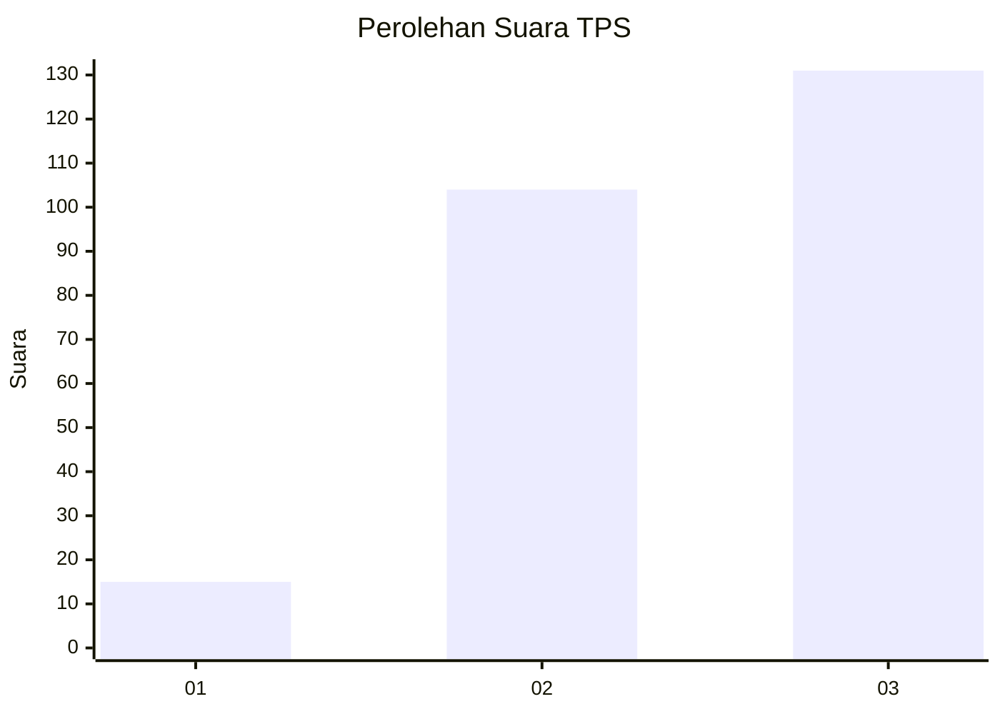
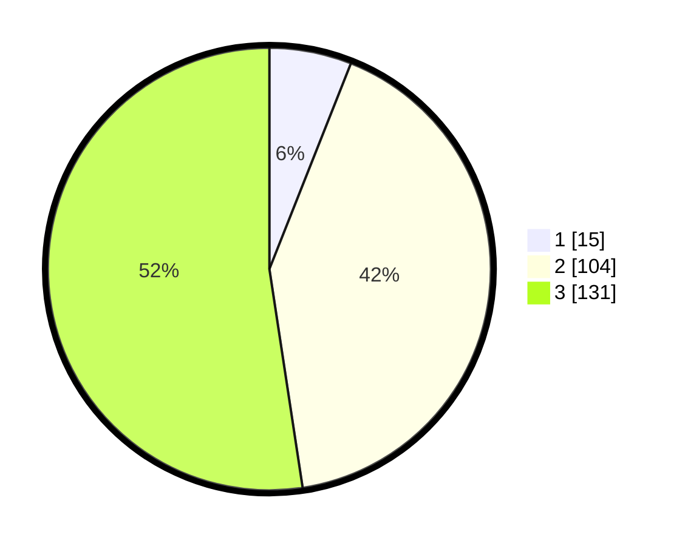

# Hasil

## Grafik

## Tabel

| No. | Nama Paslon    | Suara | Suara (raw) | Persentase |
|:--- |:-------------- | -----:| -----------:| ----------:|
| 1   | ANIES MUHAIMIN | 15    | [15][p-1]   | 6,00       |
| 2   | PRABOWO GIBRAN | 104   | [104][p-2]  | 41,60      |
| 3   | GANJAR MAHFUD  | 131   | [131][p-3]  | 52,40      |

[p-1]: https://github.com/gigit-pemilu/pemilu-2024/blob/main/pilpres/hitung-suara/sub/33-jawa-tengah/sub/74-kota-semarang/sub/10-tembalang/sub/1010-sendangguwo/sub/007-tps/sub/paslon-1.txt
[p-2]: https://github.com/gigit-pemilu/pemilu-2024/blob/main/pilpres/hitung-suara/sub/33-jawa-tengah/sub/74-kota-semarang/sub/10-tembalang/sub/1010-sendangguwo/sub/007-tps/sub/paslon-2.txt
[p-3]: https://github.com/gigit-pemilu/pemilu-2024/blob/main/pilpres/hitung-suara/sub/33-jawa-tengah/sub/74-kota-semarang/sub/10-tembalang/sub/1010-sendangguwo/sub/007-tps/sub/paslon-3.txt

## Foto C Plano

https://sirekap-obj-formc.kpu.go.id/836f/pemilu/ppwp/33/74/10/10/10/3374101010007-20240215-014246--3609df10-ac41-4000-8204-3f931fa777ec.jpg

https://sirekap-obj-formc.kpu.go.id/836f/pemilu/ppwp/33/74/10/10/10/3374101010007-20240215-014346--b953337e-a2c2-4c84-bf81-354fa1c584b8.jpg

https://sirekap-obj-formc.kpu.go.id/836f/pemilu/ppwp/33/74/10/10/10/3374101010007-20240215-014439--542984e4-6bcc-491f-b772-442728f3f02f.jpg

## Metadata

| Key        | Value               |
| ---------- | ------------------- |
| Time Stamp | 2024-02-16 09:00:28 |

