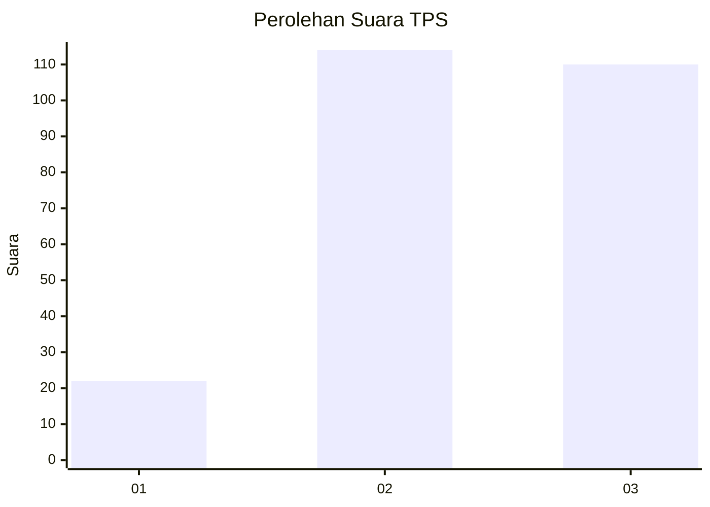
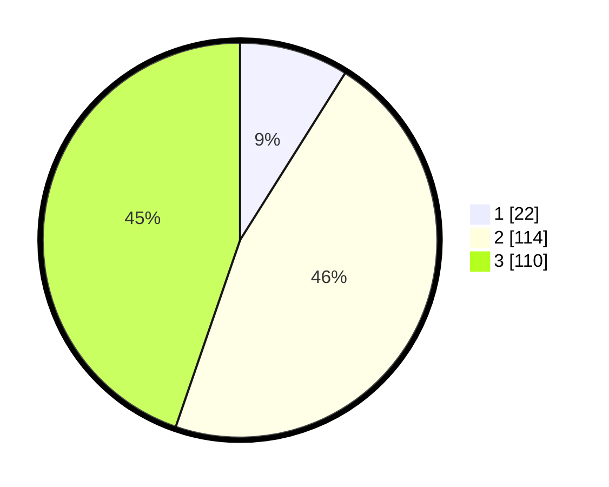

# Hasil

## Grafik

## Tabel

| No. | Nama Paslon    | Suara | Suara (raw) | Persentase |
|:--- |:-------------- | -----:| -----------:| ----------:|
| 1   | ANIES MUHAIMIN | 22    | [22][p-1]   | 8,94       |
| 2   | PRABOWO GIBRAN | 114   | [114][p-2]  | 46,34      |
| 3   | GANJAR MAHFUD  | 110   | [110][p-3]  | 44,72      |

[p-1]: https://github.com/gigit-pemilu/pemilu-2024/blob/main/pilpres/hitung-suara/sub/33-jawa-tengah/sub/74-kota-semarang/sub/10-tembalang/sub/1010-sendangguwo/sub/009-tps/sub/paslon-1.txt
[p-2]: https://github.com/gigit-pemilu/pemilu-2024/blob/main/pilpres/hitung-suara/sub/33-jawa-tengah/sub/74-kota-semarang/sub/10-tembalang/sub/1010-sendangguwo/sub/009-tps/sub/paslon-2.txt
[p-3]: https://github.com/gigit-pemilu/pemilu-2024/blob/main/pilpres/hitung-suara/sub/33-jawa-tengah/sub/74-kota-semarang/sub/10-tembalang/sub/1010-sendangguwo/sub/009-tps/sub/paslon-3.txt

## Foto C Plano

https://sirekap-obj-formc.kpu.go.id/ec48/pemilu/ppwp/33/74/10/10/10/3374101010009-20240215-005219--5e5841a8-6dc9-418c-a13a-dcbaf75d7ceb.jpg

https://sirekap-obj-formc.kpu.go.id/ec48/pemilu/ppwp/33/74/10/10/10/3374101010009-20240215-005431--9828c72b-aecd-4ca7-a50b-712f2891a013.jpg

https://sirekap-obj-formc.kpu.go.id/ec48/pemilu/ppwp/33/74/10/10/10/3374101010009-20240215-005647--0a51d040-3e13-4df9-b366-21d1e7147994.jpg

## Metadata

| Key        | Value               |
| ---------- | ------------------- |
| Time Stamp | 2024-02-16 09:00:28 |

