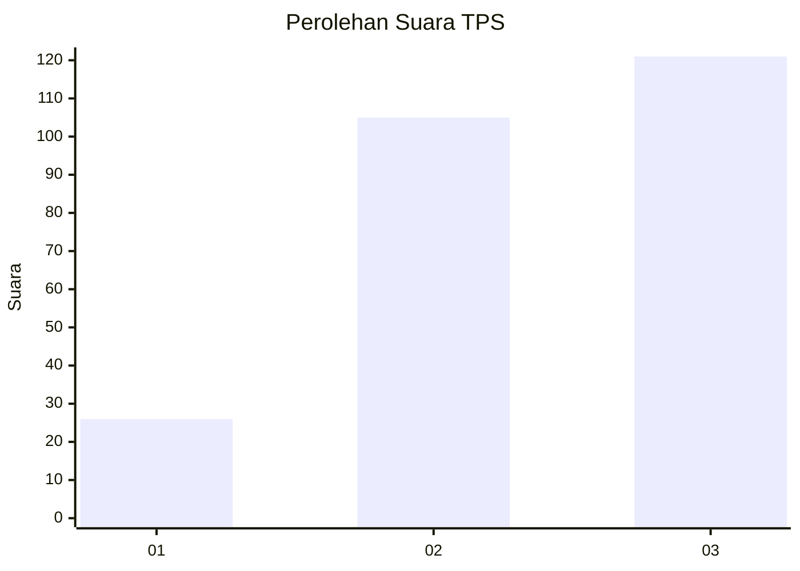
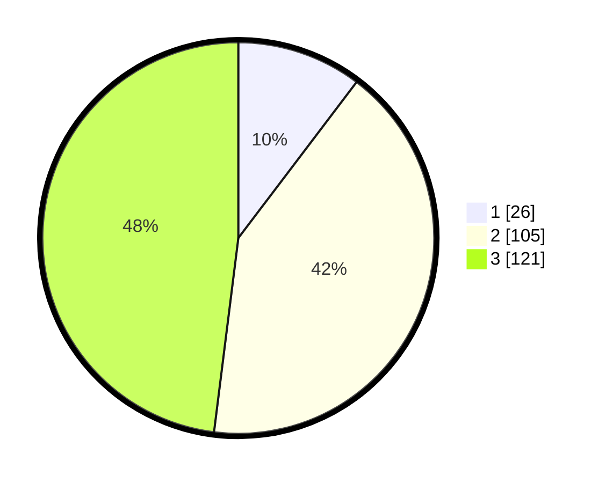

# Hasil

## Grafik

## Tabel

| No. | Nama Paslon    | Suara | Suara (raw) | Persentase |
|:--- |:-------------- | -----:| -----------:| ----------:|
| 1   | ANIES MUHAIMIN | 26    | [26][p-1]   | 10,32      |
| 2   | PRABOWO GIBRAN | 105   | [105][p-2]  | 41,67      |
| 3   | GANJAR MAHFUD  | 121   | [121][p-3]  | 48,02      |

[p-1]: https://github.com/gigit-pemilu/pemilu-2024-33-jawa-tengah/blob/main/pilpres/hitung-suara/sub/33-jawa-tengah/sub/74-kota-semarang/sub/10-tembalang/sub/1010-sendangguwo/sub/038-tps/sub/paslon-1.txt
[p-2]: https://github.com/gigit-pemilu/pemilu-2024-33-jawa-tengah/blob/main/pilpres/hitung-suara/sub/33-jawa-tengah/sub/74-kota-semarang/sub/10-tembalang/sub/1010-sendangguwo/sub/038-tps/sub/paslon-2.txt
[p-3]: https://github.com/gigit-pemilu/pemilu-2024-33-jawa-tengah/blob/main/pilpres/hitung-suara/sub/33-jawa-tengah/sub/74-kota-semarang/sub/10-tembalang/sub/1010-sendangguwo/sub/038-tps/sub/paslon-3.txt

## Foto C Plano

https://sirekap-obj-formc.kpu.go.id/ed08/pemilu/ppwp/33/74/10/10/10/3374101010038-20240214-204959--35d3139d-06b5-404d-9044-52be51afabd3.jpg

https://sirekap-obj-formc.kpu.go.id/ed08/pemilu/ppwp/33/74/10/10/10/3374101010038-20240214-205015--ede6be51-123d-4227-ba7e-6d1a00c2013e.jpg

https://sirekap-obj-formc.kpu.go.id/ed08/pemilu/ppwp/33/74/10/10/10/3374101010038-20240214-202511--ee57ef5a-17ee-4766-869c-8de30e2682d0.jpg

## Metadata

| Key        | Value               |
| ---------- | ------------------- |
| Time Stamp | 2024-02-16 09:30:28 |

