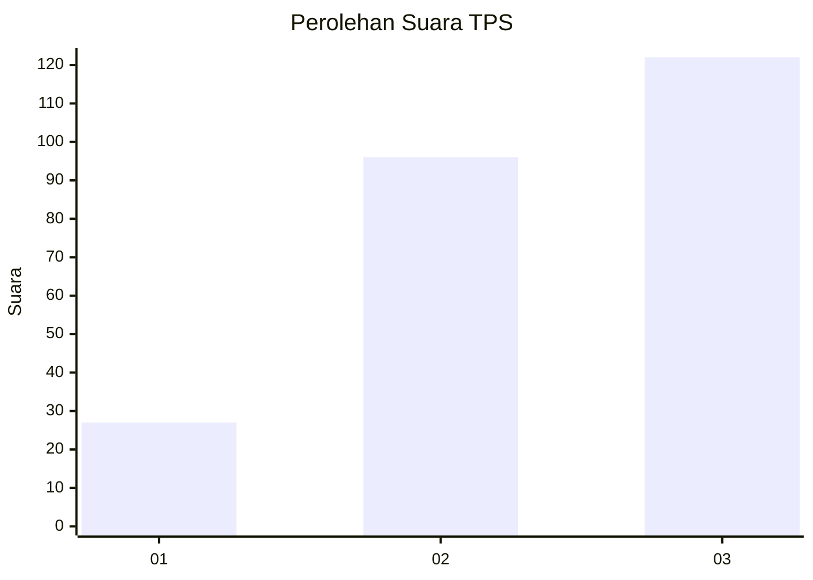
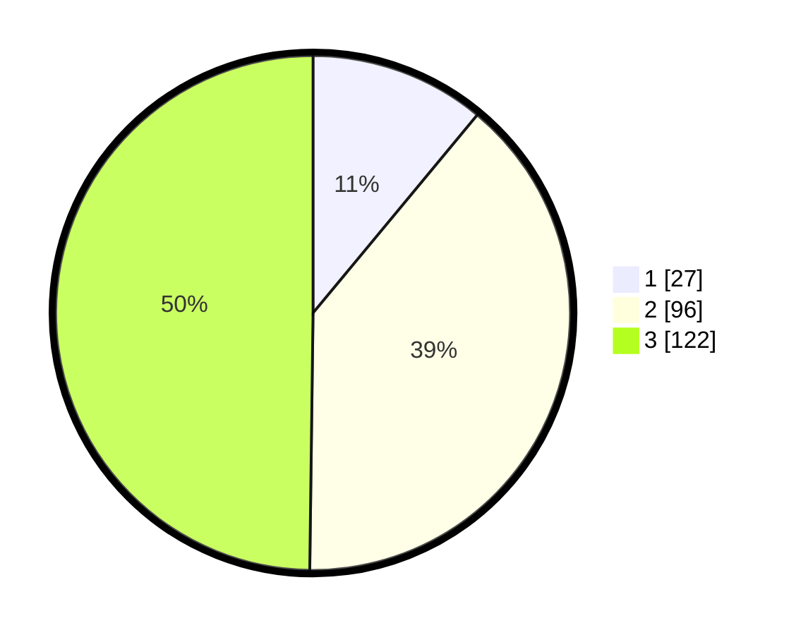

# Hasil

## Grafik

## Tabel

| No. | Nama Paslon    | Suara | Suara (raw) | Persentase |
|:--- |:-------------- | -----:| -----------:| ----------:|
| 1   | ANIES MUHAIMIN | 27    | [27][p-1]   | 11,02      |
| 2   | PRABOWO GIBRAN | 96    | [96][p-2]   | 39,18      |
| 3   | GANJAR MAHFUD  | 122   | [122][p-3]  | 49,80      |

[p-1]: https://github.com/gigit-pemilu/pemilu-2024-33-jawa-tengah/blob/main/pilpres/hitung-suara/sub/33-jawa-tengah/sub/74-kota-semarang/sub/10-tembalang/sub/1010-sendangguwo/sub/039-tps/sub/paslon-1.txt
[p-2]: https://github.com/gigit-pemilu/pemilu-2024-33-jawa-tengah/blob/main/pilpres/hitung-suara/sub/33-jawa-tengah/sub/74-kota-semarang/sub/10-tembalang/sub/1010-sendangguwo/sub/039-tps/sub/paslon-2.txt
[p-3]: https://github.com/gigit-pemilu/pemilu-2024-33-jawa-tengah/blob/main/pilpres/hitung-suara/sub/33-jawa-tengah/sub/74-kota-semarang/sub/10-tembalang/sub/1010-sendangguwo/sub/039-tps/sub/paslon-3.txt

## Foto C Plano

https://sirekap-obj-formc.kpu.go.id/e97c/pemilu/ppwp/33/74/10/10/10/3374101010039-20240215-004924--19374afc-1bfd-415c-98e2-b5da5010863c.jpg

https://sirekap-obj-formc.kpu.go.id/e97c/pemilu/ppwp/33/74/10/10/10/3374101010039-20240215-005057--8176ff4b-d8e5-4463-9c9b-ec7189757fd7.jpg

https://sirekap-obj-formc.kpu.go.id/e97c/pemilu/ppwp/33/74/10/10/10/3374101010039-20240215-005204--48fc58a8-bc7b-467d-95ed-a4700ecdff87.jpg

## Metadata

| Key        | Value               |
| ---------- | ------------------- |
| Time Stamp | 2024-02-16 16:25:10 |

