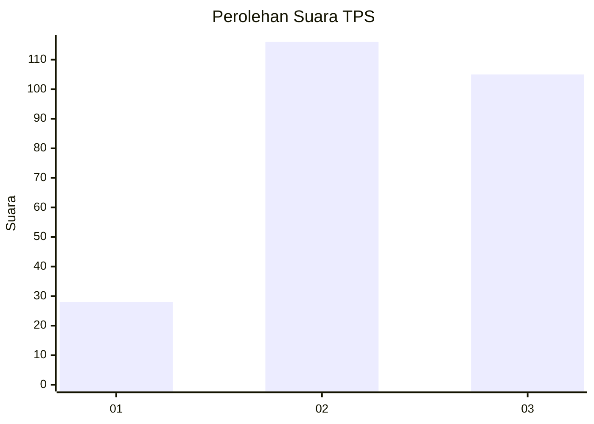
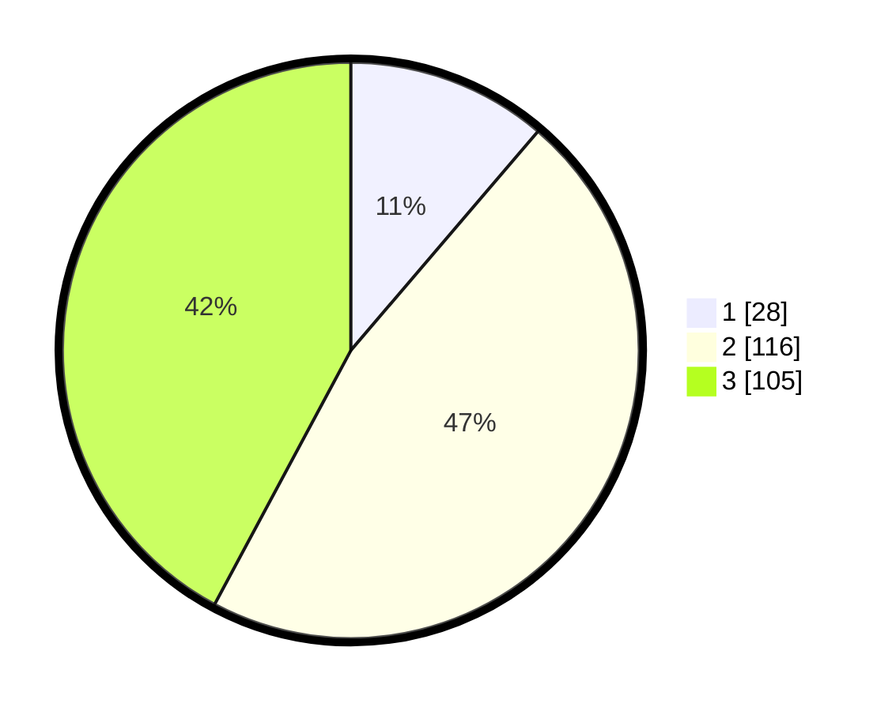

# Hasil

## Grafik

## Tabel

| No. | Nama Paslon    | Suara | Suara (raw) | Persentase |
|:--- |:-------------- | -----:| -----------:| ----------:|
| 1   | ANIES MUHAIMIN | 28    | [28][p-1]   | 11,24      |
| 2   | PRABOWO GIBRAN | 116   | [116][p-2]  | 46,59      |
| 3   | GANJAR MAHFUD  | 105   | [105][p-3]  | 42,17      |

[p-1]: https://github.com/gigit-pemilu/pemilu-2024/blob/main/pilpres/hitung-suara/sub/33-jawa-tengah/sub/74-kota-semarang/sub/10-tembalang/sub/1010-sendangguwo/sub/050-tps/sub/paslon-1.txt
[p-2]: https://github.com/gigit-pemilu/pemilu-2024/blob/main/pilpres/hitung-suara/sub/33-jawa-tengah/sub/74-kota-semarang/sub/10-tembalang/sub/1010-sendangguwo/sub/050-tps/sub/paslon-2.txt
[p-3]: https://github.com/gigit-pemilu/pemilu-2024/blob/main/pilpres/hitung-suara/sub/33-jawa-tengah/sub/74-kota-semarang/sub/10-tembalang/sub/1010-sendangguwo/sub/050-tps/sub/paslon-3.txt

## Foto C Plano

https://sirekap-obj-formc.kpu.go.id/3081/pemilu/ppwp/33/74/10/10/10/3374101010050-20240214-213729--04598228-0539-4e5b-8e04-ffdeff8921d5.jpg

https://sirekap-obj-formc.kpu.go.id/3081/pemilu/ppwp/33/74/10/10/10/3374101010050-20240214-213851--c58bde13-1c7c-4478-be29-8293c13ce420.jpg

https://sirekap-obj-formc.kpu.go.id/3081/pemilu/ppwp/33/74/10/10/10/3374101010050-20240214-214013--bdbdaf2e-070a-4414-b99f-28dc345969c1.jpg

## Metadata

| Key        | Value               |
| ---------- | ------------------- |
| Time Stamp | 2024-02-16 09:30:28 |

