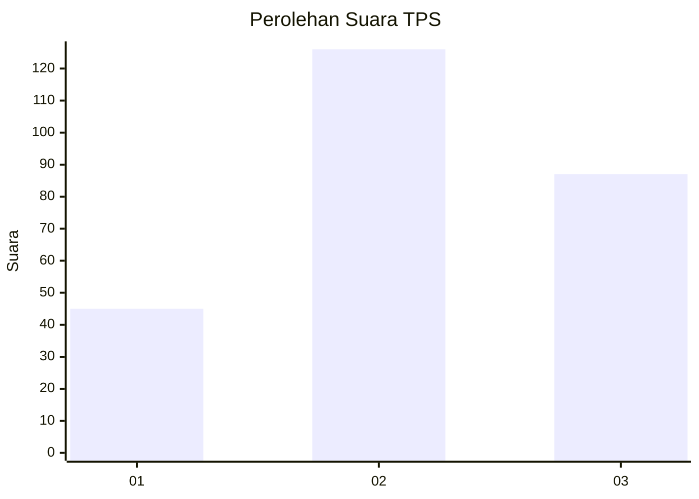
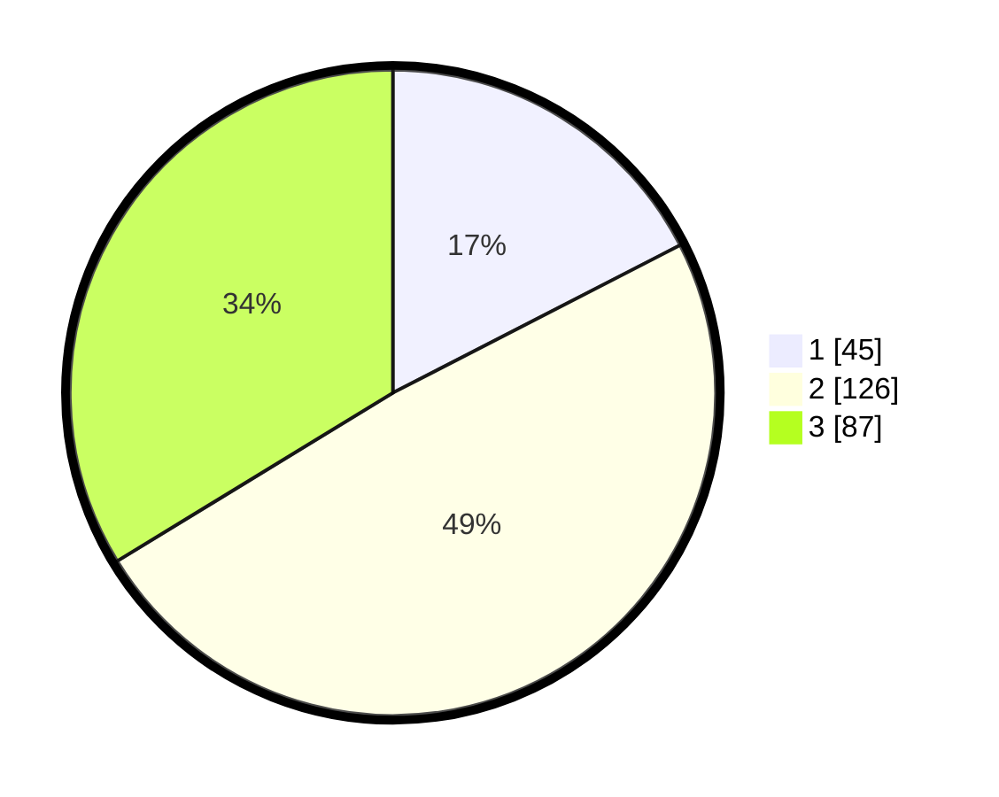

# Hasil

## Grafik

## Tabel

| No. | Nama Paslon    | Suara | Suara (raw) | Persentase |
|:--- |:-------------- | -----:| -----------:| ----------:|
| 1   | ANIES MUHAIMIN | 45    | [45][p-1]   | 17,44      |
| 2   | PRABOWO GIBRAN | 126   | [126][p-2]  | 48,84      |
| 3   | GANJAR MAHFUD  | 87    | [87][p-3]   | 33,72      |

[p-1]: https://github.com/gigit-pemilu/pemilu-2024/blob/main/pilpres/hitung-suara/sub/33-jawa-tengah/sub/74-kota-semarang/sub/10-tembalang/sub/1011-sendangmulyo/sub/098-tps/sub/paslon-1.txt
[p-2]: https://github.com/gigit-pemilu/pemilu-2024/blob/main/pilpres/hitung-suara/sub/33-jawa-tengah/sub/74-kota-semarang/sub/10-tembalang/sub/1011-sendangmulyo/sub/098-tps/sub/paslon-2.txt
[p-3]: https://github.com/gigit-pemilu/pemilu-2024/blob/main/pilpres/hitung-suara/sub/33-jawa-tengah/sub/74-kota-semarang/sub/10-tembalang/sub/1011-sendangmulyo/sub/098-tps/sub/paslon-3.txt

## Foto C Plano

https://sirekap-obj-formc.kpu.go.id/bc9d/pemilu/ppwp/33/74/10/10/11/3374101011098-20240215-055158--52645d30-9ae7-4953-a6da-86b603b0a62d.jpg

https://sirekap-obj-formc.kpu.go.id/bc9d/pemilu/ppwp/33/74/10/10/11/3374101011098-20240215-055617--7608e030-c4de-42d8-b0bd-bc590220c256.jpg

https://sirekap-obj-formc.kpu.go.id/bc9d/pemilu/ppwp/33/74/10/10/11/3374101011098-20240215-055711--da993670-ba65-4eb5-ae64-3fed639b924a.jpg

## Metadata

| Key        | Value               |
| ---------- | ------------------- |
| Time Stamp | 2024-02-16 10:30:29 |

