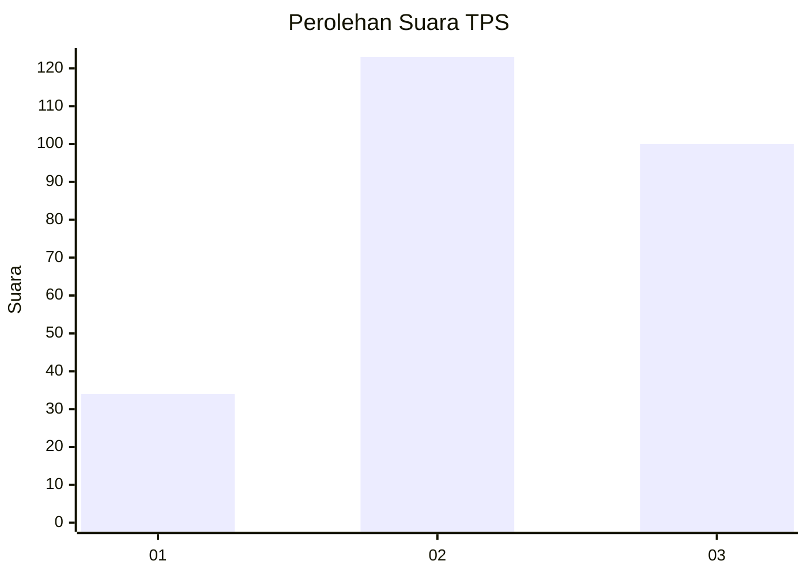
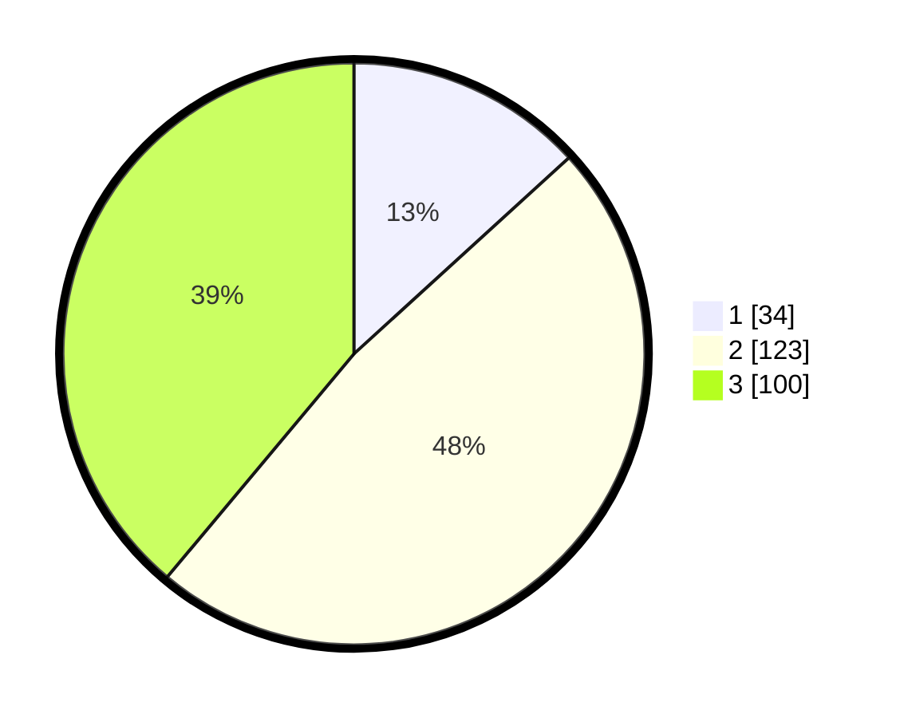

# Hasil

## Grafik

## Tabel

| No. | Nama Paslon    | Suara | Suara (raw) | Persentase |
|:--- |:-------------- | -----:| -----------:| ----------:|
| 1   | ANIES MUHAIMIN | 34    | [34][p-1]   | 13,23      |
| 2   | PRABOWO GIBRAN | 123   | [123][p-2]  | 47,86      |
| 3   | GANJAR MAHFUD  | 100   | [100][p-3]  | 38,91      |

[p-1]: https://github.com/gigit-pemilu/pemilu-2024-33-jawa-tengah/blob/main/pilpres/hitung-suara/sub/33-jawa-tengah/sub/74-kota-semarang/sub/11-banyumanik/sub/1001-pudakpayung/sub/002-tps/sub/paslon-1.txt
[p-2]: https://github.com/gigit-pemilu/pemilu-2024-33-jawa-tengah/blob/main/pilpres/hitung-suara/sub/33-jawa-tengah/sub/74-kota-semarang/sub/11-banyumanik/sub/1001-pudakpayung/sub/002-tps/sub/paslon-2.txt
[p-3]: https://github.com/gigit-pemilu/pemilu-2024-33-jawa-tengah/blob/main/pilpres/hitung-suara/sub/33-jawa-tengah/sub/74-kota-semarang/sub/11-banyumanik/sub/1001-pudakpayung/sub/002-tps/sub/paslon-3.txt

## Foto C Plano

https://sirekap-obj-formc.kpu.go.id/d23c/pemilu/ppwp/33/74/11/10/01/3374111001002-20240215-002735--2aabc7f7-1d71-4ee7-8850-8cfa5c94b045.jpg

https://sirekap-obj-formc.kpu.go.id/d23c/pemilu/ppwp/33/74/11/10/01/3374111001002-20240215-002808--8811ed96-917a-4cb1-93cd-8e2afbfbf97e.jpg

https://sirekap-obj-formc.kpu.go.id/d23c/pemilu/ppwp/33/74/11/10/01/3374111001002-20240215-002833--490bce91-2654-4d39-b651-f02be278d3a7.jpg

## Metadata

| Key        | Value               |
| ---------- | ------------------- |
| Time Stamp | 2024-02-16 12:51:22 |

