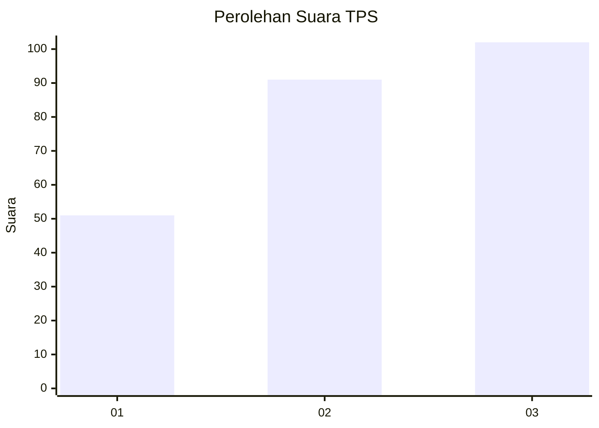
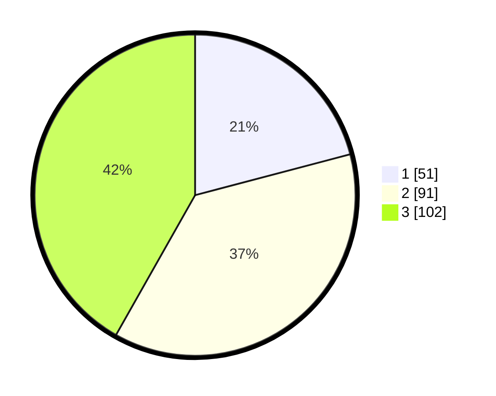

# Hasil

## Grafik

## Tabel

| No. | Nama Paslon    | Suara | Suara (raw) | Persentase |
|:--- |:-------------- | -----:| -----------:| ----------:|
| 1   | ANIES MUHAIMIN | 51    | [51][p-1]   | 20,90      |
| 2   | PRABOWO GIBRAN | 91    | [91][p-2]   | 37,30      |
| 3   | GANJAR MAHFUD  | 102   | [102][p-3]  | 41,80      |

[p-1]: https://github.com/gigit-pemilu/pemilu-2024/blob/main/pilpres/hitung-suara/sub/33-jawa-tengah/sub/74-kota-semarang/sub/11-banyumanik/sub/1001-pudakpayung/sub/003-tps/sub/paslon-1.txt
[p-2]: https://github.com/gigit-pemilu/pemilu-2024/blob/main/pilpres/hitung-suara/sub/33-jawa-tengah/sub/74-kota-semarang/sub/11-banyumanik/sub/1001-pudakpayung/sub/003-tps/sub/paslon-2.txt
[p-3]: https://github.com/gigit-pemilu/pemilu-2024/blob/main/pilpres/hitung-suara/sub/33-jawa-tengah/sub/74-kota-semarang/sub/11-banyumanik/sub/1001-pudakpayung/sub/003-tps/sub/paslon-3.txt

## Foto C Plano

https://sirekap-obj-formc.kpu.go.id/c0a0/pemilu/ppwp/33/74/11/10/01/3374111001003-20240215-031339--59aa5bde-ee09-49da-89f5-bbdf5406c618.jpg

https://sirekap-obj-formc.kpu.go.id/c0a0/pemilu/ppwp/33/74/11/10/01/3374111001003-20240215-031416--955214c2-89f0-461d-831d-0fed8001bba6.jpg

https://sirekap-obj-formc.kpu.go.id/c0a0/pemilu/ppwp/33/74/11/10/01/3374111001003-20240215-031454--ab86daa9-989f-48f8-ad44-e76eaf130b68.jpg

## Metadata

| Key        | Value               |
| ---------- | ------------------- |
| Time Stamp | 2024-02-16 12:51:22 |

