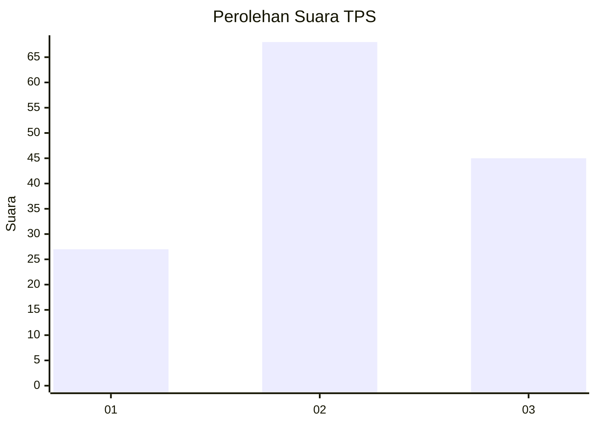
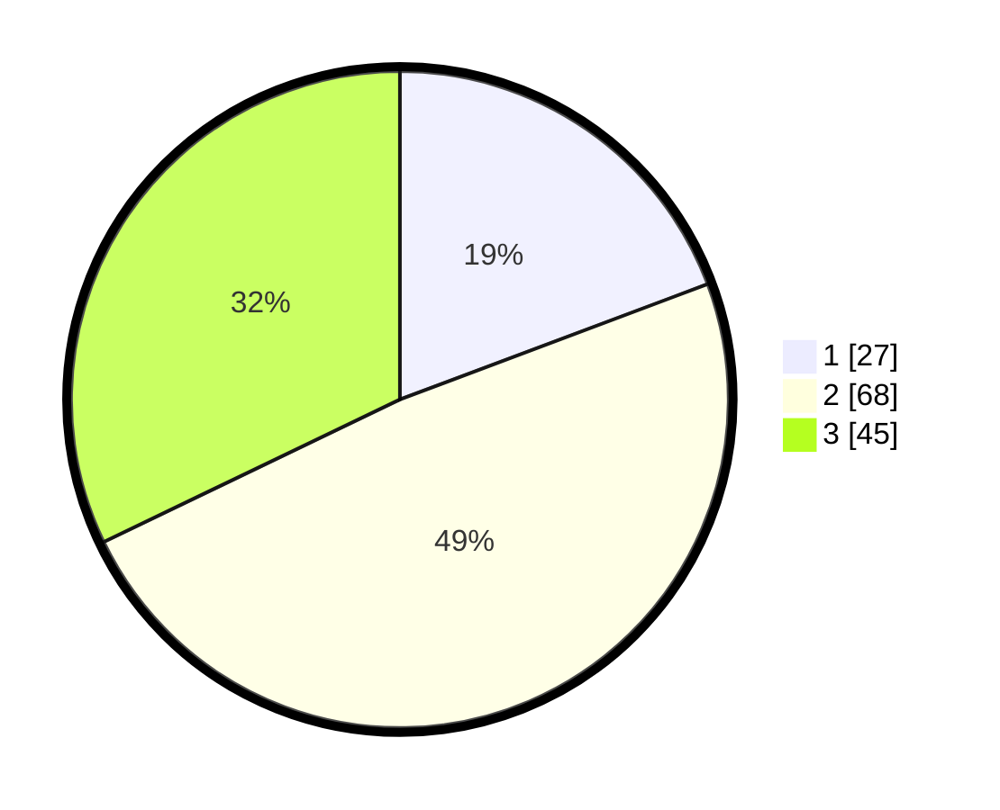

# Hasil

## Grafik

## Tabel

| No. | Nama Paslon    | Suara | Suara (raw) | Persentase |
|:--- |:-------------- | -----:| -----------:| ----------:|
| 1   | ANIES MUHAIMIN | 27    | [27][p-1]   | 19,29      |
| 2   | PRABOWO GIBRAN | 68    | [68][p-2]   | 48,57      |
| 3   | GANJAR MAHFUD  | 45    | [45][p-3]   | 32,14      |

[p-1]: https://github.com/gigit-pemilu/pemilu-2024/blob/main/pilpres/hitung-suara/sub/33-jawa-tengah/sub/74-kota-semarang/sub/11-banyumanik/sub/1001-pudakpayung/sub/008-tps/sub/paslon-1.txt
[p-2]: https://github.com/gigit-pemilu/pemilu-2024/blob/main/pilpres/hitung-suara/sub/33-jawa-tengah/sub/74-kota-semarang/sub/11-banyumanik/sub/1001-pudakpayung/sub/008-tps/sub/paslon-2.txt
[p-3]: https://github.com/gigit-pemilu/pemilu-2024/blob/main/pilpres/hitung-suara/sub/33-jawa-tengah/sub/74-kota-semarang/sub/11-banyumanik/sub/1001-pudakpayung/sub/008-tps/sub/paslon-3.txt

## Foto C Plano

https://sirekap-obj-formc.kpu.go.id/1f55/pemilu/ppwp/33/74/11/10/01/3374111001008-20240215-001012--3bdc3239-ceec-4d34-b114-38cb3697ecd7.jpg

https://sirekap-obj-formc.kpu.go.id/1f55/pemilu/ppwp/33/74/11/10/01/3374111001008-20240215-001116--cb6cc3af-349a-443a-9353-7094871330c0.jpg

https://sirekap-obj-formc.kpu.go.id/1f55/pemilu/ppwp/33/74/11/10/01/3374111001008-20240215-001326--bca5aa37-9d68-4bb0-a363-a578dcfde729.jpg

## Metadata

| Key        | Value               |
| ---------- | ------------------- |
| Time Stamp | 2024-02-16 12:51:22 |

