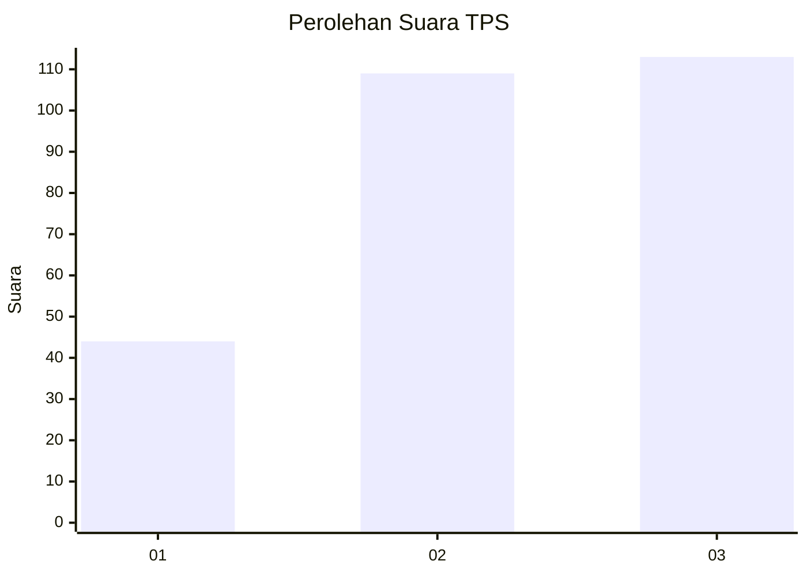
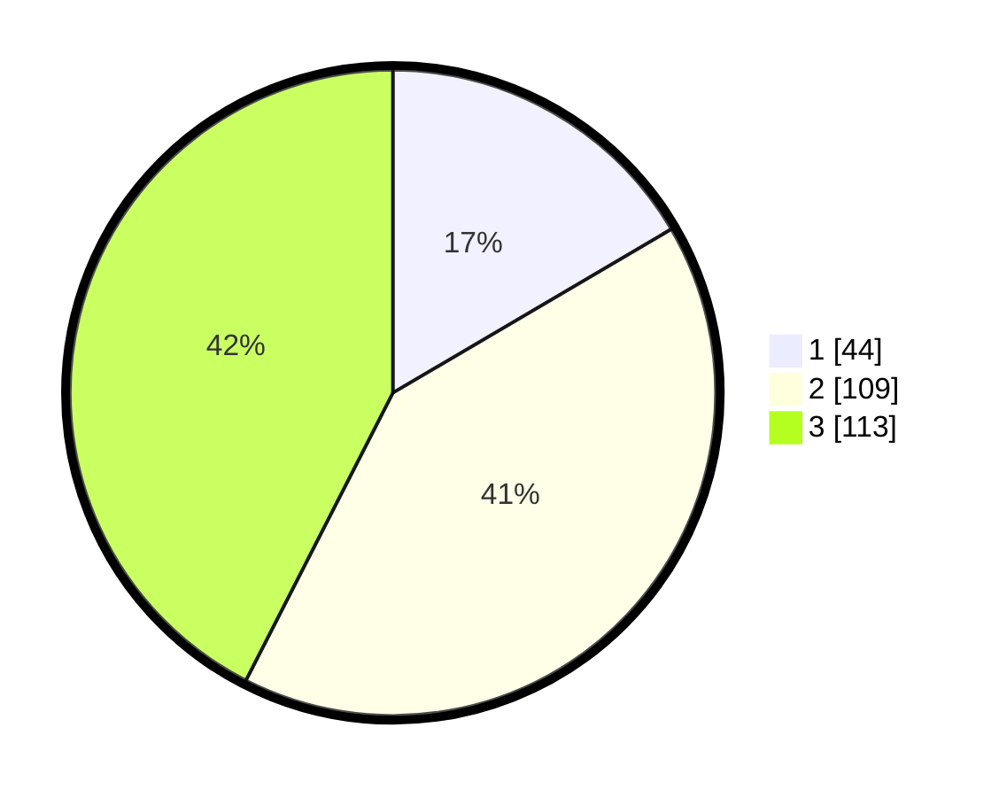

# Hasil

## Grafik

## Tabel

| No. | Nama Paslon    | Suara | Suara (raw) | Persentase |
|:--- |:-------------- | -----:| -----------:| ----------:|
| 1   | ANIES MUHAIMIN | 44    | [44][p-1]   | 16,54      |
| 2   | PRABOWO GIBRAN | 109   | [109][p-2]  | 40,98      |
| 3   | GANJAR MAHFUD  | 113   | [113][p-3]  | 42,48      |

[p-1]: https://github.com/gigit-pemilu/pemilu-2024-33-jawa-tengah/blob/main/pilpres/hitung-suara/sub/33-jawa-tengah/sub/74-kota-semarang/sub/11-banyumanik/sub/1001-pudakpayung/sub/017-tps/sub/paslon-1.txt
[p-2]: https://github.com/gigit-pemilu/pemilu-2024-33-jawa-tengah/blob/main/pilpres/hitung-suara/sub/33-jawa-tengah/sub/74-kota-semarang/sub/11-banyumanik/sub/1001-pudakpayung/sub/017-tps/sub/paslon-2.txt
[p-3]: https://github.com/gigit-pemilu/pemilu-2024-33-jawa-tengah/blob/main/pilpres/hitung-suara/sub/33-jawa-tengah/sub/74-kota-semarang/sub/11-banyumanik/sub/1001-pudakpayung/sub/017-tps/sub/paslon-3.txt

## Foto C Plano

https://sirekap-obj-formc.kpu.go.id/729d/pemilu/ppwp/33/74/11/10/01/3374111001017-20240215-102904--824e5b33-2280-4e35-ae92-80199dd5f0e8.jpg

https://sirekap-obj-formc.kpu.go.id/729d/pemilu/ppwp/33/74/11/10/01/3374111001017-20240215-102939--a8a7595b-0ec3-4885-8558-7cae3a23c788.jpg

https://sirekap-obj-formc.kpu.go.id/729d/pemilu/ppwp/33/74/11/10/01/3374111001017-20240215-103001--4dc2f8e7-a345-4c13-b851-610d6103665c.jpg

## Metadata

| Key        | Value               |
| ---------- | ------------------- |
| Time Stamp | 2024-02-16 12:51:22 |

