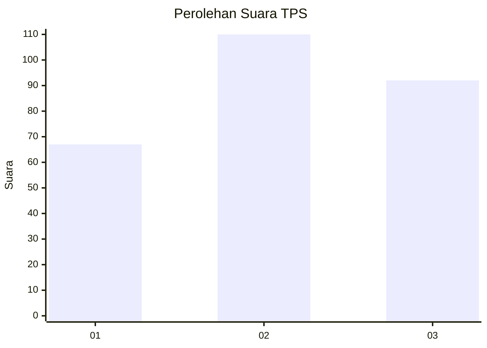
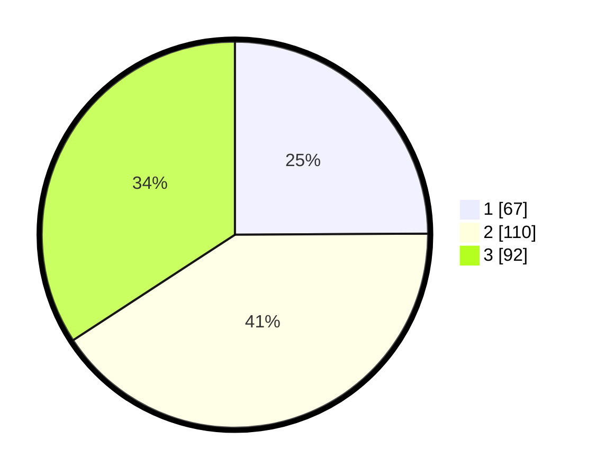

# Hasil

## Grafik

## Tabel

| No. | Nama Paslon    | Suara | Suara (raw) | Persentase |
|:--- |:-------------- | -----:| -----------:| ----------:|
| 1   | ANIES MUHAIMIN | 67    | [67][p-1]   | 24,91      |
| 2   | PRABOWO GIBRAN | 110   | [110][p-2]  | 40,89      |
| 3   | GANJAR MAHFUD  | 92    | [92][p-3]   | 34,20      |

[p-1]: https://github.com/gigit-pemilu/pemilu-2024/blob/main/pilpres/hitung-suara/sub/33-jawa-tengah/sub/74-kota-semarang/sub/11-banyumanik/sub/1001-pudakpayung/sub/054-tps/sub/paslon-1.txt
[p-2]: https://github.com/gigit-pemilu/pemilu-2024/blob/main/pilpres/hitung-suara/sub/33-jawa-tengah/sub/74-kota-semarang/sub/11-banyumanik/sub/1001-pudakpayung/sub/054-tps/sub/paslon-2.txt
[p-3]: https://github.com/gigit-pemilu/pemilu-2024/blob/main/pilpres/hitung-suara/sub/33-jawa-tengah/sub/74-kota-semarang/sub/11-banyumanik/sub/1001-pudakpayung/sub/054-tps/sub/paslon-3.txt

## Foto C Plano

https://sirekap-obj-formc.kpu.go.id/08cb/pemilu/ppwp/33/74/11/10/01/3374111001054-20240214-202157--4a63aaaa-74a8-40a9-88a1-be849e2e8c9e.jpg

https://sirekap-obj-formc.kpu.go.id/08cb/pemilu/ppwp/33/74/11/10/01/3374111001054-20240214-202301--5aa2f3ba-23bc-4f22-936e-8e866d57abcb.jpg

https://sirekap-obj-formc.kpu.go.id/08cb/pemilu/ppwp/33/74/11/10/01/3374111001054-20240214-211348--dfb7fce7-bbba-4d2d-a44d-51595308b22b.jpg

## Metadata

| Key        | Value               |
| ---------- | ------------------- |
| Time Stamp | 2024-02-16 12:51:22 |

