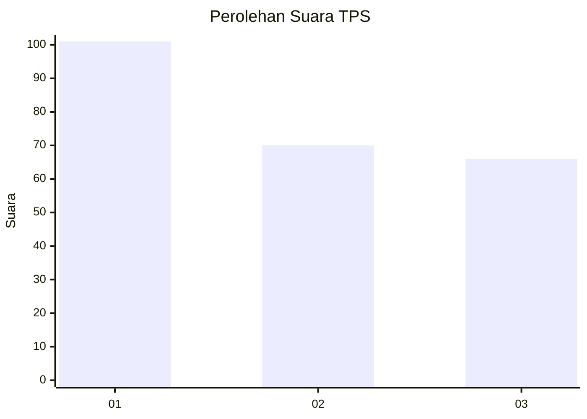
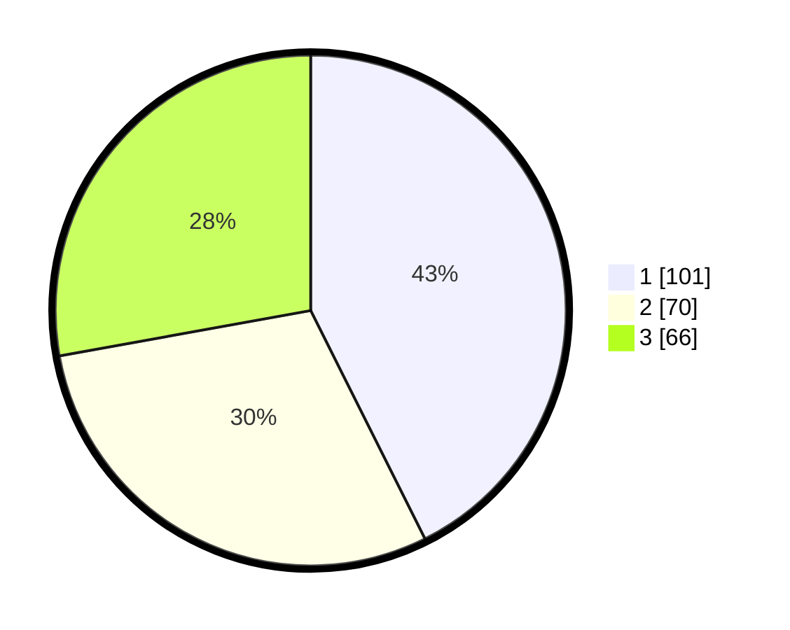

# Hasil

## Grafik

## Tabel

| No. | Nama Paslon    | Suara | Suara (raw) | Persentase |
|:--- |:-------------- | -----:| -----------:| ----------:|
| 1   | ANIES MUHAIMIN | 101   | [101][p-1]  | 42,62      |
| 2   | PRABOWO GIBRAN | 70    | [70][p-2]   | 29,54      |
| 3   | GANJAR MAHFUD  | 66    | [66][p-3]   | 27,85      |

[p-1]: https://github.com/gigit-pemilu/pemilu-2024/blob/main/pilpres/hitung-suara/sub/33-jawa-tengah/sub/74-kota-semarang/sub/11-banyumanik/sub/1002-gedawang/sub/014-tps/sub/paslon-1.txt
[p-2]: https://github.com/gigit-pemilu/pemilu-2024/blob/main/pilpres/hitung-suara/sub/33-jawa-tengah/sub/74-kota-semarang/sub/11-banyumanik/sub/1002-gedawang/sub/014-tps/sub/paslon-2.txt
[p-3]: https://github.com/gigit-pemilu/pemilu-2024/blob/main/pilpres/hitung-suara/sub/33-jawa-tengah/sub/74-kota-semarang/sub/11-banyumanik/sub/1002-gedawang/sub/014-tps/sub/paslon-3.txt

## Foto C Plano

https://sirekap-obj-formc.kpu.go.id/dd85/pemilu/ppwp/33/74/11/10/02/3374111002014-20240215-211057--0c5cea20-9ae3-47a4-99dc-db9c1cf68e93.jpg

https://sirekap-obj-formc.kpu.go.id/dd85/pemilu/ppwp/33/74/11/10/02/3374111002014-20240215-220941--998adaaf-77e3-46d4-9f12-ecf1c733c456.jpg

https://sirekap-obj-formc.kpu.go.id/dd85/pemilu/ppwp/33/74/11/10/02/3374111002014-20240214-230019--797885fe-7d08-47f6-8884-bfa0a887cf82.jpg

## Metadata

| Key        | Value               |
| ---------- | ------------------- |
| Time Stamp | 2024-02-16 01:00:27 |

