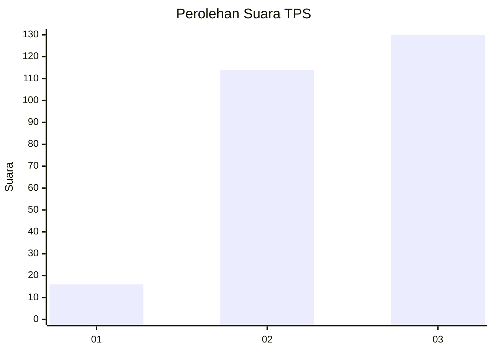
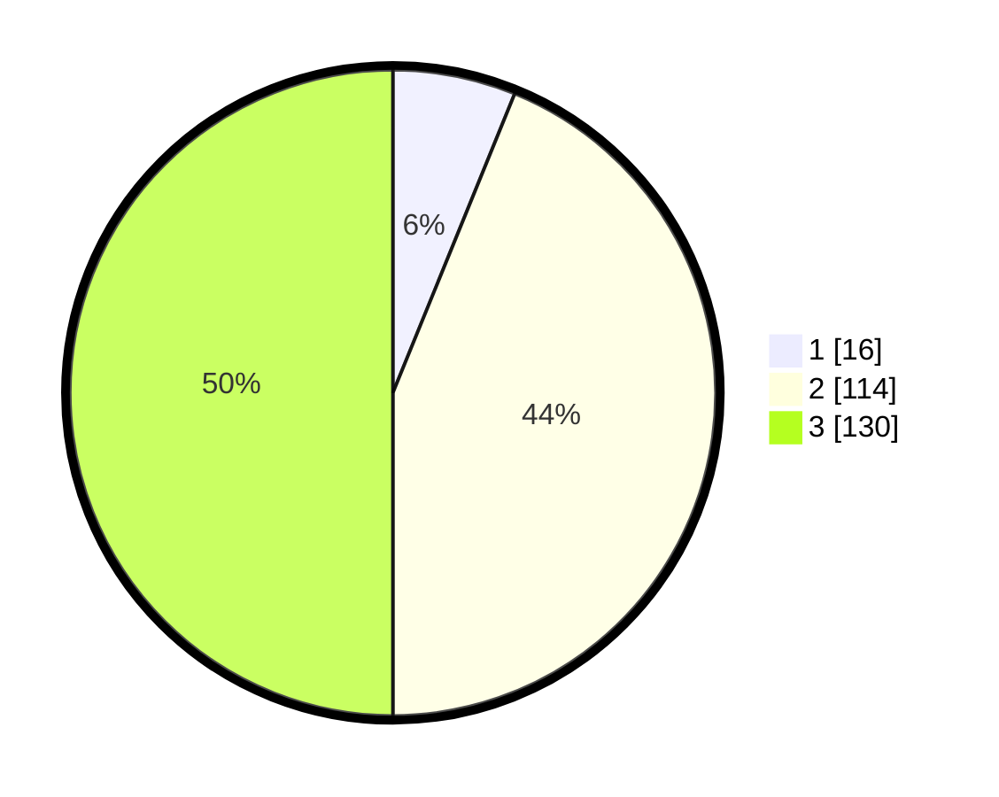

# Hasil

## Grafik

## Tabel

| No. | Nama Paslon    | Suara | Suara (raw) | Persentase |
|:--- |:-------------- | -----:| -----------:| ----------:|
| 1   | ANIES MUHAIMIN | 16    | [16][p-1]   | 6,15       |
| 2   | PRABOWO GIBRAN | 114   | [114][p-2]  | 43,85      |
| 3   | GANJAR MAHFUD  | 130   | [130][p-3]  | 50,00      |

[p-1]: https://github.com/gigit-pemilu/pemilu-2024/blob/main/pilpres/hitung-suara/sub/33-jawa-tengah/sub/74-kota-semarang/sub/11-banyumanik/sub/1003-jabungan/sub/008-tps/sub/paslon-1.txt
[p-2]: https://github.com/gigit-pemilu/pemilu-2024/blob/main/pilpres/hitung-suara/sub/33-jawa-tengah/sub/74-kota-semarang/sub/11-banyumanik/sub/1003-jabungan/sub/008-tps/sub/paslon-2.txt
[p-3]: https://github.com/gigit-pemilu/pemilu-2024/blob/main/pilpres/hitung-suara/sub/33-jawa-tengah/sub/74-kota-semarang/sub/11-banyumanik/sub/1003-jabungan/sub/008-tps/sub/paslon-3.txt

## Foto C Plano

https://sirekap-obj-formc.kpu.go.id/f858/pemilu/ppwp/33/74/11/10/03/3374111003008-20240220-185140--379c6938-b805-4d5f-9f63-c91a2c6eb7ff.jpg

https://sirekap-obj-formc.kpu.go.id/f858/pemilu/ppwp/33/74/11/10/03/3374111003008-20240220-192559--4dd8c8a5-9aa3-41d7-b93d-22eb5e1fc83e.jpg

https://sirekap-obj-formc.kpu.go.id/f858/pemilu/ppwp/33/74/11/10/03/3374111003008-20240220-191452--a2cfcc89-9bed-4f9c-95ed-8f204f6d70fe.jpg

## Metadata

| Key        | Value               |
| ---------- | ------------------- |
| Time Stamp | 2024-02-22 15:00:00 |

