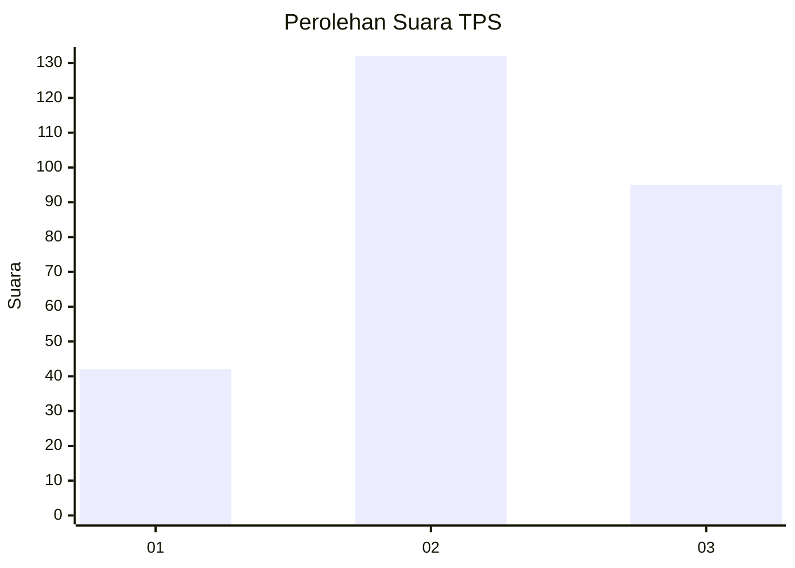
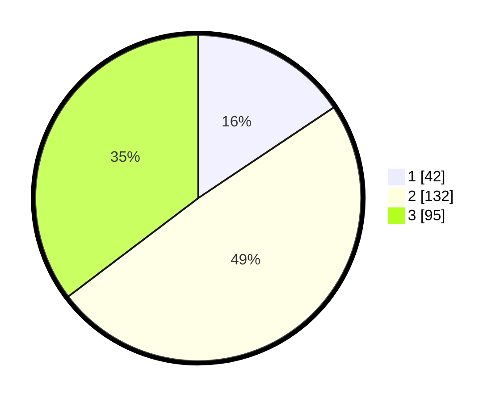

# Hasil

## Grafik

## Tabel

| No. | Nama Paslon    | Suara | Suara (raw) | Persentase |
|:--- |:-------------- | -----:| -----------:| ----------:|
| 1   | ANIES MUHAIMIN | 42    | [42][p-1]   | 15,61      |
| 2   | PRABOWO GIBRAN | 132   | [132][p-2]  | 49,07      |
| 3   | GANJAR MAHFUD  | 95    | [95][p-3]   | 35,32      |

[p-1]: https://github.com/gigit-pemilu/pemilu-2024/blob/main/pilpres/hitung-suara/sub/33-jawa-tengah/sub/74-kota-semarang/sub/11-banyumanik/sub/1005-banyumanik/sub/009-tps/sub/paslon-1.txt
[p-2]: https://github.com/gigit-pemilu/pemilu-2024/blob/main/pilpres/hitung-suara/sub/33-jawa-tengah/sub/74-kota-semarang/sub/11-banyumanik/sub/1005-banyumanik/sub/009-tps/sub/paslon-2.txt
[p-3]: https://github.com/gigit-pemilu/pemilu-2024/blob/main/pilpres/hitung-suara/sub/33-jawa-tengah/sub/74-kota-semarang/sub/11-banyumanik/sub/1005-banyumanik/sub/009-tps/sub/paslon-3.txt

## Foto C Plano

https://sirekap-obj-formc.kpu.go.id/f98c/pemilu/ppwp/33/74/11/10/05/3374111005009-20240220-165901--36e33292-a846-44ba-a935-ccd2c94bceff.jpg

https://sirekap-obj-formc.kpu.go.id/f98c/pemilu/ppwp/33/74/11/10/05/3374111005009-20240220-165950--747fd559-1b78-4a95-ade5-7237d48a279f.jpg

https://sirekap-obj-formc.kpu.go.id/f98c/pemilu/ppwp/33/74/11/10/05/3374111005009-20240220-170125--16b1dcf9-4bc3-4100-a76d-5c86010e9aa4.jpg

## Metadata

| Key        | Value               |
| ---------- | ------------------- |
| Time Stamp | 2024-02-22 15:00:00 |

