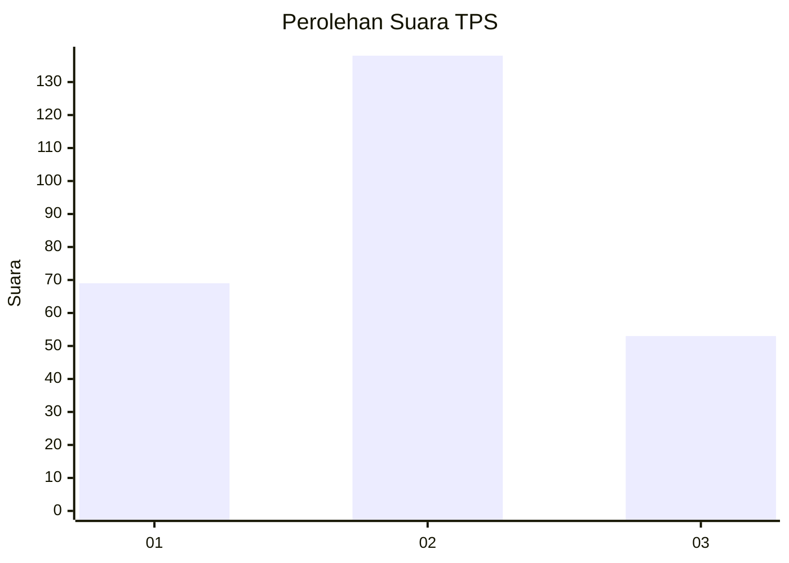
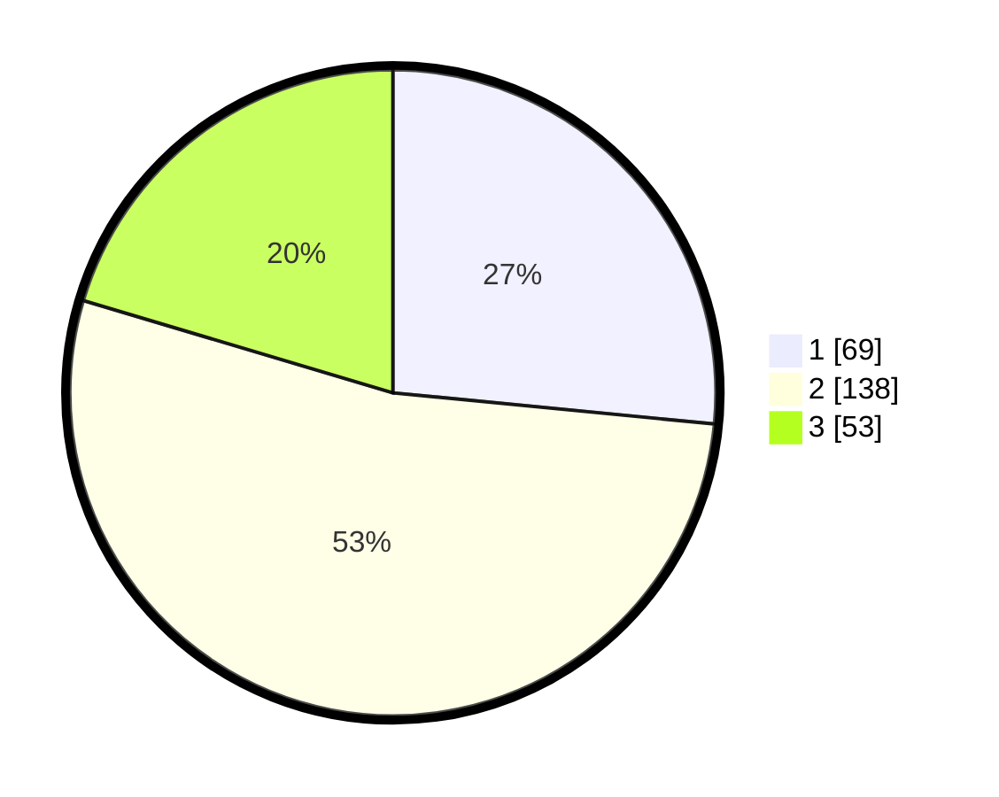

# Hasil

## Grafik

## Tabel

| No. | Nama Paslon    | Suara | Suara (raw) | Persentase |
|:--- |:-------------- | -----:| -----------:| ----------:|
| 1   | ANIES MUHAIMIN | 69    | [69][p-1]   | 26,54      |
| 2   | PRABOWO GIBRAN | 138   | [138][p-2]  | 53,08      |
| 3   | GANJAR MAHFUD  | 53    | [53][p-3]   | 20,38      |

[p-1]: https://github.com/gigit-pemilu/pemilu-2024/blob/main/pilpres/hitung-suara/sub/33-jawa-tengah/sub/74-kota-semarang/sub/11-banyumanik/sub/1007-srondol-wetan/sub/006-tps/sub/paslon-1.txt
[p-2]: https://github.com/gigit-pemilu/pemilu-2024/blob/main/pilpres/hitung-suara/sub/33-jawa-tengah/sub/74-kota-semarang/sub/11-banyumanik/sub/1007-srondol-wetan/sub/006-tps/sub/paslon-2.txt
[p-3]: https://github.com/gigit-pemilu/pemilu-2024/blob/main/pilpres/hitung-suara/sub/33-jawa-tengah/sub/74-kota-semarang/sub/11-banyumanik/sub/1007-srondol-wetan/sub/006-tps/sub/paslon-3.txt

## Foto C Plano

https://sirekap-obj-formc.kpu.go.id/91db/pemilu/ppwp/33/74/11/10/07/3374111007006-20240214-212927--d8c1d3e6-5999-4a41-8f9a-a0afdb5cc075.jpg

https://sirekap-obj-formc.kpu.go.id/91db/pemilu/ppwp/33/74/11/10/07/3374111007006-20240214-212948--7f52f98e-4447-4728-b8ed-5131daed32b5.jpg

https://sirekap-obj-formc.kpu.go.id/91db/pemilu/ppwp/33/74/11/10/07/3374111007006-20240214-213012--fe7d35e5-8ea5-4775-b90f-33ea7894b7f4.jpg

## Metadata

| Key        | Value               |
| ---------- | ------------------- |
| Time Stamp | 2024-02-16 14:00:34 |

