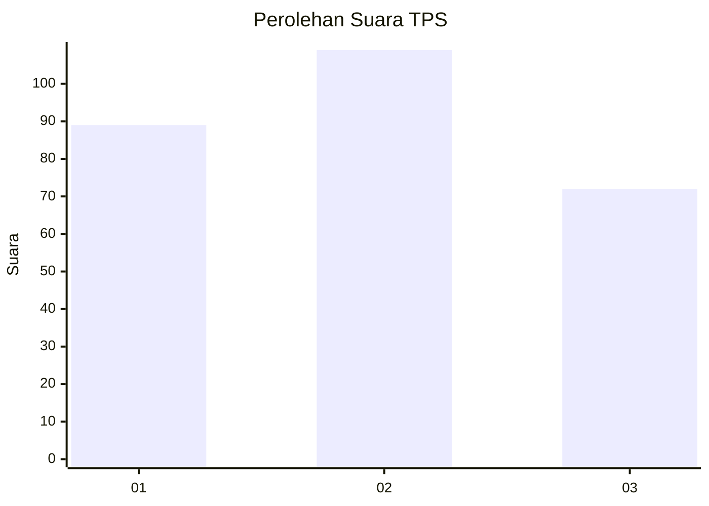
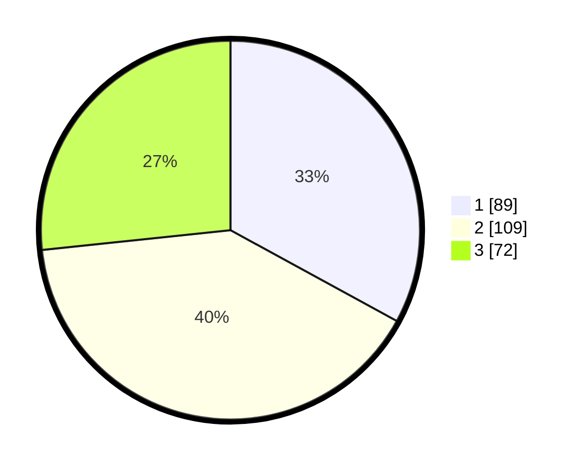

# Hasil

## Grafik

## Tabel

| No. | Nama Paslon    | Suara | Suara (raw) | Persentase |
|:--- |:-------------- | -----:| -----------:| ----------:|
| 1   | ANIES MUHAIMIN | 89    | [89][p-1]   | 32,96      |
| 2   | PRABOWO GIBRAN | 109   | [109][p-2]  | 40,37      |
| 3   | GANJAR MAHFUD  | 72    | [72][p-3]   | 26,67      |

[p-1]: https://github.com/gigit-pemilu/pemilu-2024-33-jawa-tengah/blob/main/pilpres/hitung-suara/sub/33-jawa-tengah/sub/74-kota-semarang/sub/11-banyumanik/sub/1010-padangsari/sub/004-tps/sub/paslon-1.txt
[p-2]: https://github.com/gigit-pemilu/pemilu-2024-33-jawa-tengah/blob/main/pilpres/hitung-suara/sub/33-jawa-tengah/sub/74-kota-semarang/sub/11-banyumanik/sub/1010-padangsari/sub/004-tps/sub/paslon-2.txt
[p-3]: https://github.com/gigit-pemilu/pemilu-2024-33-jawa-tengah/blob/main/pilpres/hitung-suara/sub/33-jawa-tengah/sub/74-kota-semarang/sub/11-banyumanik/sub/1010-padangsari/sub/004-tps/sub/paslon-3.txt

## Foto C Plano

https://sirekap-obj-formc.kpu.go.id/3523/pemilu/ppwp/33/74/11/10/10/3374111010004-20240215-011515--fc5c6a2d-1c21-4673-8f66-2f24e5276a84.jpg

https://sirekap-obj-formc.kpu.go.id/3523/pemilu/ppwp/33/74/11/10/10/3374111010004-20240215-011612--a7d2a0b0-292f-448d-bd2d-644c307cf1fc.jpg

https://sirekap-obj-formc.kpu.go.id/3523/pemilu/ppwp/33/74/11/10/10/3374111010004-20240215-011725--e4798846-8954-400c-936d-68a26beda6ab.jpg

## Metadata

| Key        | Value               |
| ---------- | ------------------- |
| Time Stamp | 2024-02-16 14:30:33 |

