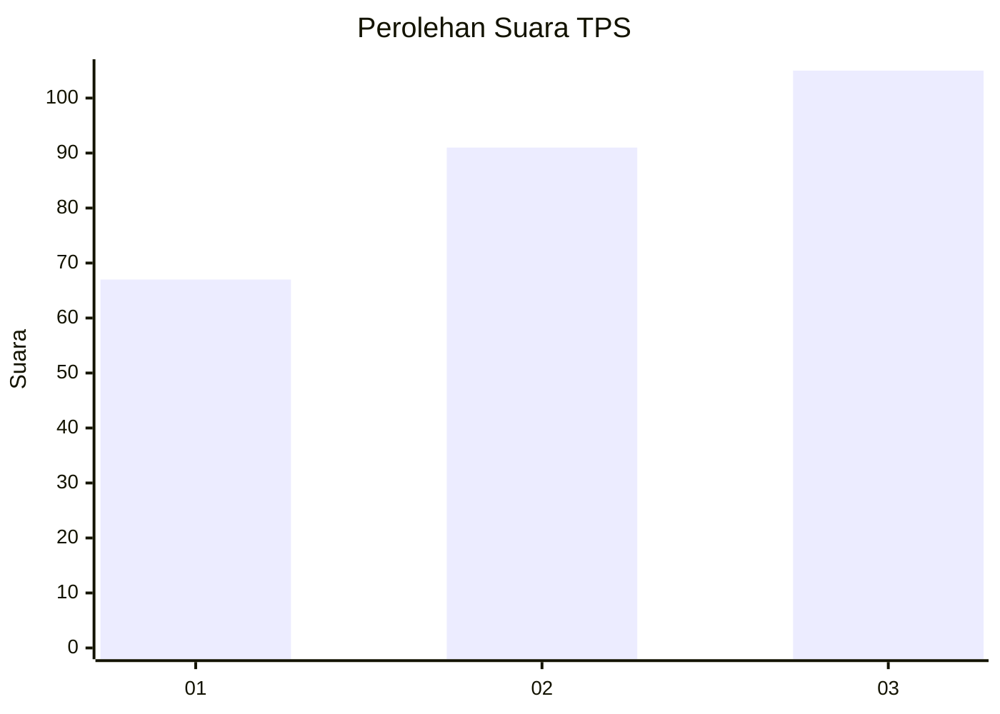
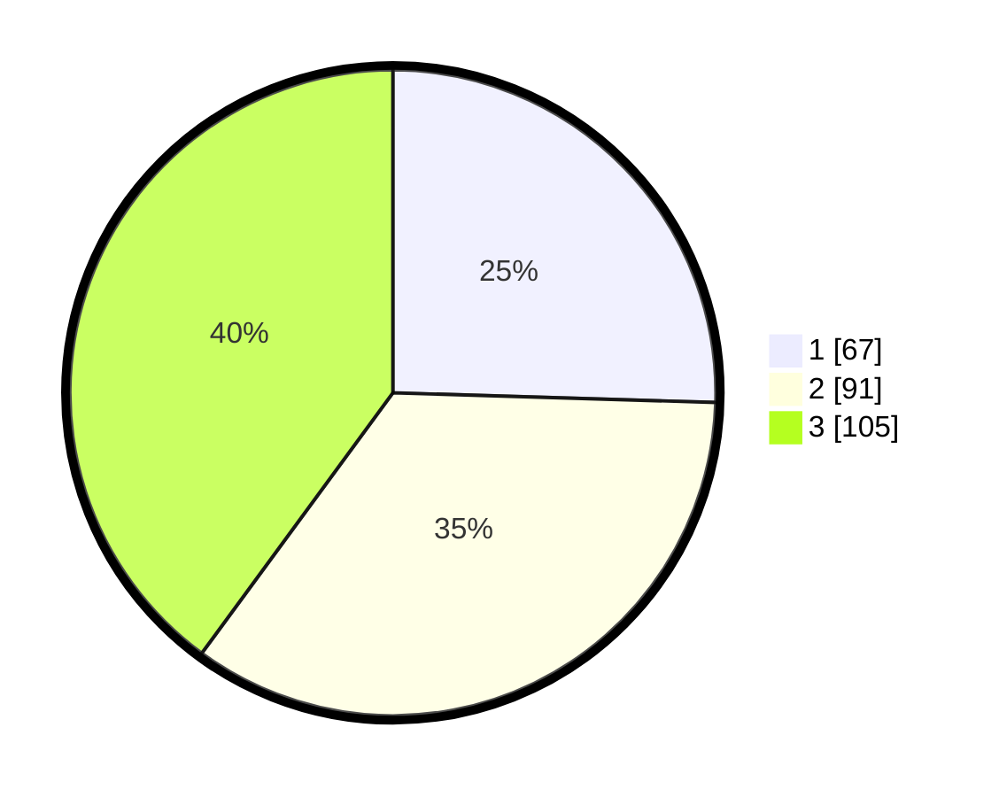

# Hasil

## Grafik

## Tabel

| No. | Nama Paslon    | Suara | Suara (raw) | Persentase |
|:--- |:-------------- | -----:| -----------:| ----------:|
| 1   | ANIES MUHAIMIN | 67    | [67][p-1]   | 25,48      |
| 2   | PRABOWO GIBRAN | 91    | [91][p-2]   | 34,60      |
| 3   | GANJAR MAHFUD  | 105   | [105][p-3]  | 39,92      |

[p-1]: https://github.com/gigit-pemilu/pemilu-2024/blob/main/pilpres/hitung-suara/sub/33-jawa-tengah/sub/74-kota-semarang/sub/11-banyumanik/sub/1011-sumurboto/sub/006-tps/sub/paslon-1.txt
[p-2]: https://github.com/gigit-pemilu/pemilu-2024/blob/main/pilpres/hitung-suara/sub/33-jawa-tengah/sub/74-kota-semarang/sub/11-banyumanik/sub/1011-sumurboto/sub/006-tps/sub/paslon-2.txt
[p-3]: https://github.com/gigit-pemilu/pemilu-2024/blob/main/pilpres/hitung-suara/sub/33-jawa-tengah/sub/74-kota-semarang/sub/11-banyumanik/sub/1011-sumurboto/sub/006-tps/sub/paslon-3.txt

## Foto C Plano

https://sirekap-obj-formc.kpu.go.id/394a/pemilu/ppwp/33/74/11/10/11/3374111011006-20240214-234006--9c8b5950-2fda-48c1-abeb-6d243b612713.jpg

https://sirekap-obj-formc.kpu.go.id/394a/pemilu/ppwp/33/74/11/10/11/3374111011006-20240214-234444--83ba2d1c-b567-4f30-abed-cbb4879745cf.jpg

https://sirekap-obj-formc.kpu.go.id/394a/pemilu/ppwp/33/74/11/10/11/3374111011006-20240215-001739--fb95099a-8c1c-4e87-ac65-fc7ff093ffd5.jpg

## Metadata

| Key        | Value               |
| ---------- | ------------------- |
| Time Stamp | 2024-02-16 14:30:33 |

