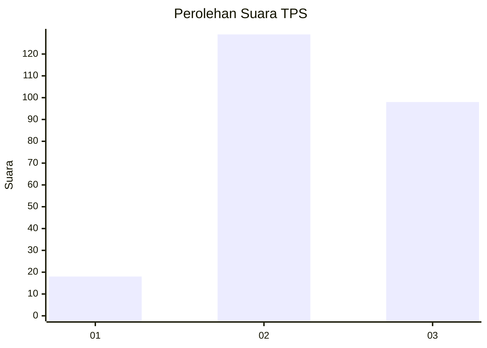
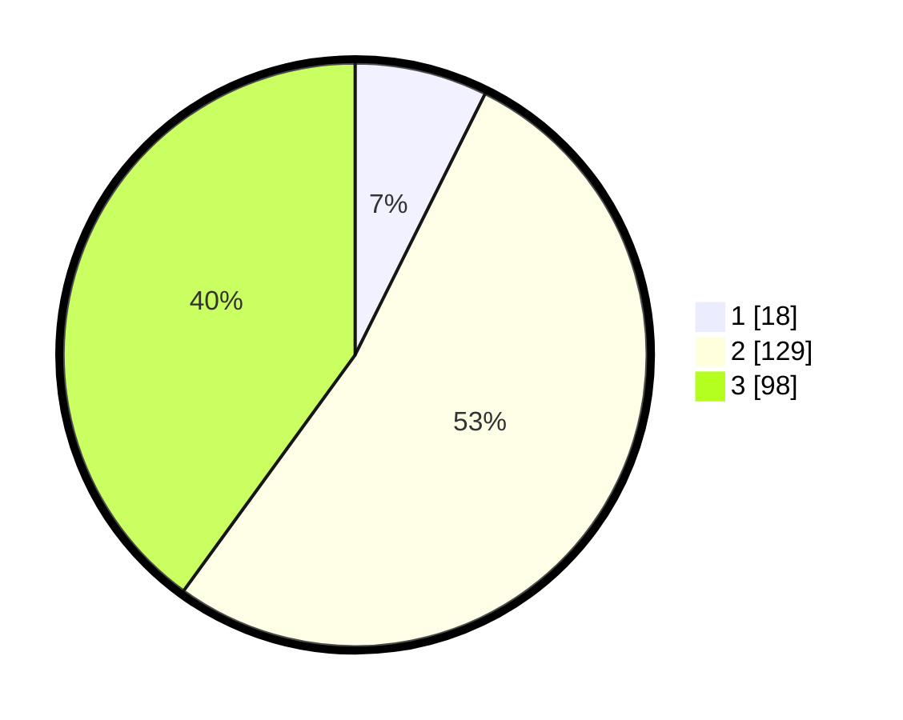

# Hasil

## Grafik

## Tabel

| No. | Nama Paslon    | Suara | Suara (raw) | Persentase |
|:--- |:-------------- | -----:| -----------:| ----------:|
| 1   | ANIES MUHAIMIN | 18    | [18][p-1]   | 7,35       |
| 2   | PRABOWO GIBRAN | 129   | [129][p-2]  | 52,65      |
| 3   | GANJAR MAHFUD  | 98    | [98][p-3]   | 40,00      |

[p-1]: https://github.com/gigit-pemilu/pemilu-2024-33-jawa-tengah/blob/main/pilpres/hitung-suara/sub/33-jawa-tengah/sub/74-kota-semarang/sub/12-gunungpati/sub/1001-pakintelan/sub/001-tps/sub/paslon-1.txt
[p-2]: https://github.com/gigit-pemilu/pemilu-2024-33-jawa-tengah/blob/main/pilpres/hitung-suara/sub/33-jawa-tengah/sub/74-kota-semarang/sub/12-gunungpati/sub/1001-pakintelan/sub/001-tps/sub/paslon-2.txt
[p-3]: https://github.com/gigit-pemilu/pemilu-2024-33-jawa-tengah/blob/main/pilpres/hitung-suara/sub/33-jawa-tengah/sub/74-kota-semarang/sub/12-gunungpati/sub/1001-pakintelan/sub/001-tps/sub/paslon-3.txt

## Foto C Plano

https://sirekap-obj-formc.kpu.go.id/15cc/pemilu/ppwp/33/74/12/10/01/3374121001001-20240214-224614--91847117-4d19-4412-aa73-f9b96255510e.jpg

https://sirekap-obj-formc.kpu.go.id/15cc/pemilu/ppwp/33/74/12/10/01/3374121001001-20240214-231258--1a91a0a3-b1ae-437f-8900-d0cc471d61a9.jpg

https://sirekap-obj-formc.kpu.go.id/15cc/pemilu/ppwp/33/74/12/10/01/3374121001001-20240214-231741--554e99ab-6d3b-45d8-9590-1ce33626be96.jpg

## Metadata

| Key        | Value               |
| ---------- | ------------------- |
| Time Stamp | 2024-02-16 11:00:29 |

