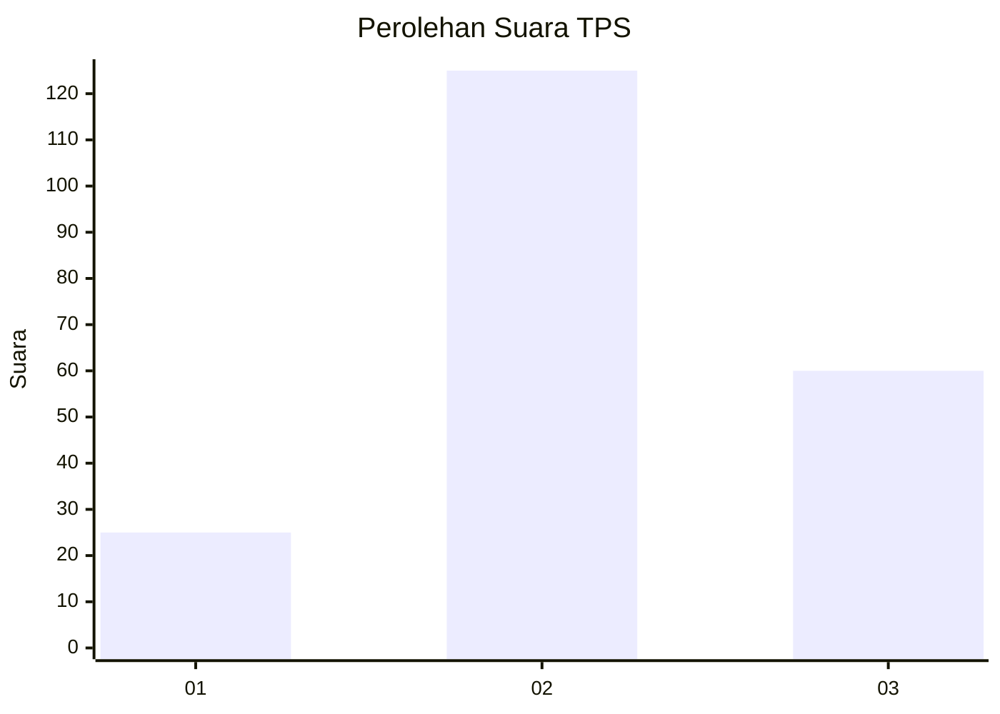
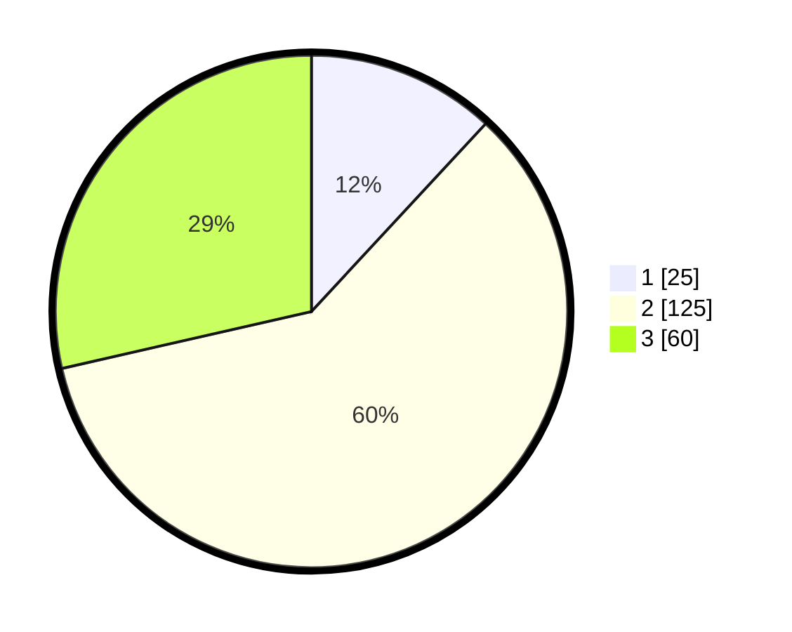

# Hasil

## Grafik

## Tabel

| No. | Nama Paslon    | Suara | Suara (raw) | Persentase |
|:--- |:-------------- | -----:| -----------:| ----------:|
| 1   | ANIES MUHAIMIN | 25    | [25][p-1]   | 11,90      |
| 2   | PRABOWO GIBRAN | 125   | [125][p-2]  | 59,52      |
| 3   | GANJAR MAHFUD  | 60    | [60][p-3]   | 28,57      |

[p-1]: https://github.com/gigit-pemilu/pemilu-2024-33-jawa-tengah/blob/main/pilpres/hitung-suara/sub/33-jawa-tengah/sub/74-kota-semarang/sub/12-gunungpati/sub/1001-pakintelan/sub/006-tps/sub/paslon-1.txt
[p-2]: https://github.com/gigit-pemilu/pemilu-2024-33-jawa-tengah/blob/main/pilpres/hitung-suara/sub/33-jawa-tengah/sub/74-kota-semarang/sub/12-gunungpati/sub/1001-pakintelan/sub/006-tps/sub/paslon-2.txt
[p-3]: https://github.com/gigit-pemilu/pemilu-2024-33-jawa-tengah/blob/main/pilpres/hitung-suara/sub/33-jawa-tengah/sub/74-kota-semarang/sub/12-gunungpati/sub/1001-pakintelan/sub/006-tps/sub/paslon-3.txt

## Foto C Plano

https://sirekap-obj-formc.kpu.go.id/4807/pemilu/ppwp/33/74/12/10/01/3374121001006-20240215-025530--bfe51c42-c7a3-44cd-b2c7-d5cd73a399a5.jpg

https://sirekap-obj-formc.kpu.go.id/4807/pemilu/ppwp/33/74/12/10/01/3374121001006-20240215-025547--3b4c8384-9d10-430c-acc4-3901e7a11352.jpg

https://sirekap-obj-formc.kpu.go.id/4807/pemilu/ppwp/33/74/12/10/01/3374121001006-20240215-025744--08c3fdea-f8a3-4053-92a9-c8251ac17a07.jpg

## Metadata

| Key        | Value               |
| ---------- | ------------------- |
| Time Stamp | 2024-02-16 11:00:29 |

