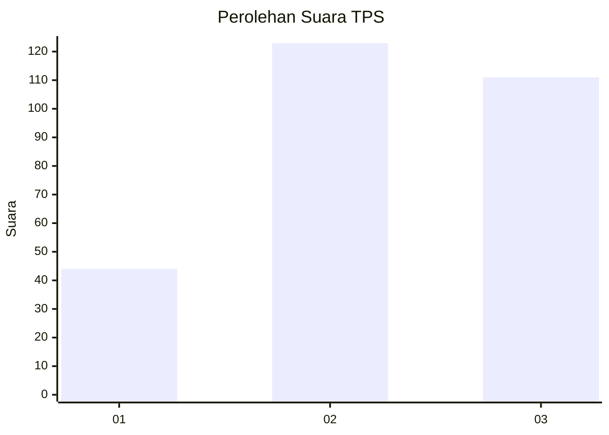
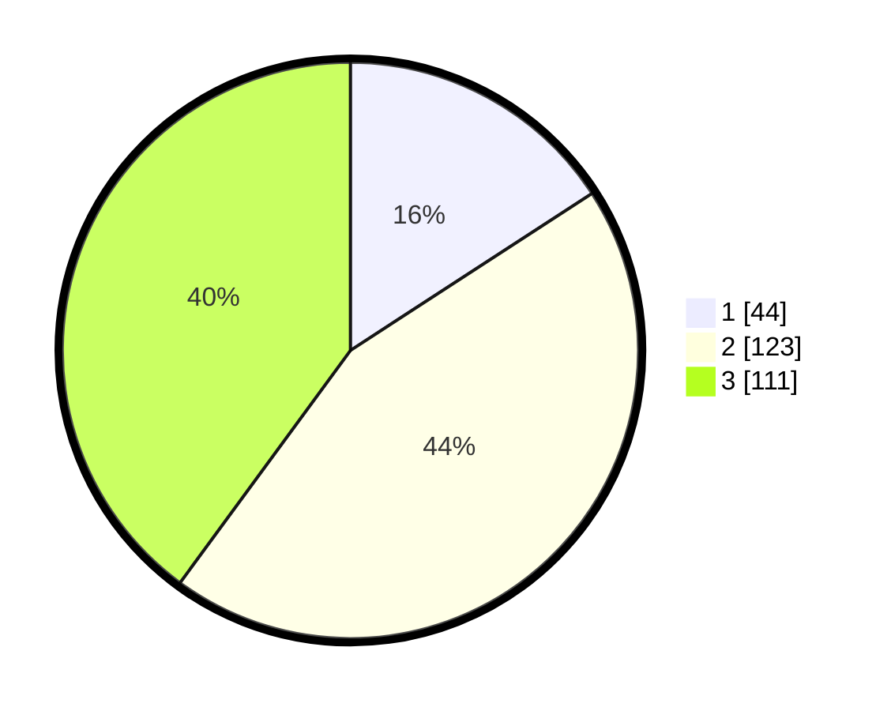

# Hasil

## Grafik

## Tabel

| No. | Nama Paslon    | Suara | Suara (raw) | Persentase |
|:--- |:-------------- | -----:| -----------:| ----------:|
| 1   | ANIES MUHAIMIN | 44    | [44][p-1]   | 15,83      |
| 2   | PRABOWO GIBRAN | 123   | [123][p-2]  | 44,24      |
| 3   | GANJAR MAHFUD  | 111   | [111][p-3]  | 39,93      |

[p-1]: https://github.com/gigit-pemilu/pemilu-2024/blob/main/pilpres/hitung-suara/sub/33-jawa-tengah/sub/74-kota-semarang/sub/12-gunungpati/sub/1001-pakintelan/sub/015-tps/sub/paslon-1.txt
[p-2]: https://github.com/gigit-pemilu/pemilu-2024/blob/main/pilpres/hitung-suara/sub/33-jawa-tengah/sub/74-kota-semarang/sub/12-gunungpati/sub/1001-pakintelan/sub/015-tps/sub/paslon-2.txt
[p-3]: https://github.com/gigit-pemilu/pemilu-2024/blob/main/pilpres/hitung-suara/sub/33-jawa-tengah/sub/74-kota-semarang/sub/12-gunungpati/sub/1001-pakintelan/sub/015-tps/sub/paslon-3.txt

## Foto C Plano

https://sirekap-obj-formc.kpu.go.id/2d22/pemilu/ppwp/33/74/12/10/01/3374121001015-20240215-005201--c6fcb855-9deb-4fc8-a462-790c6d00953c.jpg

https://sirekap-obj-formc.kpu.go.id/2d22/pemilu/ppwp/33/74/12/10/01/3374121001015-20240215-005231--202ad04d-9d0d-40a5-a196-2e6a15d86fd8.jpg

https://sirekap-obj-formc.kpu.go.id/2d22/pemilu/ppwp/33/74/12/10/01/3374121001015-20240215-005301--14f672ea-6188-4b8e-b231-69fdb22dce61.jpg

## Metadata

| Key        | Value               |
| ---------- | ------------------- |
| Time Stamp | 2024-02-16 12:51:22 |

