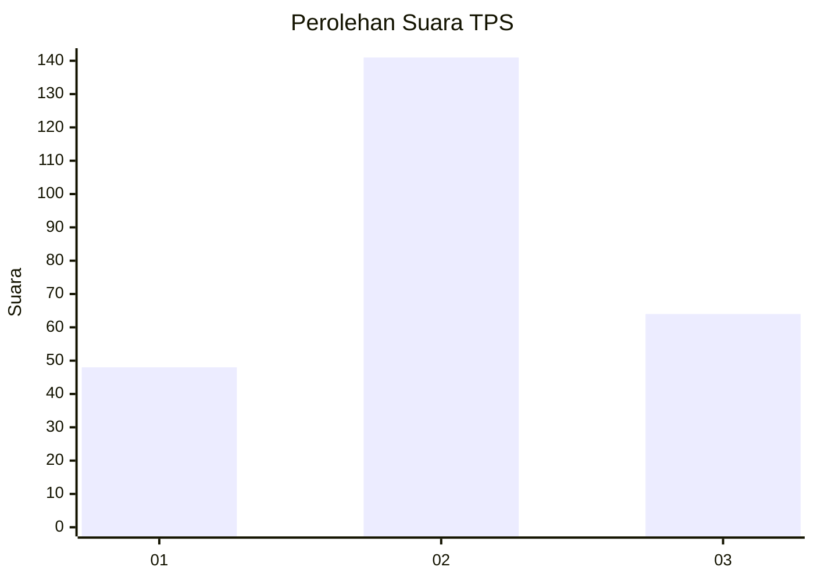
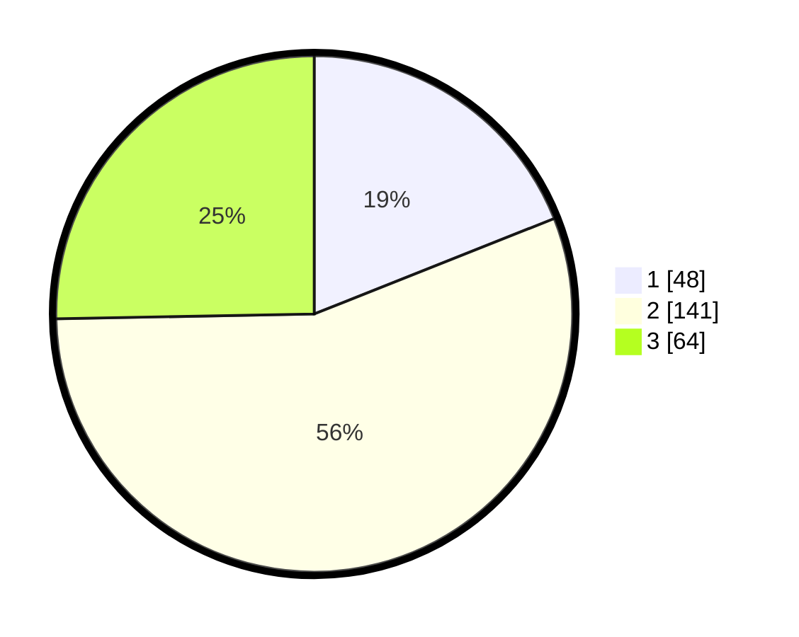

# Hasil

## Grafik

## Tabel

| No. | Nama Paslon    | Suara | Suara (raw) | Persentase |
|:--- |:-------------- | -----:| -----------:| ----------:|
| 1   | ANIES MUHAIMIN | 48    | [48][p-1]   | 18,97      |
| 2   | PRABOWO GIBRAN | 141   | [141][p-2]  | 55,73      |
| 3   | GANJAR MAHFUD  | 64    | [64][p-3]   | 25,30      |

[p-1]: https://github.com/gigit-pemilu/pemilu-2024-33-jawa-tengah/blob/main/pilpres/hitung-suara/sub/33-jawa-tengah/sub/74-kota-semarang/sub/12-gunungpati/sub/1004-gunungpati/sub/002-tps/sub/paslon-1.txt
[p-2]: https://github.com/gigit-pemilu/pemilu-2024-33-jawa-tengah/blob/main/pilpres/hitung-suara/sub/33-jawa-tengah/sub/74-kota-semarang/sub/12-gunungpati/sub/1004-gunungpati/sub/002-tps/sub/paslon-2.txt
[p-3]: https://github.com/gigit-pemilu/pemilu-2024-33-jawa-tengah/blob/main/pilpres/hitung-suara/sub/33-jawa-tengah/sub/74-kota-semarang/sub/12-gunungpati/sub/1004-gunungpati/sub/002-tps/sub/paslon-3.txt

## Foto C Plano

https://sirekap-obj-formc.kpu.go.id/499c/pemilu/ppwp/33/74/12/10/04/3374121004002-20240219-135033--2c506a0d-af22-4f6b-9678-a914f1cf4b6f.jpg

https://sirekap-obj-formc.kpu.go.id/499c/pemilu/ppwp/33/74/12/10/04/3374121004002-20240215-023057--5a19c48e-4c36-4d60-b1bb-68646670f7db.jpg

https://sirekap-obj-formc.kpu.go.id/499c/pemilu/ppwp/33/74/12/10/04/3374121004002-20240215-023220--40995da4-a84b-4640-8e8b-ca3cabb328eb.jpg

## Metadata

| Key        | Value               |
| ---------- | ------------------- |
| Time Stamp | 2024-02-19 14:00:00 |

