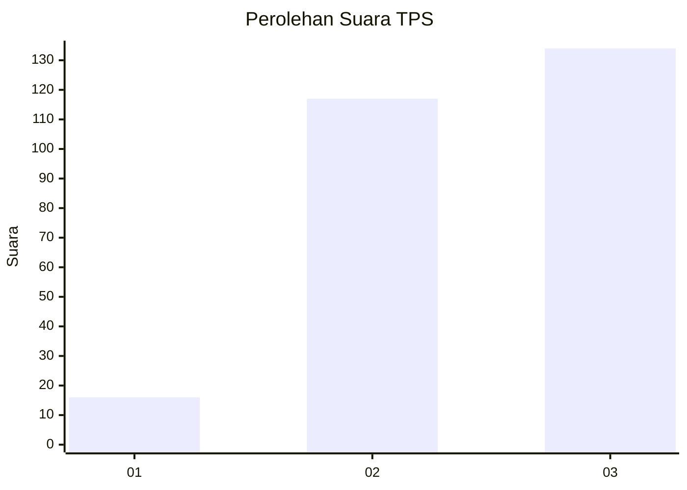
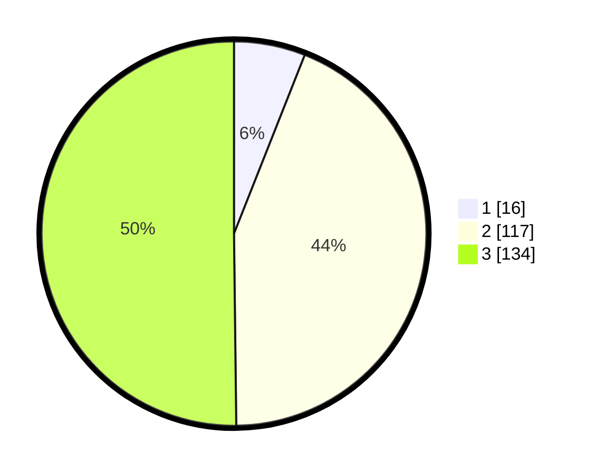

# Hasil

## Grafik

## Tabel

| No. | Nama Paslon    | Suara | Suara (raw) | Persentase |
|:--- |:-------------- | -----:| -----------:| ----------:|
| 1   | ANIES MUHAIMIN | 16    | [16][p-1]   | 5,99       |
| 2   | PRABOWO GIBRAN | 117   | [117][p-2]  | 43,82      |
| 3   | GANJAR MAHFUD  | 134   | [134][p-3]  | 50,19      |

[p-1]: https://github.com/gigit-pemilu/pemilu-2024/blob/main/pilpres/hitung-suara/sub/33-jawa-tengah/sub/74-kota-semarang/sub/12-gunungpati/sub/1004-gunungpati/sub/018-tps/sub/paslon-1.txt
[p-2]: https://github.com/gigit-pemilu/pemilu-2024/blob/main/pilpres/hitung-suara/sub/33-jawa-tengah/sub/74-kota-semarang/sub/12-gunungpati/sub/1004-gunungpati/sub/018-tps/sub/paslon-2.txt
[p-3]: https://github.com/gigit-pemilu/pemilu-2024/blob/main/pilpres/hitung-suara/sub/33-jawa-tengah/sub/74-kota-semarang/sub/12-gunungpati/sub/1004-gunungpati/sub/018-tps/sub/paslon-3.txt

## Foto C Plano

https://sirekap-obj-formc.kpu.go.id/3f88/pemilu/ppwp/33/74/12/10/04/3374121004018-20240219-163312--516b213e-ea61-46e1-97ba-8a0b4fb40f73.jpg

https://sirekap-obj-formc.kpu.go.id/3f88/pemilu/ppwp/33/74/12/10/04/3374121004018-20240219-163402--4ad3fd49-089a-4f34-a4b0-eb2e54e9e7df.jpg

https://sirekap-obj-formc.kpu.go.id/3f88/pemilu/ppwp/33/74/12/10/04/3374121004018-20240219-163527--7d7cd7e6-b3eb-4190-877e-8da94eb84a13.jpg

## Metadata

| Key        | Value               |
| ---------- | ------------------- |
| Time Stamp | 2024-02-24 22:31:28 |

