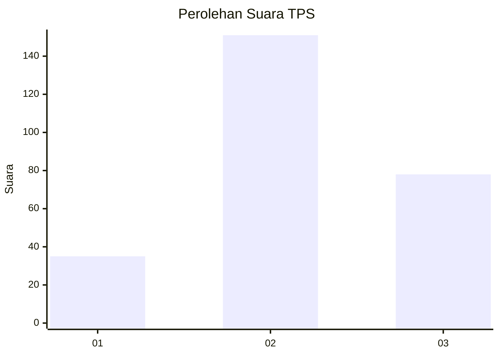
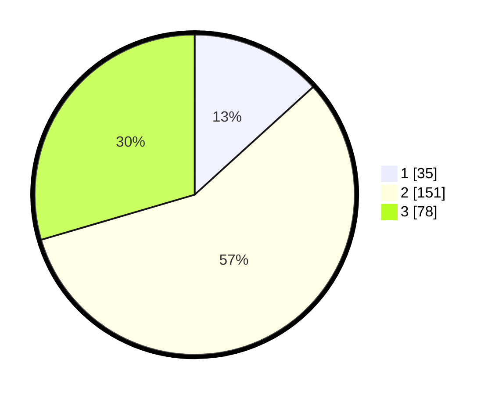

# Hasil

## Grafik

## Tabel

| No. | Nama Paslon    | Suara | Suara (raw) | Persentase |
|:--- |:-------------- | -----:| -----------:| ----------:|
| 1   | ANIES MUHAIMIN | 35    | [35][p-1]   | 13,26      |
| 2   | PRABOWO GIBRAN | 151   | [151][p-2]  | 57,20      |
| 3   | GANJAR MAHFUD  | 78    | [78][p-3]   | 29,55      |

[p-1]: https://github.com/gigit-pemilu/pemilu-2024/blob/main/pilpres/hitung-suara/sub/33-jawa-tengah/sub/74-kota-semarang/sub/12-gunungpati/sub/1005-nongkosawit/sub/014-tps/sub/paslon-1.txt
[p-2]: https://github.com/gigit-pemilu/pemilu-2024/blob/main/pilpres/hitung-suara/sub/33-jawa-tengah/sub/74-kota-semarang/sub/12-gunungpati/sub/1005-nongkosawit/sub/014-tps/sub/paslon-2.txt
[p-3]: https://github.com/gigit-pemilu/pemilu-2024/blob/main/pilpres/hitung-suara/sub/33-jawa-tengah/sub/74-kota-semarang/sub/12-gunungpati/sub/1005-nongkosawit/sub/014-tps/sub/paslon-3.txt

## Foto C Plano

https://sirekap-obj-formc.kpu.go.id/54cf/pemilu/ppwp/33/74/12/10/05/3374121005014-20240214-214453--654bfb17-475c-4169-a977-001904bd812f.jpg

https://sirekap-obj-formc.kpu.go.id/54cf/pemilu/ppwp/33/74/12/10/05/3374121005014-20240214-214637--bc6ef229-eb62-4661-a806-67517120b81b.jpg

https://sirekap-obj-formc.kpu.go.id/54cf/pemilu/ppwp/33/74/12/10/05/3374121005014-20240214-214753--f009a100-15bd-42a1-a569-dc80814ed57e.jpg

## Metadata

| Key        | Value               |
| ---------- | ------------------- |
| Time Stamp | 2024-02-16 12:51:22 |

