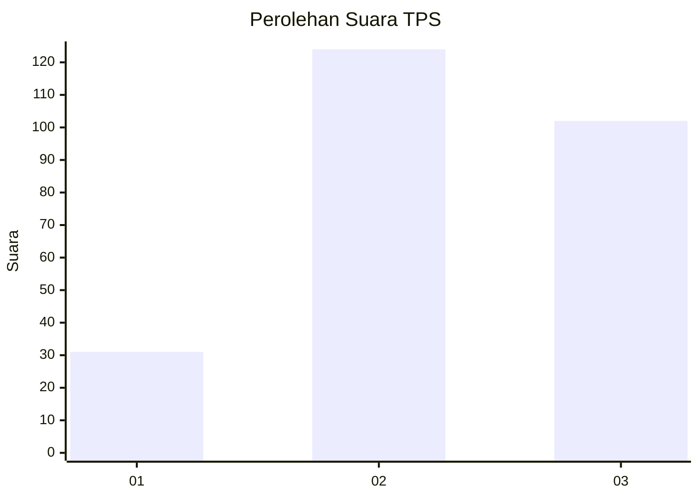
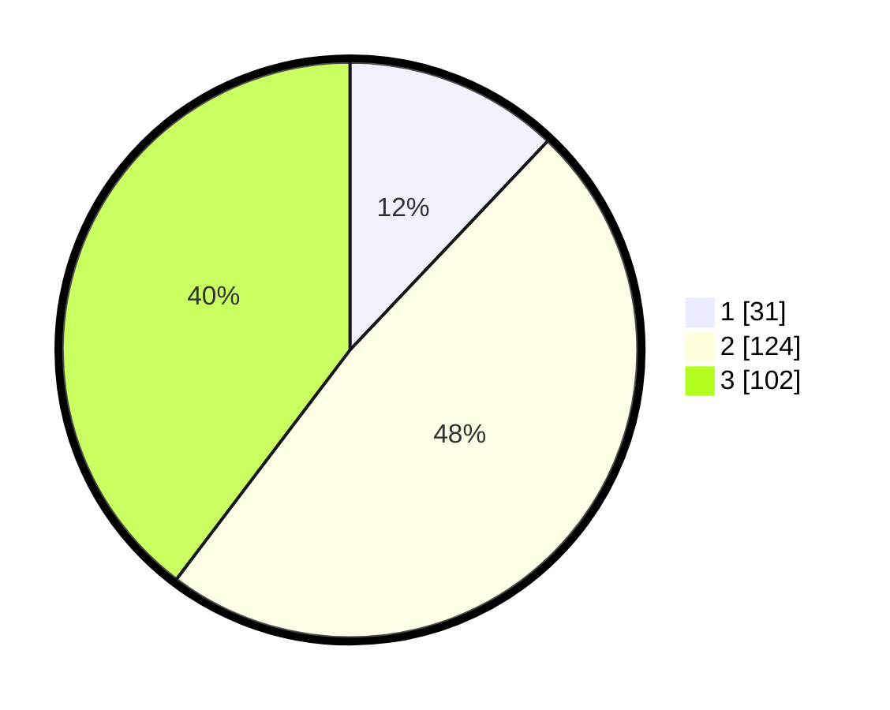

# Hasil

## Grafik

## Tabel

| No. | Nama Paslon    | Suara | Suara (raw) | Persentase |
|:--- |:-------------- | -----:| -----------:| ----------:|
| 1   | ANIES MUHAIMIN | 31    | [31][p-1]   | 12,06      |
| 2   | PRABOWO GIBRAN | 124   | [124][p-2]  | 48,25      |
| 3   | GANJAR MAHFUD  | 102   | [102][p-3]  | 39,69      |

[p-1]: https://github.com/gigit-pemilu/pemilu-2024/blob/main/pilpres/hitung-suara/sub/33-jawa-tengah/sub/74-kota-semarang/sub/12-gunungpati/sub/1006-pongangan/sub/003-tps/sub/paslon-1.txt
[p-2]: https://github.com/gigit-pemilu/pemilu-2024/blob/main/pilpres/hitung-suara/sub/33-jawa-tengah/sub/74-kota-semarang/sub/12-gunungpati/sub/1006-pongangan/sub/003-tps/sub/paslon-2.txt
[p-3]: https://github.com/gigit-pemilu/pemilu-2024/blob/main/pilpres/hitung-suara/sub/33-jawa-tengah/sub/74-kota-semarang/sub/12-gunungpati/sub/1006-pongangan/sub/003-tps/sub/paslon-3.txt

## Foto C Plano

https://sirekap-obj-formc.kpu.go.id/eb53/pemilu/ppwp/33/74/12/10/06/3374121006003-20240214-235006--dfb6b59d-0082-4a4c-8bf0-2a31a11aefef.jpg

https://sirekap-obj-formc.kpu.go.id/eb53/pemilu/ppwp/33/74/12/10/06/3374121006003-20240214-235125--1c74079f-d199-42fd-a817-d97b6c92f98f.jpg

https://sirekap-obj-formc.kpu.go.id/eb53/pemilu/ppwp/33/74/12/10/06/3374121006003-20240214-235239--6a98f94d-ef87-4380-a5c6-b8f20cd2dfbe.jpg

## Metadata

| Key        | Value               |
| ---------- | ------------------- |
| Time Stamp | 2024-02-16 12:51:22 |

