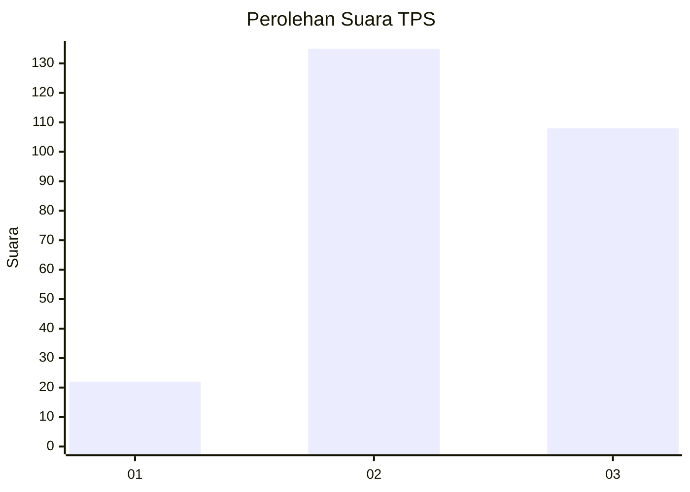
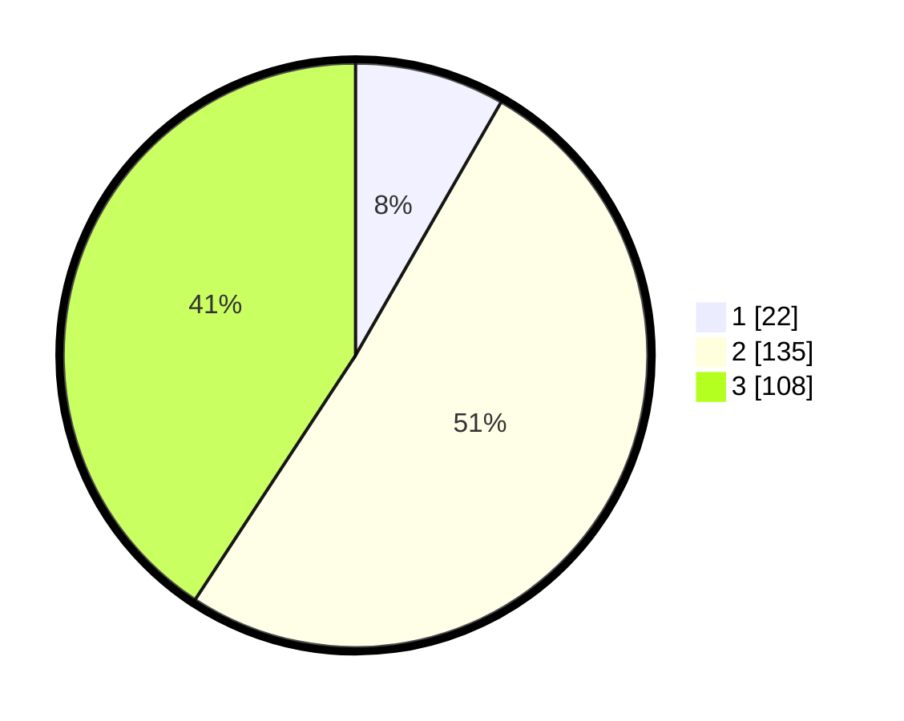

# Hasil

## Grafik

## Tabel

| No. | Nama Paslon    | Suara | Suara (raw) | Persentase |
|:--- |:-------------- | -----:| -----------:| ----------:|
| 1   | ANIES MUHAIMIN | 22    | [22][p-1]   | 8,30       |
| 2   | PRABOWO GIBRAN | 135   | [135][p-2]  | 50,94      |
| 3   | GANJAR MAHFUD  | 108   | [108][p-3]  | 40,75      |

[p-1]: https://github.com/gigit-pemilu/pemilu-2024-33-jawa-tengah/blob/main/pilpres/hitung-suara/sub/33-jawa-tengah/sub/74-kota-semarang/sub/12-gunungpati/sub/1007-ngijo/sub/004-tps/sub/paslon-1.txt
[p-2]: https://github.com/gigit-pemilu/pemilu-2024-33-jawa-tengah/blob/main/pilpres/hitung-suara/sub/33-jawa-tengah/sub/74-kota-semarang/sub/12-gunungpati/sub/1007-ngijo/sub/004-tps/sub/paslon-2.txt
[p-3]: https://github.com/gigit-pemilu/pemilu-2024-33-jawa-tengah/blob/main/pilpres/hitung-suara/sub/33-jawa-tengah/sub/74-kota-semarang/sub/12-gunungpati/sub/1007-ngijo/sub/004-tps/sub/paslon-3.txt

## Foto C Plano

https://sirekap-obj-formc.kpu.go.id/1739/pemilu/ppwp/33/74/12/10/07/3374121007004-20240214-184821--45e6bd09-8002-41de-9b89-371502818e39.jpg

https://sirekap-obj-formc.kpu.go.id/1739/pemilu/ppwp/33/74/12/10/07/3374121007004-20240214-184821--ad0b15f2-0438-439a-8a31-5e50c76901cb.jpg

https://sirekap-obj-formc.kpu.go.id/1739/pemilu/ppwp/33/74/12/10/07/3374121007004-20240214-184824--9d270513-7c69-4d14-9304-c016ce906d6b.jpg

## Metadata

| Key        | Value               |
| ---------- | ------------------- |
| Time Stamp | 2024-02-16 12:51:22 |

