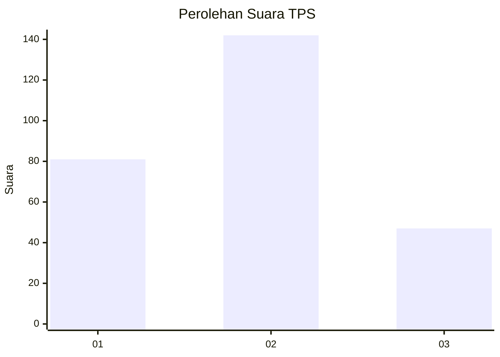
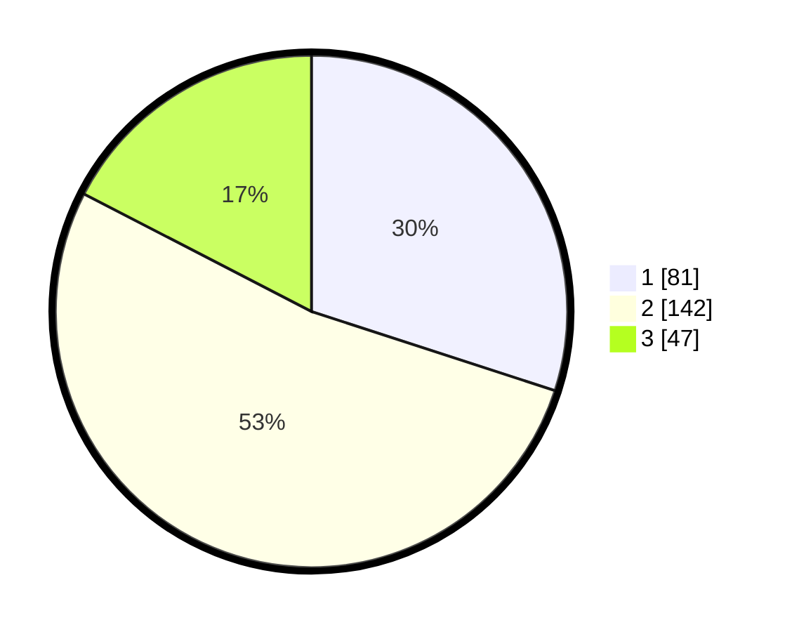

# Hasil

## Grafik

## Tabel

| No. | Nama Paslon    | Suara | Suara (raw) | Persentase |
|:--- |:-------------- | -----:| -----------:| ----------:|
| 1   | ANIES MUHAIMIN | 81    | [81][p-1]   | 30,00      |
| 2   | PRABOWO GIBRAN | 142   | [142][p-2]  | 52,59      |
| 3   | GANJAR MAHFUD  | 47    | [47][p-3]   | 17,41      |

[p-1]: https://github.com/gigit-pemilu/pemilu-2024-33-jawa-tengah/blob/main/pilpres/hitung-suara/sub/33-jawa-tengah/sub/74-kota-semarang/sub/12-gunungpati/sub/1008-patemon/sub/009-tps/sub/paslon-1.txt
[p-2]: https://github.com/gigit-pemilu/pemilu-2024-33-jawa-tengah/blob/main/pilpres/hitung-suara/sub/33-jawa-tengah/sub/74-kota-semarang/sub/12-gunungpati/sub/1008-patemon/sub/009-tps/sub/paslon-2.txt
[p-3]: https://github.com/gigit-pemilu/pemilu-2024-33-jawa-tengah/blob/main/pilpres/hitung-suara/sub/33-jawa-tengah/sub/74-kota-semarang/sub/12-gunungpati/sub/1008-patemon/sub/009-tps/sub/paslon-3.txt

## Foto C Plano

https://sirekap-obj-formc.kpu.go.id/d463/pemilu/ppwp/33/74/12/10/08/3374121008009-20240214-234154--a8c0bbac-c767-401c-acf1-69805a4fd9b4.jpg

https://sirekap-obj-formc.kpu.go.id/d463/pemilu/ppwp/33/74/12/10/08/3374121008009-20240214-234319--d53cb63e-9159-43f1-a6e9-8ba5e05e71d9.jpg

https://sirekap-obj-formc.kpu.go.id/d463/pemilu/ppwp/33/74/12/10/08/3374121008009-20240214-234424--19046ee8-6d72-4fb0-a42d-56cf20f65b71.jpg

## Metadata

| Key        | Value               |
| ---------- | ------------------- |
| Time Stamp | 2024-02-16 12:51:22 |

