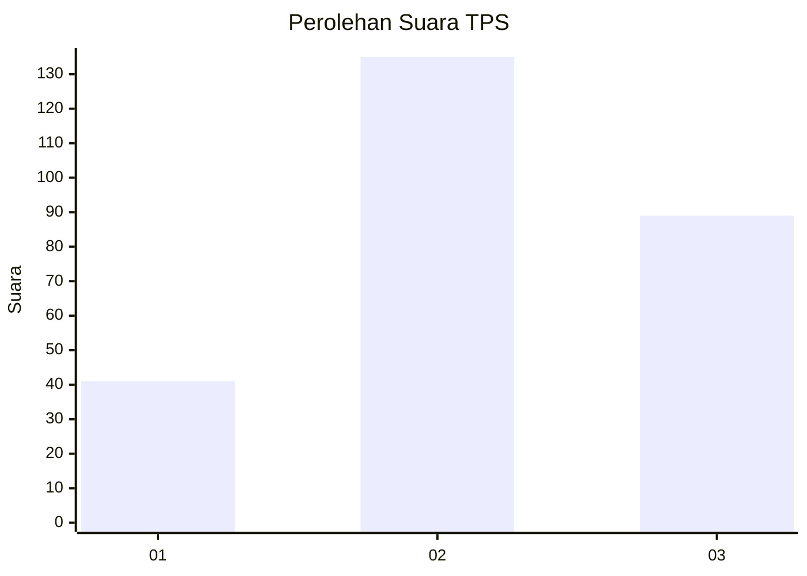
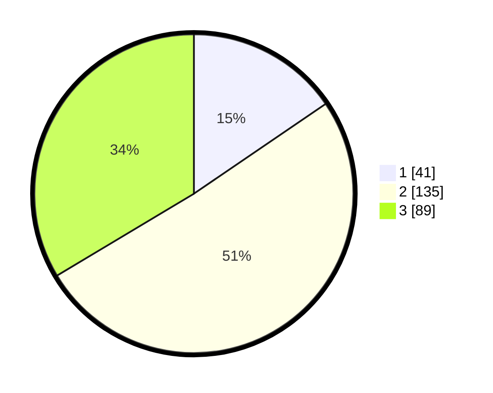

# Hasil

## Grafik

## Tabel

| No. | Nama Paslon    | Suara | Suara (raw) | Persentase |
|:--- |:-------------- | -----:| -----------:| ----------:|
| 1   | ANIES MUHAIMIN | 41    | [41][p-1]   | 15,47      |
| 2   | PRABOWO GIBRAN | 135   | [135][p-2]  | 50,94      |
| 3   | GANJAR MAHFUD  | 89    | [89][p-3]   | 33,58      |

[p-1]: https://github.com/gigit-pemilu/pemilu-2024-33-jawa-tengah/blob/main/pilpres/hitung-suara/sub/33-jawa-tengah/sub/74-kota-semarang/sub/12-gunungpati/sub/1008-patemon/sub/014-tps/sub/paslon-1.txt
[p-2]: https://github.com/gigit-pemilu/pemilu-2024-33-jawa-tengah/blob/main/pilpres/hitung-suara/sub/33-jawa-tengah/sub/74-kota-semarang/sub/12-gunungpati/sub/1008-patemon/sub/014-tps/sub/paslon-2.txt
[p-3]: https://github.com/gigit-pemilu/pemilu-2024-33-jawa-tengah/blob/main/pilpres/hitung-suara/sub/33-jawa-tengah/sub/74-kota-semarang/sub/12-gunungpati/sub/1008-patemon/sub/014-tps/sub/paslon-3.txt

## Foto C Plano

https://sirekap-obj-formc.kpu.go.id/deeb/pemilu/ppwp/33/74/12/10/08/3374121008014-20240214-212729--5588fb7a-1686-49b7-a96e-272b46aa47ff.jpg

https://sirekap-obj-formc.kpu.go.id/deeb/pemilu/ppwp/33/74/12/10/08/3374121008014-20240214-212741--224fea9b-8e62-40de-ac7f-91cc13dd8413.jpg

https://sirekap-obj-formc.kpu.go.id/deeb/pemilu/ppwp/33/74/12/10/08/3374121008014-20240214-212746--44fe1054-4482-4f03-98ab-a23c44f7ddec.jpg

## Metadata

| Key        | Value               |
| ---------- | ------------------- |
| Time Stamp | 2024-02-16 12:51:22 |

