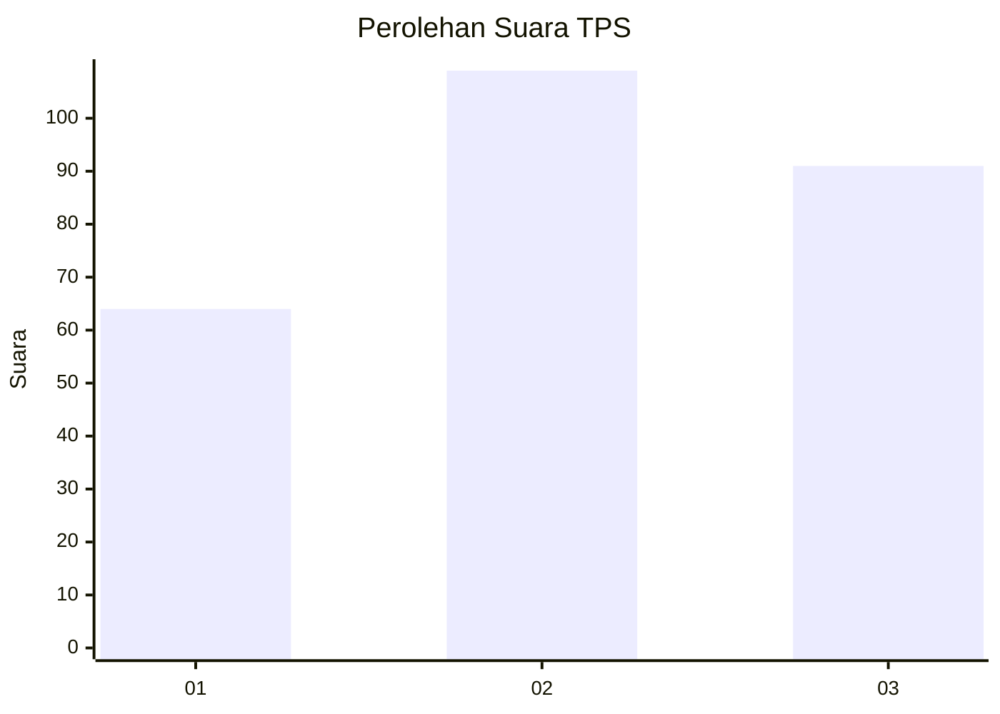
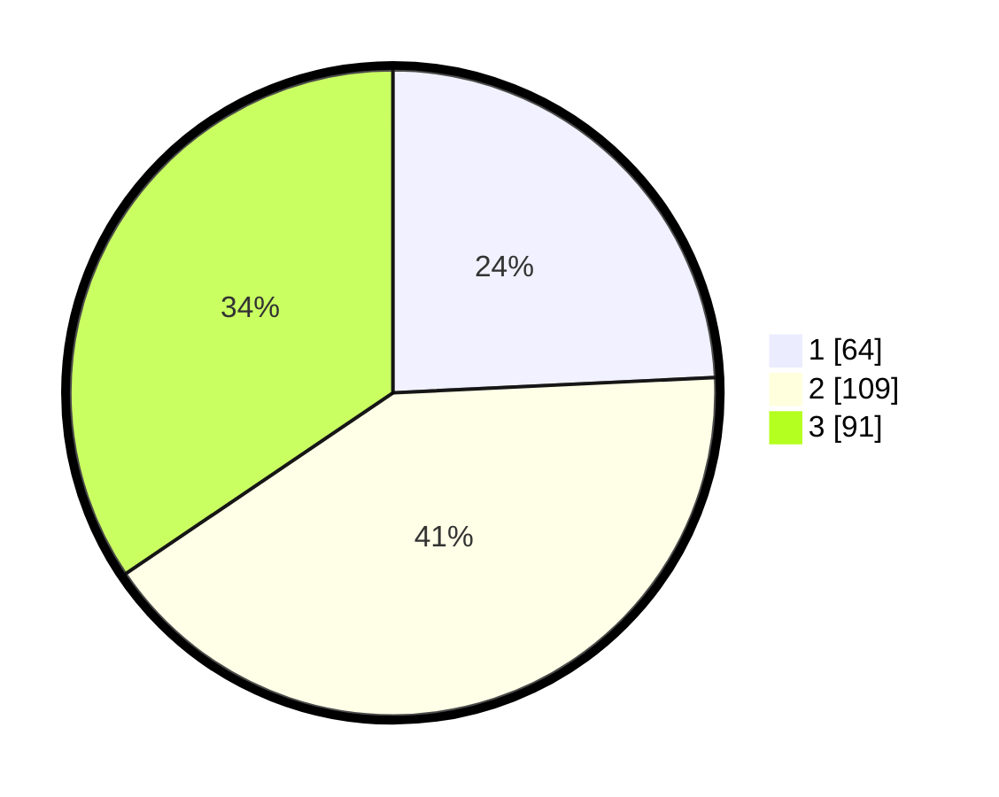

# Hasil

## Grafik

## Tabel

| No. | Nama Paslon    | Suara | Suara (raw) | Persentase |
|:--- |:-------------- | -----:| -----------:| ----------:|
| 1   | ANIES MUHAIMIN | 64    | [64][p-1]   | 24,24      |
| 2   | PRABOWO GIBRAN | 109   | [109][p-2]  | 41,29      |
| 3   | GANJAR MAHFUD  | 91    | [91][p-3]   | 34,47      |

[p-1]: https://github.com/gigit-pemilu/pemilu-2024/blob/main/pilpres/hitung-suara/sub/33-jawa-tengah/sub/74-kota-semarang/sub/12-gunungpati/sub/1009-sekaran/sub/013-tps/sub/paslon-1.txt
[p-2]: https://github.com/gigit-pemilu/pemilu-2024/blob/main/pilpres/hitung-suara/sub/33-jawa-tengah/sub/74-kota-semarang/sub/12-gunungpati/sub/1009-sekaran/sub/013-tps/sub/paslon-2.txt
[p-3]: https://github.com/gigit-pemilu/pemilu-2024/blob/main/pilpres/hitung-suara/sub/33-jawa-tengah/sub/74-kota-semarang/sub/12-gunungpati/sub/1009-sekaran/sub/013-tps/sub/paslon-3.txt

## Foto C Plano

https://sirekap-obj-formc.kpu.go.id/1e20/pemilu/ppwp/33/74/12/10/09/3374121009013-20240214-210128--b6fd7231-832d-47ed-bfb2-e2bc347bb5bb.jpg

https://sirekap-obj-formc.kpu.go.id/1e20/pemilu/ppwp/33/74/12/10/09/3374121009013-20240214-210328--d79d961a-4ddb-4164-be9b-00de1fcb9d7b.jpg

https://sirekap-obj-formc.kpu.go.id/1e20/pemilu/ppwp/33/74/12/10/09/3374121009013-20240214-210538--5acf5556-c530-4669-bf0a-6bcd6d1dbacb.jpg

## Metadata

| Key        | Value               |
| ---------- | ------------------- |
| Time Stamp | 2024-02-16 12:51:22 |

