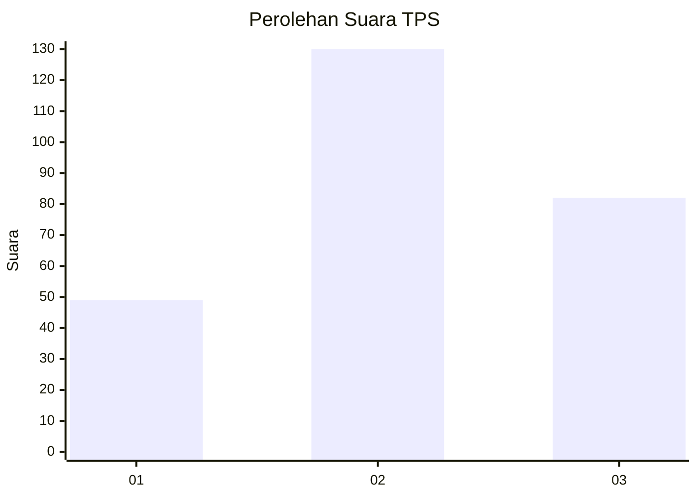
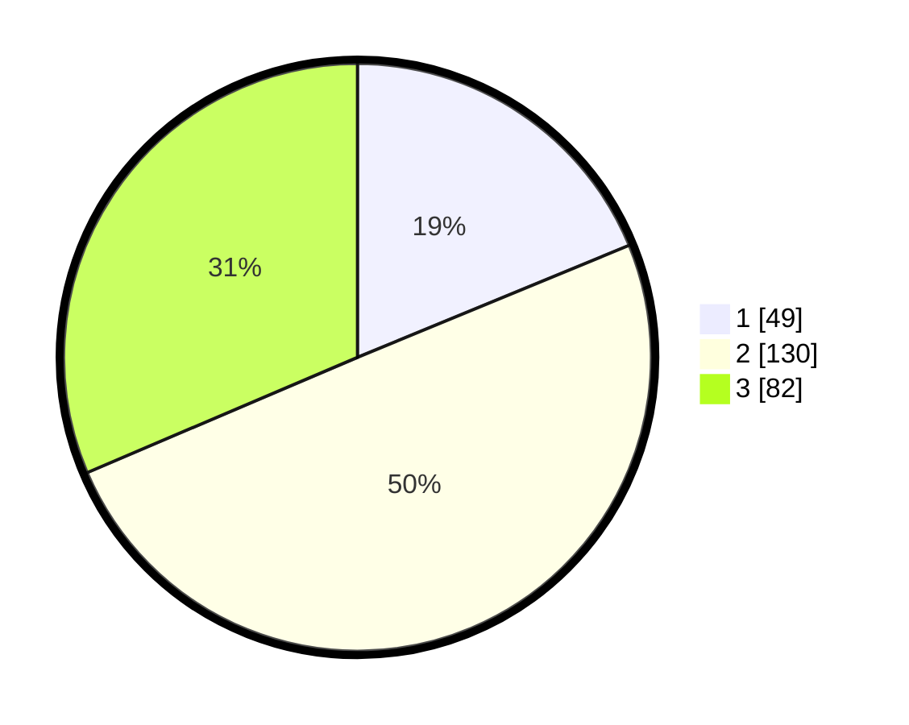

# Hasil

## Grafik

## Tabel

| No. | Nama Paslon    | Suara | Suara (raw) | Persentase |
|:--- |:-------------- | -----:| -----------:| ----------:|
| 1   | ANIES MUHAIMIN | 49    | [49][p-1]   | 18,77      |
| 2   | PRABOWO GIBRAN | 130   | [130][p-2]  | 49,81      |
| 3   | GANJAR MAHFUD  | 82    | [82][p-3]   | 31,42      |

[p-1]: https://github.com/gigit-pemilu/pemilu-2024-33-jawa-tengah/blob/main/pilpres/hitung-suara/sub/33-jawa-tengah/sub/74-kota-semarang/sub/12-gunungpati/sub/1009-sekaran/sub/014-tps/sub/paslon-1.txt
[p-2]: https://github.com/gigit-pemilu/pemilu-2024-33-jawa-tengah/blob/main/pilpres/hitung-suara/sub/33-jawa-tengah/sub/74-kota-semarang/sub/12-gunungpati/sub/1009-sekaran/sub/014-tps/sub/paslon-2.txt
[p-3]: https://github.com/gigit-pemilu/pemilu-2024-33-jawa-tengah/blob/main/pilpres/hitung-suara/sub/33-jawa-tengah/sub/74-kota-semarang/sub/12-gunungpati/sub/1009-sekaran/sub/014-tps/sub/paslon-3.txt

## Foto C Plano

https://sirekap-obj-formc.kpu.go.id/0d70/pemilu/ppwp/33/74/12/10/09/3374121009014-20240214-225713--ac9b78d3-f69f-473a-a9b4-7d968ed604b8.jpg

https://sirekap-obj-formc.kpu.go.id/0d70/pemilu/ppwp/33/74/12/10/09/3374121009014-20240214-225726--c71c54da-7106-49e5-a219-26d86931f251.jpg

https://sirekap-obj-formc.kpu.go.id/0d70/pemilu/ppwp/33/74/12/10/09/3374121009014-20240214-225743--c00f817a-9fd0-45bb-ad4a-d52ef15f4500.jpg

## Metadata

| Key        | Value               |
| ---------- | ------------------- |
| Time Stamp | 2024-02-16 16:25:10 |

