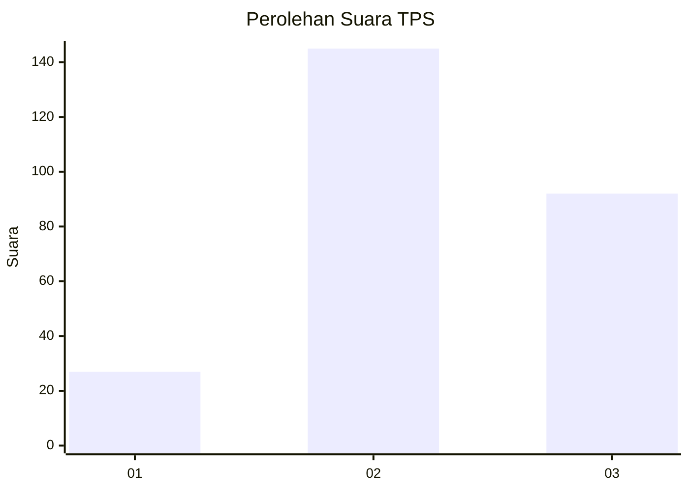
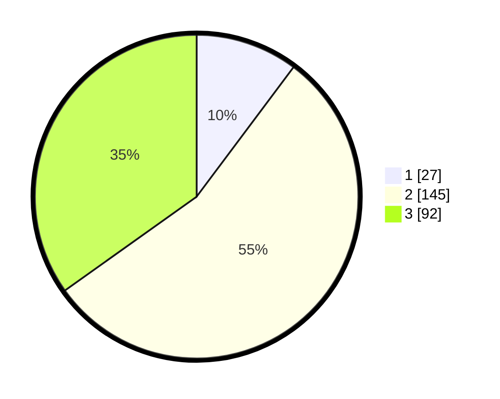

# Hasil

## Grafik

## Tabel

| No. | Nama Paslon    | Suara | Suara (raw) | Persentase |
|:--- |:-------------- | -----:| -----------:| ----------:|
| 1   | ANIES MUHAIMIN | 27    | [27][p-1]   | 10,23      |
| 2   | PRABOWO GIBRAN | 145   | [145][p-2]  | 54,92      |
| 3   | GANJAR MAHFUD  | 92    | [92][p-3]   | 34,85      |

[p-1]: https://github.com/gigit-pemilu/pemilu-2024/blob/main/pilpres/hitung-suara/sub/33-jawa-tengah/sub/74-kota-semarang/sub/12-gunungpati/sub/1009-sekaran/sub/016-tps/sub/paslon-1.txt
[p-2]: https://github.com/gigit-pemilu/pemilu-2024/blob/main/pilpres/hitung-suara/sub/33-jawa-tengah/sub/74-kota-semarang/sub/12-gunungpati/sub/1009-sekaran/sub/016-tps/sub/paslon-2.txt
[p-3]: https://github.com/gigit-pemilu/pemilu-2024/blob/main/pilpres/hitung-suara/sub/33-jawa-tengah/sub/74-kota-semarang/sub/12-gunungpati/sub/1009-sekaran/sub/016-tps/sub/paslon-3.txt

## Foto C Plano

https://sirekap-obj-formc.kpu.go.id/a150/pemilu/ppwp/33/74/12/10/09/3374121009016-20240215-004618--d83433f2-7401-4283-bfae-39750b87ece2.jpg

https://sirekap-obj-formc.kpu.go.id/a150/pemilu/ppwp/33/74/12/10/09/3374121009016-20240215-004650--dc124538-2185-4678-a890-319eba7f7978.jpg

https://sirekap-obj-formc.kpu.go.id/a150/pemilu/ppwp/33/74/12/10/09/3374121009016-20240215-004718--fb9cb105-3d68-4410-880a-31600d88f631.jpg

## Metadata

| Key        | Value               |
| ---------- | ------------------- |
| Time Stamp | 2024-02-16 12:51:22 |

