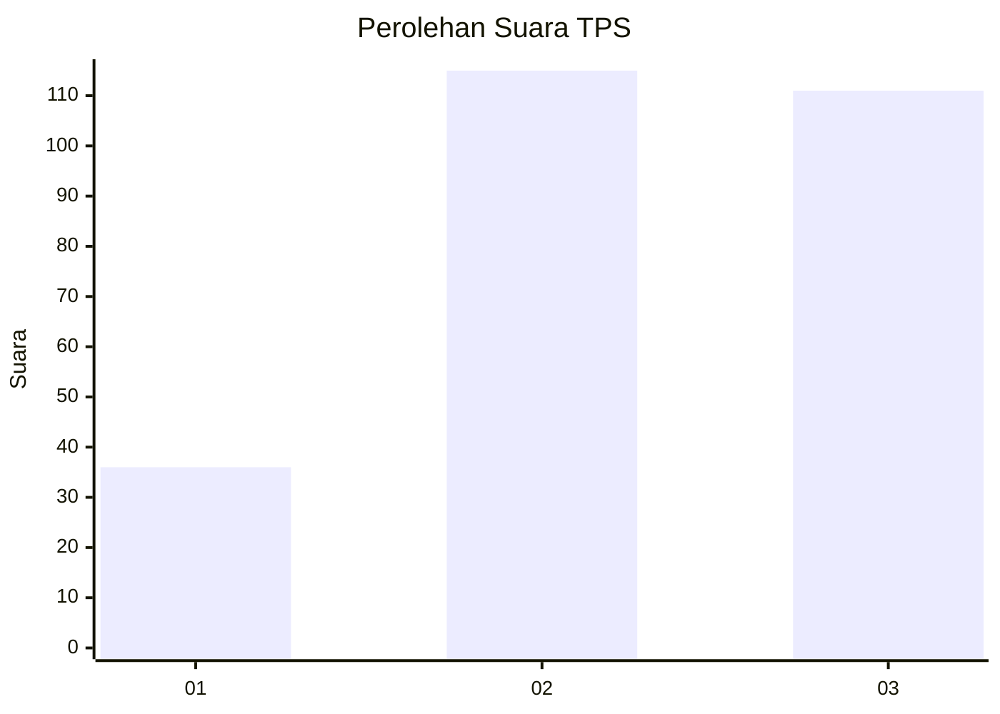
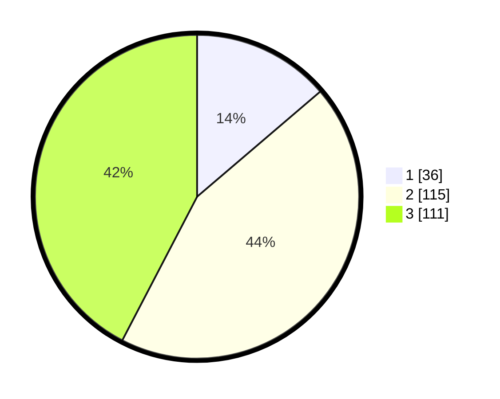

# Hasil

## Grafik

## Tabel

| No. | Nama Paslon    | Suara | Suara (raw) | Persentase |
|:--- |:-------------- | -----:| -----------:| ----------:|
| 1   | ANIES MUHAIMIN | 36    | [36][p-1]   | 13,74      |
| 2   | PRABOWO GIBRAN | 115   | [115][p-2]  | 43,89      |
| 3   | GANJAR MAHFUD  | 111   | [111][p-3]  | 42,37      |

[p-1]: https://github.com/gigit-pemilu/pemilu-2024/blob/main/pilpres/hitung-suara/sub/33-jawa-tengah/sub/74-kota-semarang/sub/12-gunungpati/sub/1010-sukorejo/sub/002-tps/sub/paslon-1.txt
[p-2]: https://github.com/gigit-pemilu/pemilu-2024/blob/main/pilpres/hitung-suara/sub/33-jawa-tengah/sub/74-kota-semarang/sub/12-gunungpati/sub/1010-sukorejo/sub/002-tps/sub/paslon-2.txt
[p-3]: https://github.com/gigit-pemilu/pemilu-2024/blob/main/pilpres/hitung-suara/sub/33-jawa-tengah/sub/74-kota-semarang/sub/12-gunungpati/sub/1010-sukorejo/sub/002-tps/sub/paslon-3.txt

## Foto C Plano

https://sirekap-obj-formc.kpu.go.id/740c/pemilu/ppwp/33/74/12/10/10/3374121010002-20240219-185843--3a63f4ec-5d99-4467-9308-acc7014ec514.jpg

https://sirekap-obj-formc.kpu.go.id/740c/pemilu/ppwp/33/74/12/10/10/3374121010002-20240219-185954--363a6e0e-ecf7-4629-9382-7e79cee40234.jpg

https://sirekap-obj-formc.kpu.go.id/740c/pemilu/ppwp/33/74/12/10/10/3374121010002-20240219-190050--0fb2e77f-7e84-454f-9b16-abc3ac2ddc2b.jpg

## Metadata

| Key        | Value               |
| ---------- | ------------------- |
| Time Stamp | 2024-02-22 15:00:00 |

