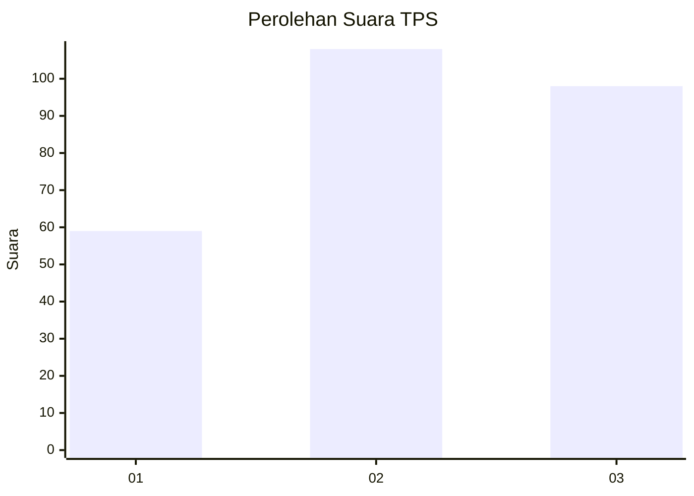
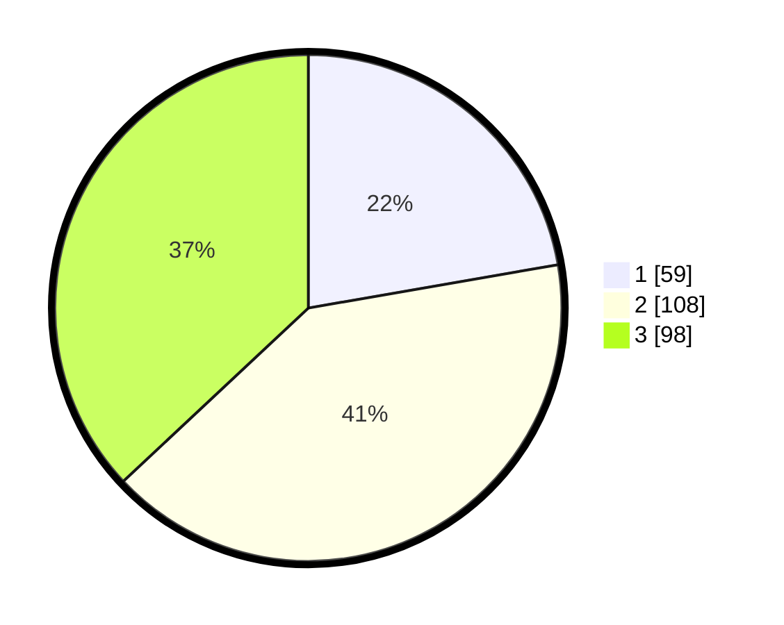

# Hasil

## Grafik

## Tabel

| No. | Nama Paslon    | Suara | Suara (raw) | Persentase |
|:--- |:-------------- | -----:| -----------:| ----------:|
| 1   | ANIES MUHAIMIN | 59    | [59][p-1]   | 22,26      |
| 2   | PRABOWO GIBRAN | 108   | [108][p-2]  | 40,75      |
| 3   | GANJAR MAHFUD  | 98    | [98][p-3]   | 36,98      |

[p-1]: https://github.com/gigit-pemilu/pemilu-2024-33-jawa-tengah/blob/main/pilpres/hitung-suara/sub/33-jawa-tengah/sub/74-kota-semarang/sub/12-gunungpati/sub/1010-sukorejo/sub/009-tps/sub/paslon-1.txt
[p-2]: https://github.com/gigit-pemilu/pemilu-2024-33-jawa-tengah/blob/main/pilpres/hitung-suara/sub/33-jawa-tengah/sub/74-kota-semarang/sub/12-gunungpati/sub/1010-sukorejo/sub/009-tps/sub/paslon-2.txt
[p-3]: https://github.com/gigit-pemilu/pemilu-2024-33-jawa-tengah/blob/main/pilpres/hitung-suara/sub/33-jawa-tengah/sub/74-kota-semarang/sub/12-gunungpati/sub/1010-sukorejo/sub/009-tps/sub/paslon-3.txt

## Foto C Plano

https://sirekap-obj-formc.kpu.go.id/95c6/pemilu/ppwp/33/74/12/10/10/3374121010009-20240220-071323--13dc899c-26b1-4c98-9ff3-c764293e7ac6.jpg

https://sirekap-obj-formc.kpu.go.id/95c6/pemilu/ppwp/33/74/12/10/10/3374121010009-20240220-071357--04991876-291a-4dc1-8c50-96c7d24862cc.jpg

https://sirekap-obj-formc.kpu.go.id/95c6/pemilu/ppwp/33/74/12/10/10/3374121010009-20240220-071615--5595974d-4a6b-4d56-85c1-b98703a21b60.jpg

## Metadata

| Key        | Value               |
| ---------- | ------------------- |
| Time Stamp | 2024-02-22 15:00:00 |

