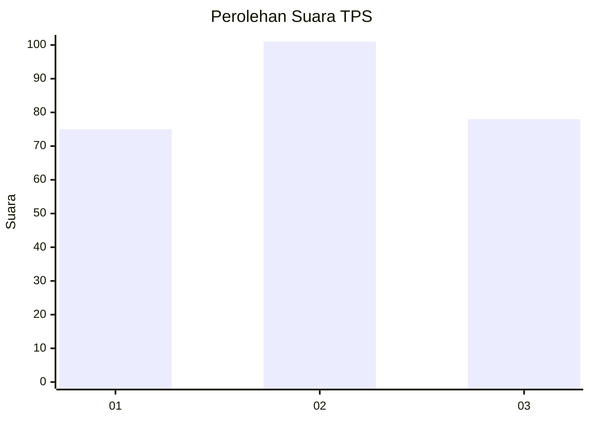
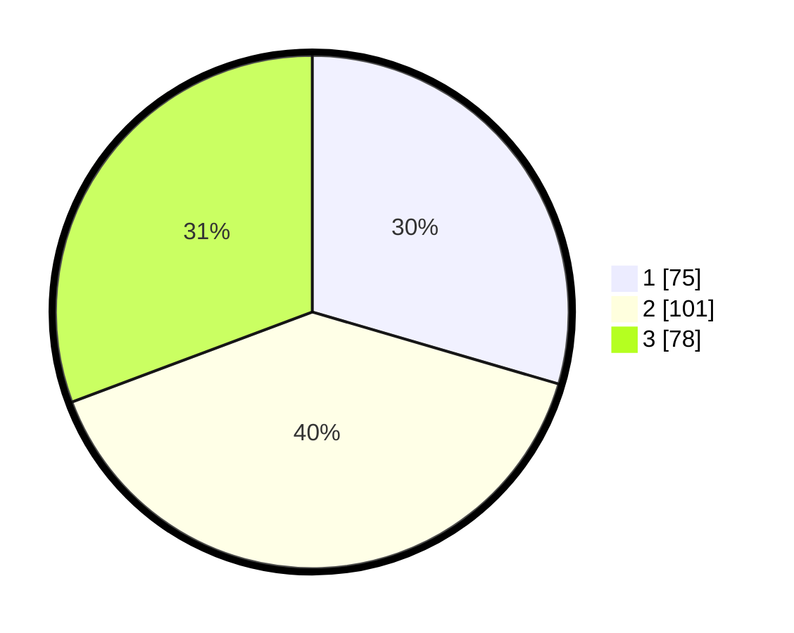

# Hasil

## Grafik

## Tabel

| No. | Nama Paslon    | Suara | Suara (raw) | Persentase |
|:--- |:-------------- | -----:| -----------:| ----------:|
| 1   | ANIES MUHAIMIN | 75    | [75][p-1]   | 29,53      |
| 2   | PRABOWO GIBRAN | 101   | [101][p-2]  | 39,76      |
| 3   | GANJAR MAHFUD  | 78    | [78][p-3]   | 30,71      |

[p-1]: https://github.com/gigit-pemilu/pemilu-2024-33-jawa-tengah/blob/main/pilpres/hitung-suara/sub/33-jawa-tengah/sub/74-kota-semarang/sub/12-gunungpati/sub/1010-sukorejo/sub/016-tps/sub/paslon-1.txt
[p-2]: https://github.com/gigit-pemilu/pemilu-2024-33-jawa-tengah/blob/main/pilpres/hitung-suara/sub/33-jawa-tengah/sub/74-kota-semarang/sub/12-gunungpati/sub/1010-sukorejo/sub/016-tps/sub/paslon-2.txt
[p-3]: https://github.com/gigit-pemilu/pemilu-2024-33-jawa-tengah/blob/main/pilpres/hitung-suara/sub/33-jawa-tengah/sub/74-kota-semarang/sub/12-gunungpati/sub/1010-sukorejo/sub/016-tps/sub/paslon-3.txt

## Foto C Plano

https://sirekap-obj-formc.kpu.go.id/b3ec/pemilu/ppwp/33/74/12/10/10/3374121010016-20240215-012804--dd6b63f3-8884-4a01-97f0-bfb409d6ad2a.jpg

https://sirekap-obj-formc.kpu.go.id/b3ec/pemilu/ppwp/33/74/12/10/10/3374121010016-20240215-012936--3ceeb9ed-9d1e-4bd2-8dda-a9792e16e0a6.jpg

https://sirekap-obj-formc.kpu.go.id/b3ec/pemilu/ppwp/33/74/12/10/10/3374121010016-20240215-013019--b463f371-9cb1-465f-ab14-a7acbb751ec2.jpg

## Metadata

| Key        | Value               |
| ---------- | ------------------- |
| Time Stamp | 2024-02-16 16:25:10 |

