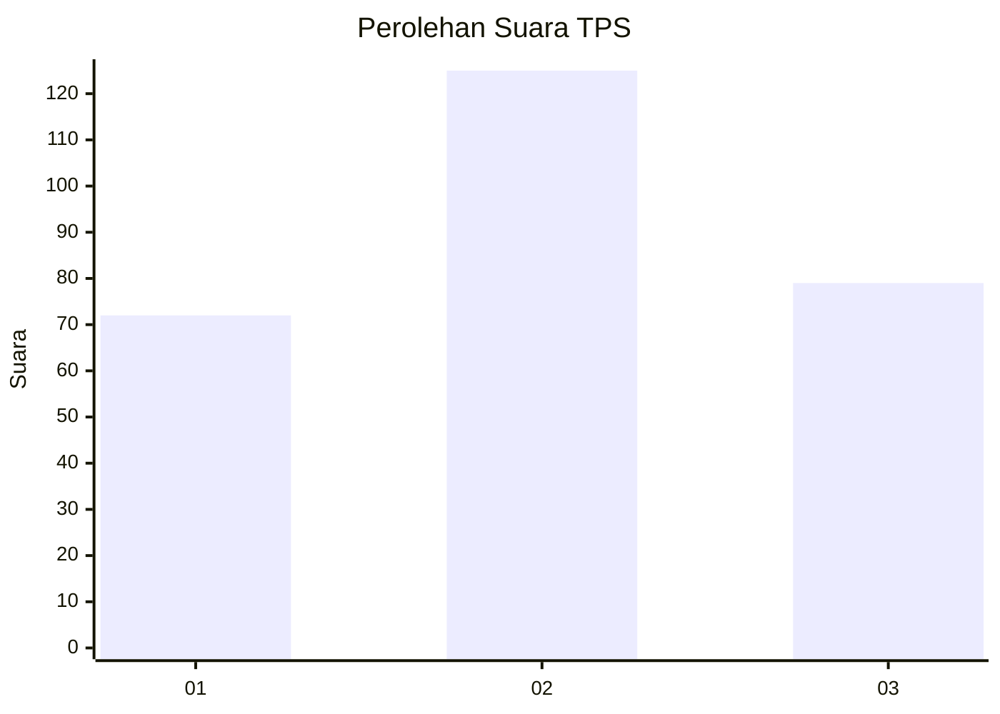
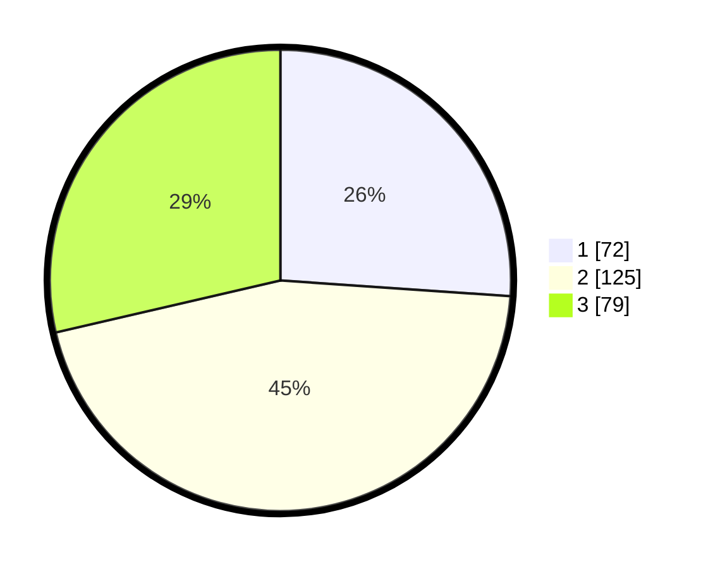

# Hasil

## Grafik

## Tabel

| No. | Nama Paslon    | Suara | Suara (raw) | Persentase |
|:--- |:-------------- | -----:| -----------:| ----------:|
| 1   | ANIES MUHAIMIN | 72    | [72][p-1]   | 26,09      |
| 2   | PRABOWO GIBRAN | 125   | [125][p-2]  | 45,29      |
| 3   | GANJAR MAHFUD  | 79    | [79][p-3]   | 28,62      |

[p-1]: https://github.com/gigit-pemilu/pemilu-2024-33-jawa-tengah/blob/main/pilpres/hitung-suara/sub/33-jawa-tengah/sub/74-kota-semarang/sub/12-gunungpati/sub/1011-sadeng/sub/020-tps/sub/paslon-1.txt
[p-2]: https://github.com/gigit-pemilu/pemilu-2024-33-jawa-tengah/blob/main/pilpres/hitung-suara/sub/33-jawa-tengah/sub/74-kota-semarang/sub/12-gunungpati/sub/1011-sadeng/sub/020-tps/sub/paslon-2.txt
[p-3]: https://github.com/gigit-pemilu/pemilu-2024-33-jawa-tengah/blob/main/pilpres/hitung-suara/sub/33-jawa-tengah/sub/74-kota-semarang/sub/12-gunungpati/sub/1011-sadeng/sub/020-tps/sub/paslon-3.txt

## Foto C Plano

https://sirekap-obj-formc.kpu.go.id/eede/pemilu/ppwp/33/74/12/10/11/3374121011020-20240215-011230--834ae14d-f634-4571-8e23-e8c21cd8e6a6.jpg

https://sirekap-obj-formc.kpu.go.id/eede/pemilu/ppwp/33/74/12/10/11/3374121011020-20240215-011317--49820b94-0658-4864-a6d6-bdb4eafe4954.jpg

https://sirekap-obj-formc.kpu.go.id/eede/pemilu/ppwp/33/74/12/10/11/3374121011020-20240215-011347--5cddf8e7-7919-40f8-953b-879b91e6eeab.jpg

## Metadata

| Key        | Value               |
| ---------- | ------------------- |
| Time Stamp | 2024-02-16 12:51:22 |

