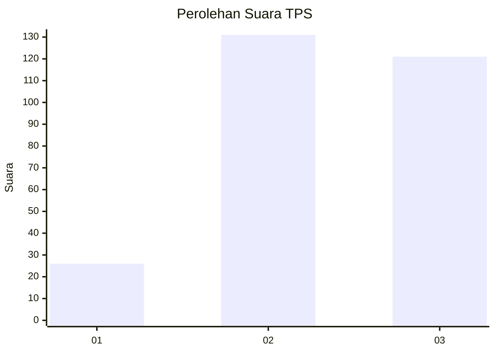
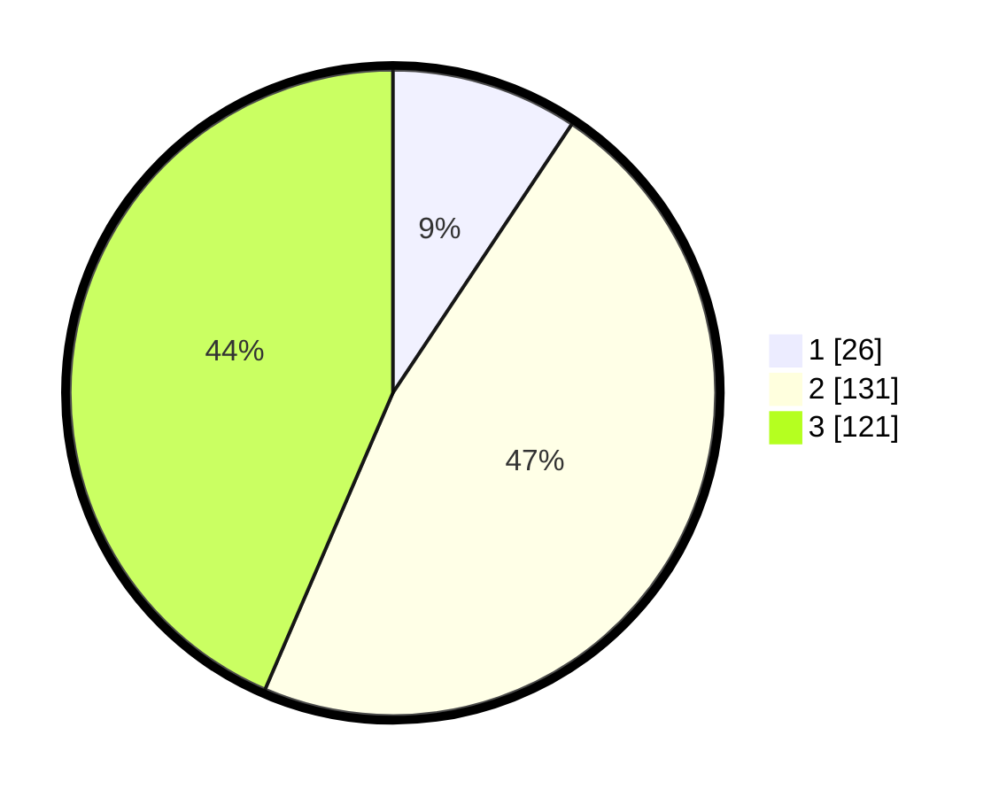

# Hasil

## Grafik

## Tabel

| No. | Nama Paslon    | Suara | Suara (raw) | Persentase |
|:--- |:-------------- | -----:| -----------:| ----------:|
| 1   | ANIES MUHAIMIN | 26    | [26][p-1]   | 9,35       |
| 2   | PRABOWO GIBRAN | 131   | [131][p-2]  | 47,12      |
| 3   | GANJAR MAHFUD  | 121   | [121][p-3]  | 43,53      |

[p-1]: https://github.com/gigit-pemilu/pemilu-2024-33-jawa-tengah/blob/main/pilpres/hitung-suara/sub/33-jawa-tengah/sub/74-kota-semarang/sub/12-gunungpati/sub/1012-cepoko/sub/009-tps/sub/paslon-1.txt
[p-2]: https://github.com/gigit-pemilu/pemilu-2024-33-jawa-tengah/blob/main/pilpres/hitung-suara/sub/33-jawa-tengah/sub/74-kota-semarang/sub/12-gunungpati/sub/1012-cepoko/sub/009-tps/sub/paslon-2.txt
[p-3]: https://github.com/gigit-pemilu/pemilu-2024-33-jawa-tengah/blob/main/pilpres/hitung-suara/sub/33-jawa-tengah/sub/74-kota-semarang/sub/12-gunungpati/sub/1012-cepoko/sub/009-tps/sub/paslon-3.txt

## Foto C Plano

https://sirekap-obj-formc.kpu.go.id/436b/pemilu/ppwp/33/74/12/10/12/3374121012009-20240214-210320--f6a6842a-01f5-4d6e-acb1-32891f60d7be.jpg

https://sirekap-obj-formc.kpu.go.id/436b/pemilu/ppwp/33/74/12/10/12/3374121012009-20240214-210514--5bd423f9-f680-4736-bbc4-7f1a878b9fe6.jpg

https://sirekap-obj-formc.kpu.go.id/436b/pemilu/ppwp/33/74/12/10/12/3374121012009-20240214-210942--ab6742ec-5f3b-466a-b06e-7d901b380d34.jpg

## Metadata

| Key        | Value               |
| ---------- | ------------------- |
| Time Stamp | 2024-02-16 12:51:22 |

