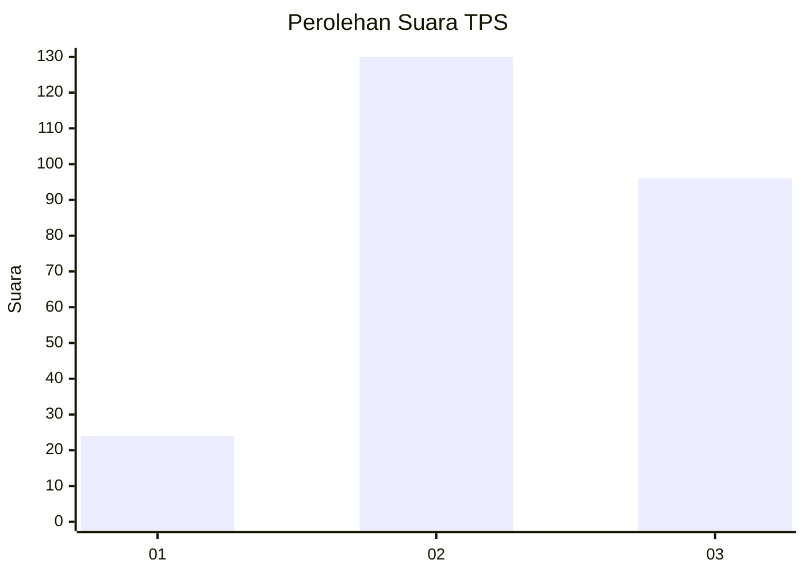
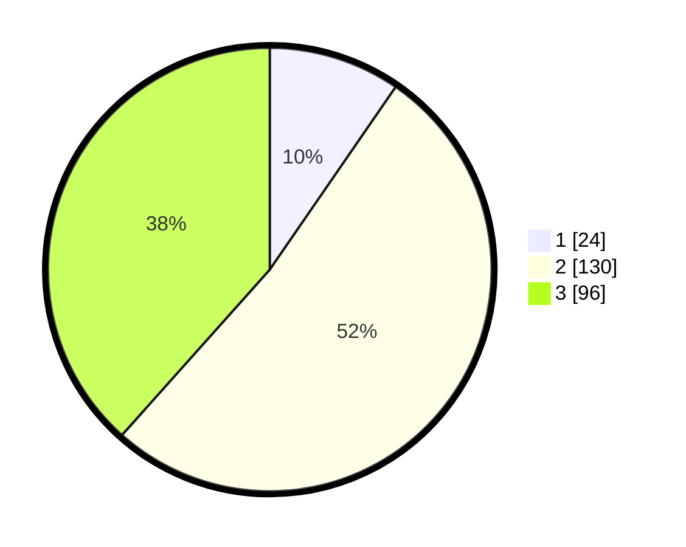

# Hasil

## Grafik

## Tabel

| No. | Nama Paslon    | Suara | Suara (raw) | Persentase |
|:--- |:-------------- | -----:| -----------:| ----------:|
| 1   | ANIES MUHAIMIN | 24    | [24][p-1]   | 9,60       |
| 2   | PRABOWO GIBRAN | 130   | [130][p-2]  | 52,00      |
| 3   | GANJAR MAHFUD  | 96    | [96][p-3]   | 38,40      |

[p-1]: https://github.com/gigit-pemilu/pemilu-2024-33-jawa-tengah/blob/main/pilpres/hitung-suara/sub/33-jawa-tengah/sub/74-kota-semarang/sub/13-semarang-barat/sub/1001-ngemplak-simongan/sub/003-tps/sub/paslon-1.txt
[p-2]: https://github.com/gigit-pemilu/pemilu-2024-33-jawa-tengah/blob/main/pilpres/hitung-suara/sub/33-jawa-tengah/sub/74-kota-semarang/sub/13-semarang-barat/sub/1001-ngemplak-simongan/sub/003-tps/sub/paslon-2.txt
[p-3]: https://github.com/gigit-pemilu/pemilu-2024-33-jawa-tengah/blob/main/pilpres/hitung-suara/sub/33-jawa-tengah/sub/74-kota-semarang/sub/13-semarang-barat/sub/1001-ngemplak-simongan/sub/003-tps/sub/paslon-3.txt

## Foto C Plano

https://sirekap-obj-formc.kpu.go.id/b960/pemilu/ppwp/33/74/13/10/01/3374131001003-20240214-194929--beab22f4-3702-40e9-8afd-53610f93ebbf.jpg

https://sirekap-obj-formc.kpu.go.id/b960/pemilu/ppwp/33/74/13/10/01/3374131001003-20240214-193026--38adb6c0-70d8-4d60-9db8-6e8164d8260b.jpg

https://sirekap-obj-formc.kpu.go.id/b960/pemilu/ppwp/33/74/13/10/01/3374131001003-20240214-192748--6910c275-b415-4f52-aba1-8d43ae9ad0e3.jpg

## Metadata

| Key        | Value               |
| ---------- | ------------------- |
| Time Stamp | 2024-02-16 10:00:28 |

