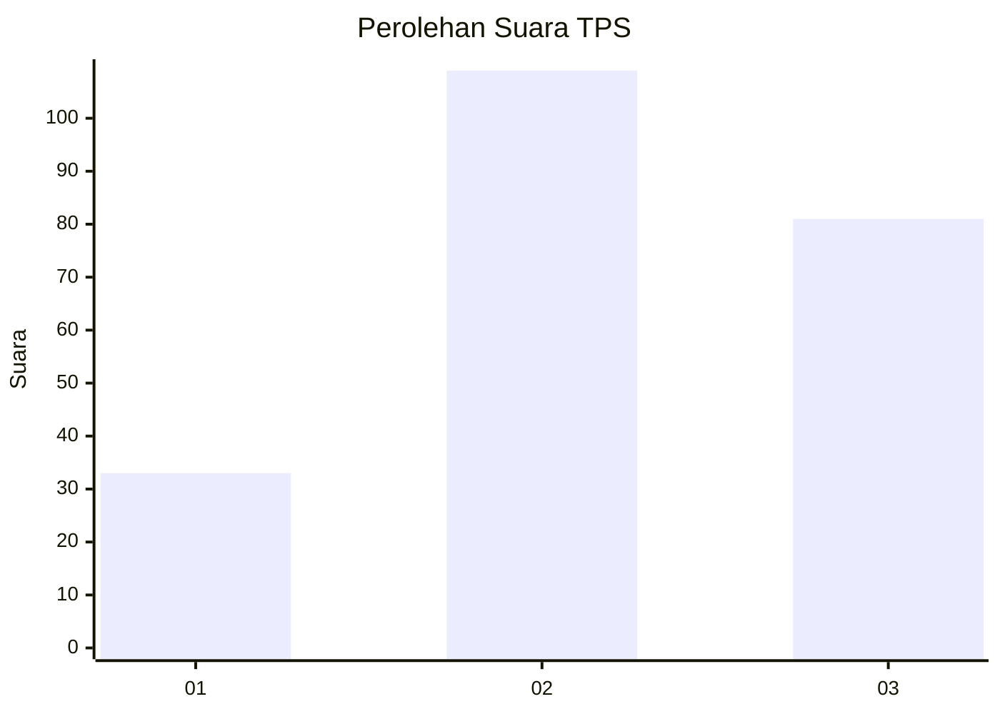
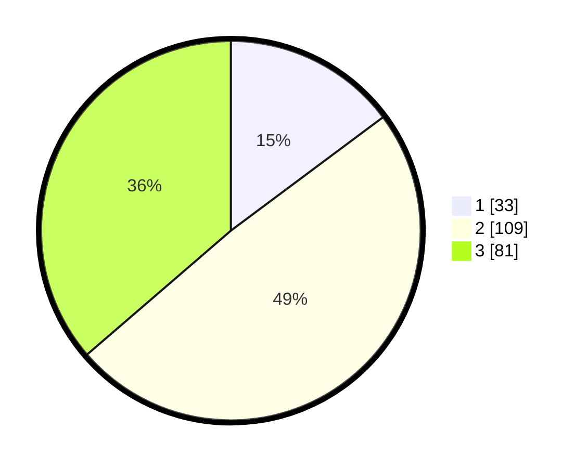

# Hasil

## Grafik

## Tabel

| No. | Nama Paslon    | Suara | Suara (raw) | Persentase |
|:--- |:-------------- | -----:| -----------:| ----------:|
| 1   | ANIES MUHAIMIN | 33    | [33][p-1]   | 14,80      |
| 2   | PRABOWO GIBRAN | 109   | [109][p-2]  | 48,88      |
| 3   | GANJAR MAHFUD  | 81    | [81][p-3]   | 36,32      |

[p-1]: https://github.com/gigit-pemilu/pemilu-2024/blob/main/pilpres/hitung-suara/sub/33-jawa-tengah/sub/74-kota-semarang/sub/13-semarang-barat/sub/1001-ngemplak-simongan/sub/004-tps/sub/paslon-1.txt
[p-2]: https://github.com/gigit-pemilu/pemilu-2024/blob/main/pilpres/hitung-suara/sub/33-jawa-tengah/sub/74-kota-semarang/sub/13-semarang-barat/sub/1001-ngemplak-simongan/sub/004-tps/sub/paslon-2.txt
[p-3]: https://github.com/gigit-pemilu/pemilu-2024/blob/main/pilpres/hitung-suara/sub/33-jawa-tengah/sub/74-kota-semarang/sub/13-semarang-barat/sub/1001-ngemplak-simongan/sub/004-tps/sub/paslon-3.txt

## Foto C Plano

https://sirekap-obj-formc.kpu.go.id/8e40/pemilu/ppwp/33/74/13/10/01/3374131001004-20240214-231053--d1fe4a80-b8a9-4237-8aed-8cfc75948709.jpg

https://sirekap-obj-formc.kpu.go.id/8e40/pemilu/ppwp/33/74/13/10/01/3374131001004-20240214-231050--22cf9e68-c42f-41ed-bb4e-3e3dbfe75ca3.jpg

https://sirekap-obj-formc.kpu.go.id/8e40/pemilu/ppwp/33/74/13/10/01/3374131001004-20240214-230632--5dcfa6fc-1203-4b78-827e-223f6baa22e3.jpg

## Metadata

| Key        | Value               |
| ---------- | ------------------- |
| Time Stamp | 2024-02-16 10:00:28 |

