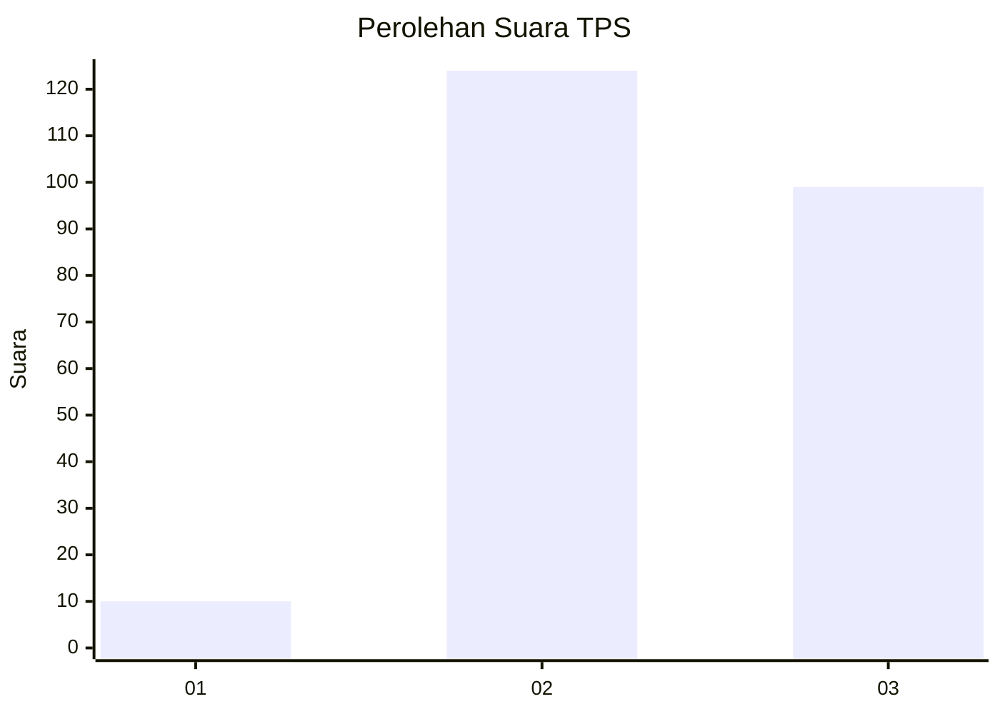
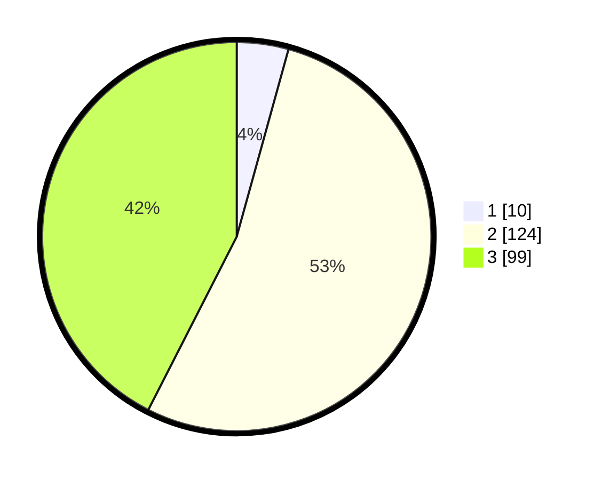

# Hasil

## Grafik

## Tabel

| No. | Nama Paslon    | Suara | Suara (raw) | Persentase |
|:--- |:-------------- | -----:| -----------:| ----------:|
| 1   | ANIES MUHAIMIN | 10    | [10][p-1]   | 4,29       |
| 2   | PRABOWO GIBRAN | 124   | [124][p-2]  | 53,22      |
| 3   | GANJAR MAHFUD  | 99    | [99][p-3]   | 42,49      |

[p-1]: https://github.com/gigit-pemilu/pemilu-2024/blob/main/pilpres/hitung-suara/sub/33-jawa-tengah/sub/74-kota-semarang/sub/13-semarang-barat/sub/1001-ngemplak-simongan/sub/008-tps/sub/paslon-1.txt
[p-2]: https://github.com/gigit-pemilu/pemilu-2024/blob/main/pilpres/hitung-suara/sub/33-jawa-tengah/sub/74-kota-semarang/sub/13-semarang-barat/sub/1001-ngemplak-simongan/sub/008-tps/sub/paslon-2.txt
[p-3]: https://github.com/gigit-pemilu/pemilu-2024/blob/main/pilpres/hitung-suara/sub/33-jawa-tengah/sub/74-kota-semarang/sub/13-semarang-barat/sub/1001-ngemplak-simongan/sub/008-tps/sub/paslon-3.txt

## Foto C Plano

https://sirekap-obj-formc.kpu.go.id/343f/pemilu/ppwp/33/74/13/10/01/3374131001008-20240214-235538--0fe2c740-a76e-49f8-b220-314bdf9111c3.jpg

https://sirekap-obj-formc.kpu.go.id/343f/pemilu/ppwp/33/74/13/10/01/3374131001008-20240214-235619--725a5f6a-a01e-4906-8a7e-9a83743e90eb.jpg

https://sirekap-obj-formc.kpu.go.id/343f/pemilu/ppwp/33/74/13/10/01/3374131001008-20240214-235726--3293e2e8-d27e-4bf6-aef3-858308c73172.jpg

## Metadata

| Key        | Value               |
| ---------- | ------------------- |
| Time Stamp | 2024-02-24 22:31:28 |

