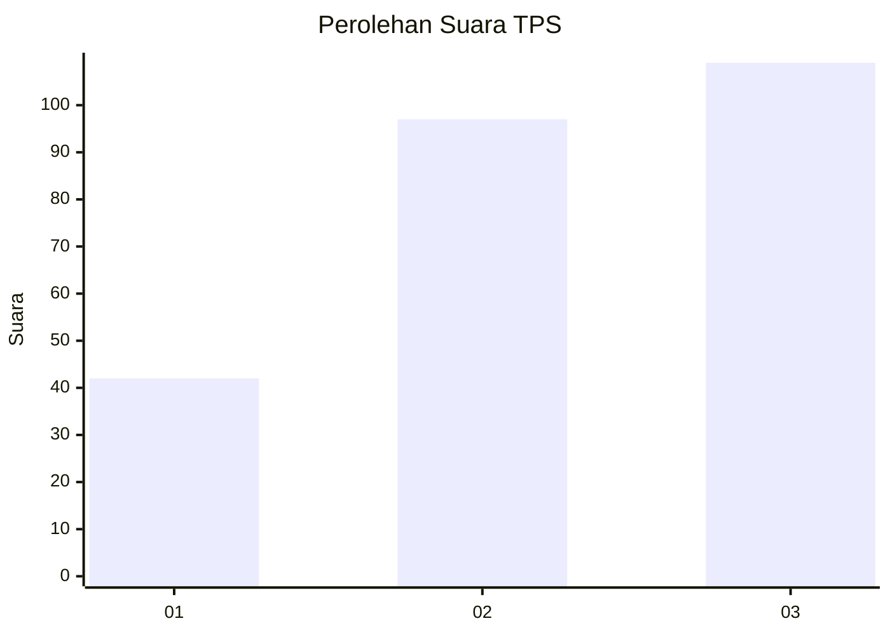
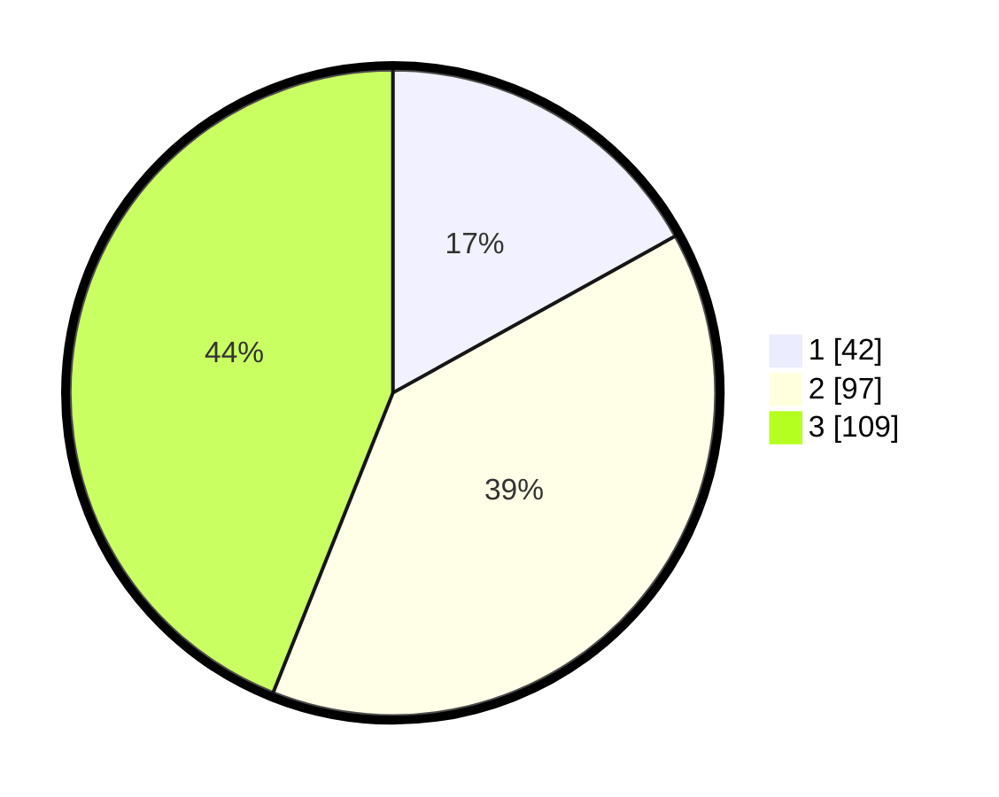

# Hasil

## Grafik

## Tabel

| No. | Nama Paslon    | Suara | Suara (raw) | Persentase |
|:--- |:-------------- | -----:| -----------:| ----------:|
| 1   | ANIES MUHAIMIN | 42    | [42][p-1]   | 16,94      |
| 2   | PRABOWO GIBRAN | 97    | [97][p-2]   | 39,11      |
| 3   | GANJAR MAHFUD  | 109   | [109][p-3]  | 43,95      |

[p-1]: https://github.com/gigit-pemilu/pemilu-2024/blob/main/pilpres/hitung-suara/sub/33-jawa-tengah/sub/74-kota-semarang/sub/13-semarang-barat/sub/1001-ngemplak-simongan/sub/027-tps/sub/paslon-1.txt
[p-2]: https://github.com/gigit-pemilu/pemilu-2024/blob/main/pilpres/hitung-suara/sub/33-jawa-tengah/sub/74-kota-semarang/sub/13-semarang-barat/sub/1001-ngemplak-simongan/sub/027-tps/sub/paslon-2.txt
[p-3]: https://github.com/gigit-pemilu/pemilu-2024/blob/main/pilpres/hitung-suara/sub/33-jawa-tengah/sub/74-kota-semarang/sub/13-semarang-barat/sub/1001-ngemplak-simongan/sub/027-tps/sub/paslon-3.txt

## Foto C Plano

https://sirekap-obj-formc.kpu.go.id/e04b/pemilu/ppwp/33/74/13/10/01/3374131001027-20240214-232340--8d53c09d-87c5-4b11-a054-b9fe86cb8eb8.jpg

https://sirekap-obj-formc.kpu.go.id/e04b/pemilu/ppwp/33/74/13/10/01/3374131001027-20240214-233335--6f2d6558-b149-42b9-ab81-5080bdb9e084.jpg

https://sirekap-obj-formc.kpu.go.id/e04b/pemilu/ppwp/33/74/13/10/01/3374131001027-20240215-032241--da0efc9f-4185-4417-b68d-6f74b3fb3737.jpg

## Metadata

| Key        | Value               |
| ---------- | ------------------- |
| Time Stamp | 2024-02-16 10:30:29 |

