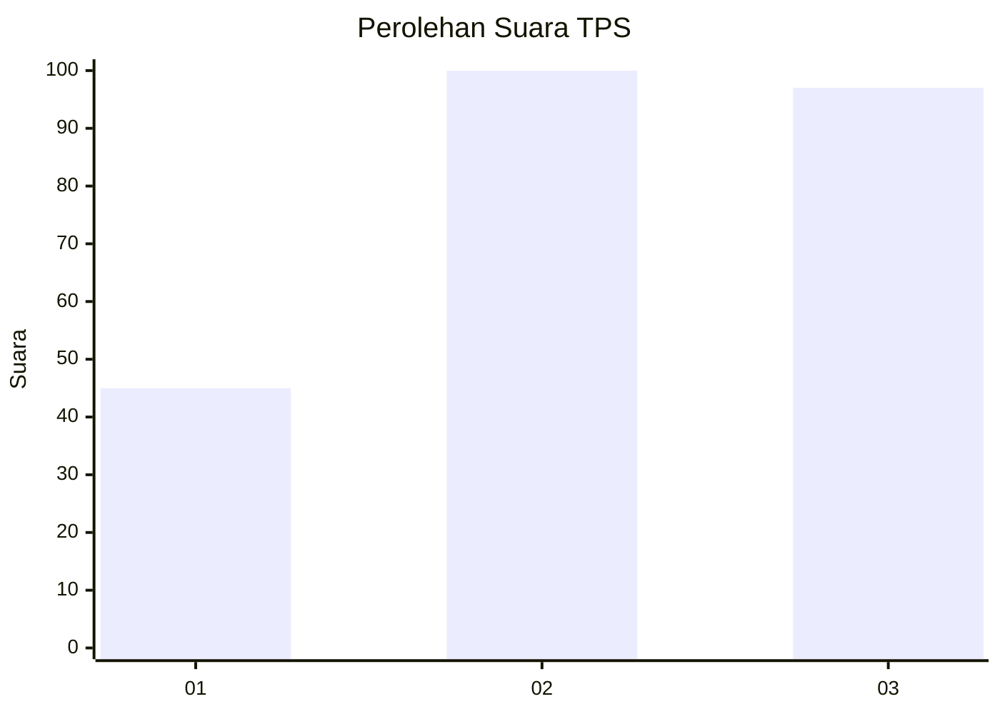
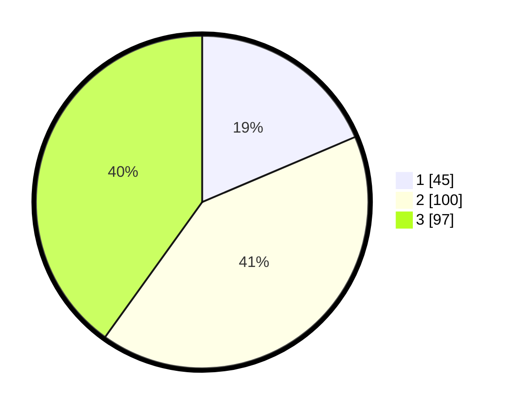

# Hasil

## Grafik

## Tabel

| No. | Nama Paslon    | Suara | Suara (raw) | Persentase |
|:--- |:-------------- | -----:| -----------:| ----------:|
| 1   | ANIES MUHAIMIN | 45    | [45][p-1]   | 18,60      |
| 2   | PRABOWO GIBRAN | 100   | [100][p-2]  | 41,32      |
| 3   | GANJAR MAHFUD  | 97    | [97][p-3]   | 40,08      |

[p-1]: https://github.com/gigit-pemilu/pemilu-2024/blob/main/pilpres/hitung-suara/sub/33-jawa-tengah/sub/74-kota-semarang/sub/13-semarang-barat/sub/1011-cabean/sub/003-tps/sub/paslon-1.txt
[p-2]: https://github.com/gigit-pemilu/pemilu-2024/blob/main/pilpres/hitung-suara/sub/33-jawa-tengah/sub/74-kota-semarang/sub/13-semarang-barat/sub/1011-cabean/sub/003-tps/sub/paslon-2.txt
[p-3]: https://github.com/gigit-pemilu/pemilu-2024/blob/main/pilpres/hitung-suara/sub/33-jawa-tengah/sub/74-kota-semarang/sub/13-semarang-barat/sub/1011-cabean/sub/003-tps/sub/paslon-3.txt

## Foto C Plano

https://sirekap-obj-formc.kpu.go.id/f142/pemilu/ppwp/33/74/13/10/11/3374131011003-20240215-043927--abcc4a16-a4be-4701-98c4-905b0a9e2d4b.jpg

https://sirekap-obj-formc.kpu.go.id/f142/pemilu/ppwp/33/74/13/10/11/3374131011003-20240215-044149--d91097ea-e4fc-4404-a9f1-dcbfb8d4ff11.jpg

https://sirekap-obj-formc.kpu.go.id/f142/pemilu/ppwp/33/74/13/10/11/3374131011003-20240215-044318--31b6aa58-732f-4fb5-967f-678d128feda3.jpg

## Metadata

| Key        | Value               |
| ---------- | ------------------- |
| Time Stamp | 2024-02-24 22:31:28 |

