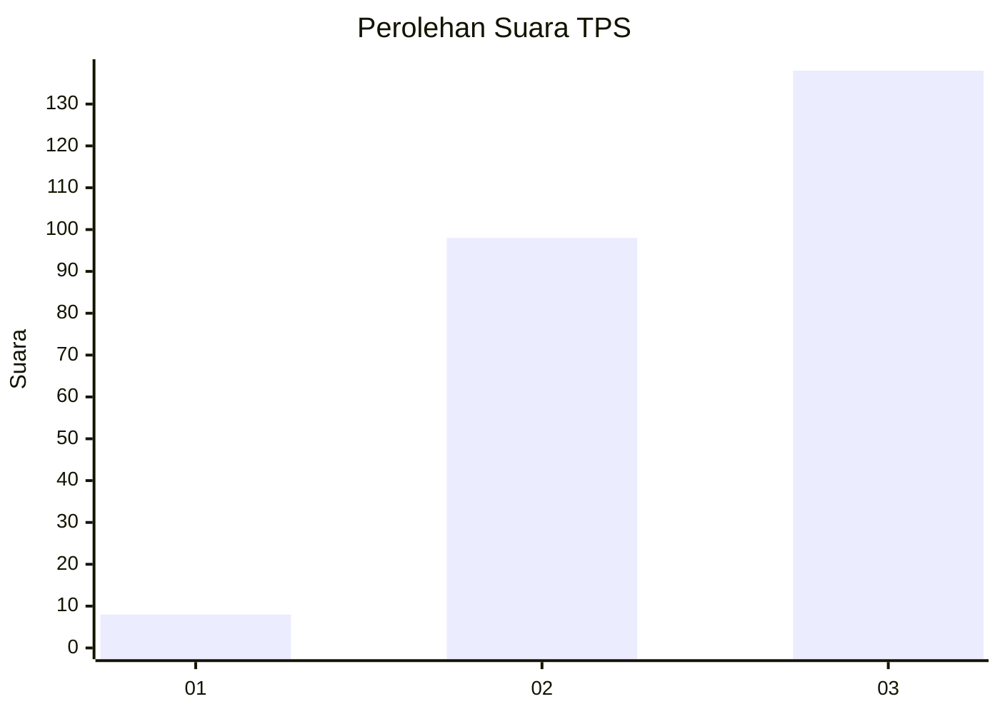
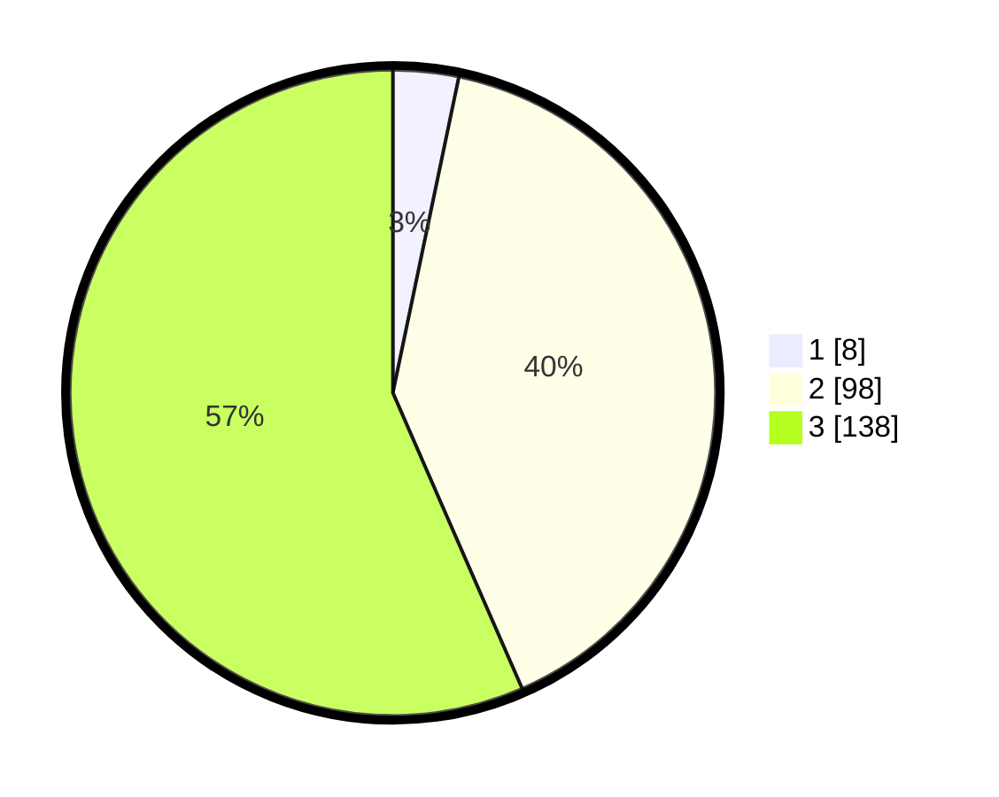

# Hasil

## Grafik

## Tabel

| No. | Nama Paslon    | Suara | Suara (raw) | Persentase |
|:--- |:-------------- | -----:| -----------:| ----------:|
| 1   | ANIES MUHAIMIN | 8     | [8][p-1]    | 3,28       |
| 2   | PRABOWO GIBRAN | 98    | [98][p-2]   | 40,16      |
| 3   | GANJAR MAHFUD  | 138   | [138][p-3]  | 56,56      |

[p-1]: https://github.com/gigit-pemilu/pemilu-2024-33-jawa-tengah/blob/main/pilpres/hitung-suara/sub/33-jawa-tengah/sub/74-kota-semarang/sub/13-semarang-barat/sub/1015-tawangmas/sub/020-tps/sub/paslon-1.txt
[p-2]: https://github.com/gigit-pemilu/pemilu-2024-33-jawa-tengah/blob/main/pilpres/hitung-suara/sub/33-jawa-tengah/sub/74-kota-semarang/sub/13-semarang-barat/sub/1015-tawangmas/sub/020-tps/sub/paslon-2.txt
[p-3]: https://github.com/gigit-pemilu/pemilu-2024-33-jawa-tengah/blob/main/pilpres/hitung-suara/sub/33-jawa-tengah/sub/74-kota-semarang/sub/13-semarang-barat/sub/1015-tawangmas/sub/020-tps/sub/paslon-3.txt

## Foto C Plano

https://sirekap-obj-formc.kpu.go.id/1966/pemilu/ppwp/33/74/13/10/15/3374131015020-20240215-021931--ff17b627-af23-44d5-b1d8-c03955aa3efe.jpg

https://sirekap-obj-formc.kpu.go.id/1966/pemilu/ppwp/33/74/13/10/15/3374131015020-20240214-213938--e878fd00-5bde-4570-b5d4-57a6aaa24cfa.jpg

https://sirekap-obj-formc.kpu.go.id/1966/pemilu/ppwp/33/74/13/10/15/3374131015020-20240214-214607--4cb1ea3b-aa57-4a85-8d01-f59868aa85da.jpg

## Metadata

| Key        | Value               |
| ---------- | ------------------- |
| Time Stamp | 2024-02-24 22:31:28 |

