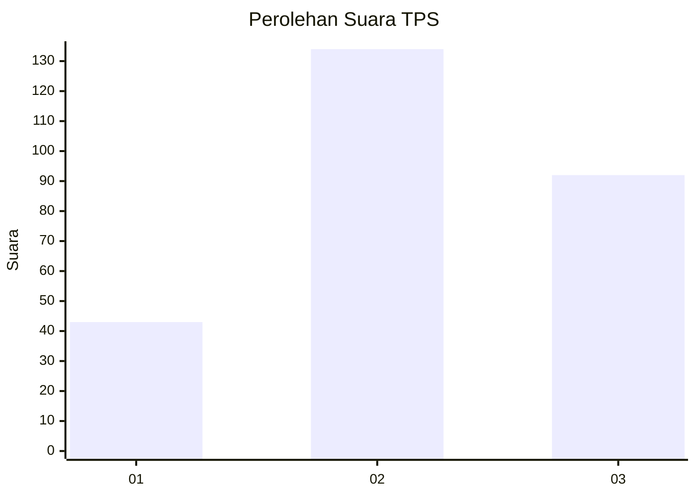
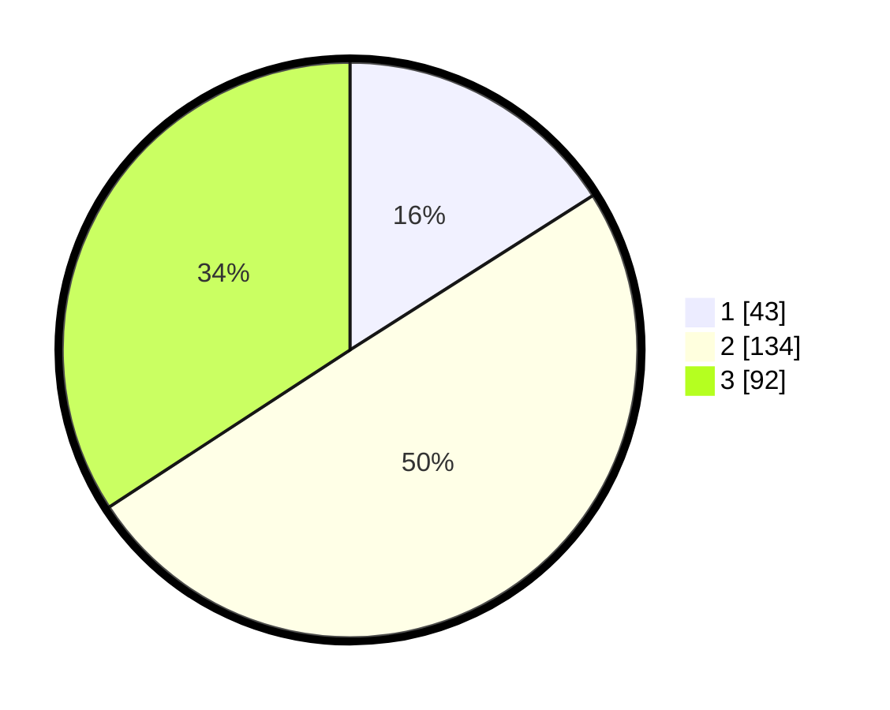

# Hasil

## Grafik

## Tabel

| No. | Nama Paslon    | Suara | Suara (raw) | Persentase |
|:--- |:-------------- | -----:| -----------:| ----------:|
| 1   | ANIES MUHAIMIN | 43    | [43][p-1]   | 15,99      |
| 2   | PRABOWO GIBRAN | 134   | [134][p-2]  | 49,81      |
| 3   | GANJAR MAHFUD  | 92    | [92][p-3]   | 34,20      |

[p-1]: https://github.com/gigit-pemilu/pemilu-2024/blob/main/pilpres/hitung-suara/sub/33-jawa-tengah/sub/74-kota-semarang/sub/14-mijen/sub/1002-bubakan/sub/001-tps/sub/paslon-1.txt
[p-2]: https://github.com/gigit-pemilu/pemilu-2024/blob/main/pilpres/hitung-suara/sub/33-jawa-tengah/sub/74-kota-semarang/sub/14-mijen/sub/1002-bubakan/sub/001-tps/sub/paslon-2.txt
[p-3]: https://github.com/gigit-pemilu/pemilu-2024/blob/main/pilpres/hitung-suara/sub/33-jawa-tengah/sub/74-kota-semarang/sub/14-mijen/sub/1002-bubakan/sub/001-tps/sub/paslon-3.txt

## Foto C Plano

https://sirekap-obj-formc.kpu.go.id/ab82/pemilu/ppwp/33/74/14/10/02/3374141002001-20240214-220837--9cbb049b-c78c-4e61-a841-cdd4b0f897a8.jpg

https://sirekap-obj-formc.kpu.go.id/ab82/pemilu/ppwp/33/74/14/10/02/3374141002001-20240214-220851--66c7044c-ef61-412e-b307-828d87adb7d3.jpg

https://sirekap-obj-formc.kpu.go.id/ab82/pemilu/ppwp/33/74/14/10/02/3374141002001-20240214-220857--413a9a33-8799-4e7a-85b6-aae16435f233.jpg

## Metadata

| Key        | Value               |
| ---------- | ------------------- |
| Time Stamp | 2024-02-24 22:31:28 |

