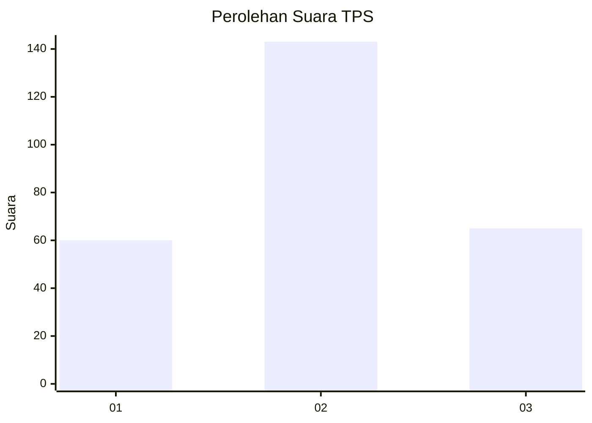
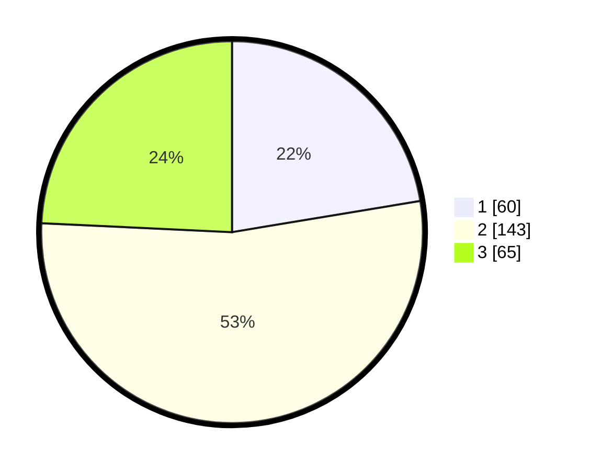

# Hasil

## Grafik

## Tabel

| No. | Nama Paslon    | Suara | Suara (raw) | Persentase |
|:--- |:-------------- | -----:| -----------:| ----------:|
| 1   | ANIES MUHAIMIN | 60    | [60][p-1]   | 22,39      |
| 2   | PRABOWO GIBRAN | 143   | [143][p-2]  | 53,36      |
| 3   | GANJAR MAHFUD  | 65    | [65][p-3]   | 24,25      |

[p-1]: https://github.com/gigit-pemilu/pemilu-2024-33-jawa-tengah/blob/main/pilpres/hitung-suara/sub/33-jawa-tengah/sub/74-kota-semarang/sub/14-mijen/sub/1002-bubakan/sub/009-tps/sub/paslon-1.txt
[p-2]: https://github.com/gigit-pemilu/pemilu-2024-33-jawa-tengah/blob/main/pilpres/hitung-suara/sub/33-jawa-tengah/sub/74-kota-semarang/sub/14-mijen/sub/1002-bubakan/sub/009-tps/sub/paslon-2.txt
[p-3]: https://github.com/gigit-pemilu/pemilu-2024-33-jawa-tengah/blob/main/pilpres/hitung-suara/sub/33-jawa-tengah/sub/74-kota-semarang/sub/14-mijen/sub/1002-bubakan/sub/009-tps/sub/paslon-3.txt

## Foto C Plano

https://sirekap-obj-formc.kpu.go.id/304c/pemilu/ppwp/33/74/14/10/02/3374141002009-20240215-131007--94b4b36a-8018-430f-a840-81cf7055df83.jpg

https://sirekap-obj-formc.kpu.go.id/304c/pemilu/ppwp/33/74/14/10/02/3374141002009-20240215-131014--90dee56b-828d-459b-b2c3-857cc1a9910a.jpg

https://sirekap-obj-formc.kpu.go.id/304c/pemilu/ppwp/33/74/14/10/02/3374141002009-20240215-131019--85579ae7-ad5f-477c-ba8f-0b2b804ffc98.jpg

## Metadata

| Key        | Value               |
| ---------- | ------------------- |
| Time Stamp | 2024-02-16 10:00:28 |

