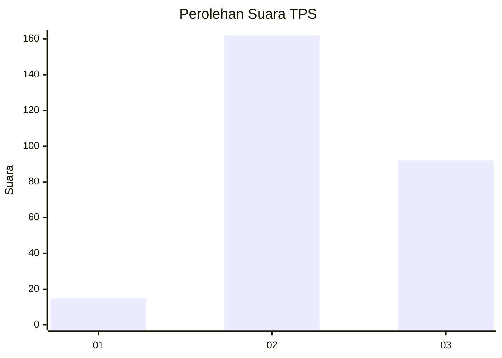
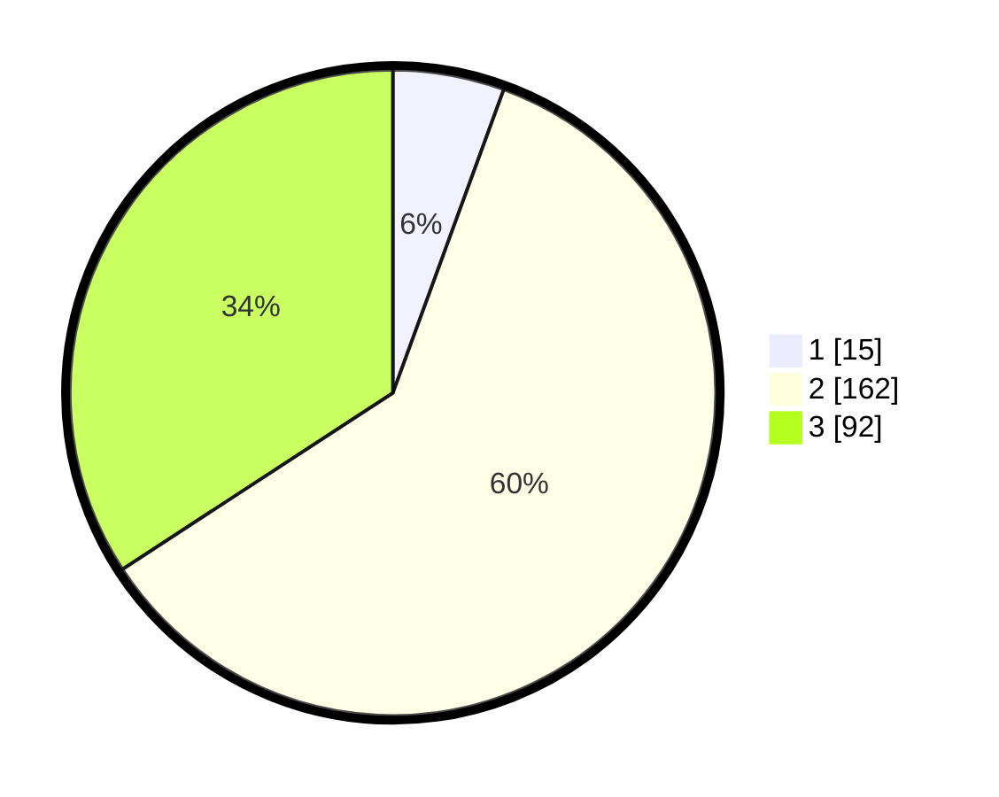

# Hasil

## Grafik

## Tabel

| No. | Nama Paslon    | Suara | Suara (raw) | Persentase |
|:--- |:-------------- | -----:| -----------:| ----------:|
| 1   | ANIES MUHAIMIN | 15    | [15][p-1]   | 5,58       |
| 2   | PRABOWO GIBRAN | 162   | [162][p-2]  | 60,22      |
| 3   | GANJAR MAHFUD  | 92    | [92][p-3]   | 34,20      |

[p-1]: https://github.com/gigit-pemilu/pemilu-2024-33-jawa-tengah/blob/main/pilpres/hitung-suara/sub/33-jawa-tengah/sub/74-kota-semarang/sub/14-mijen/sub/1012-wonoplumbon/sub/003-tps/sub/paslon-1.txt
[p-2]: https://github.com/gigit-pemilu/pemilu-2024-33-jawa-tengah/blob/main/pilpres/hitung-suara/sub/33-jawa-tengah/sub/74-kota-semarang/sub/14-mijen/sub/1012-wonoplumbon/sub/003-tps/sub/paslon-2.txt
[p-3]: https://github.com/gigit-pemilu/pemilu-2024-33-jawa-tengah/blob/main/pilpres/hitung-suara/sub/33-jawa-tengah/sub/74-kota-semarang/sub/14-mijen/sub/1012-wonoplumbon/sub/003-tps/sub/paslon-3.txt

## Foto C Plano

https://sirekap-obj-formc.kpu.go.id/fc6e/pemilu/ppwp/33/74/14/10/12/3374141012003-20240214-214453--d942865f-b320-4a99-88fa-a1657f565f19.jpg

https://sirekap-obj-formc.kpu.go.id/fc6e/pemilu/ppwp/33/74/14/10/12/3374141012003-20240214-214728--2d3ee88f-e5cf-4112-b95c-c079a678e927.jpg

https://sirekap-obj-formc.kpu.go.id/fc6e/pemilu/ppwp/33/74/14/10/12/3374141012003-20240214-214850--95ddb8cd-236b-4836-b4ca-cd6ebdb3e6ac.jpg

## Metadata

| Key        | Value               |
| ---------- | ------------------- |
| Time Stamp | 2024-02-24 22:31:28 |

