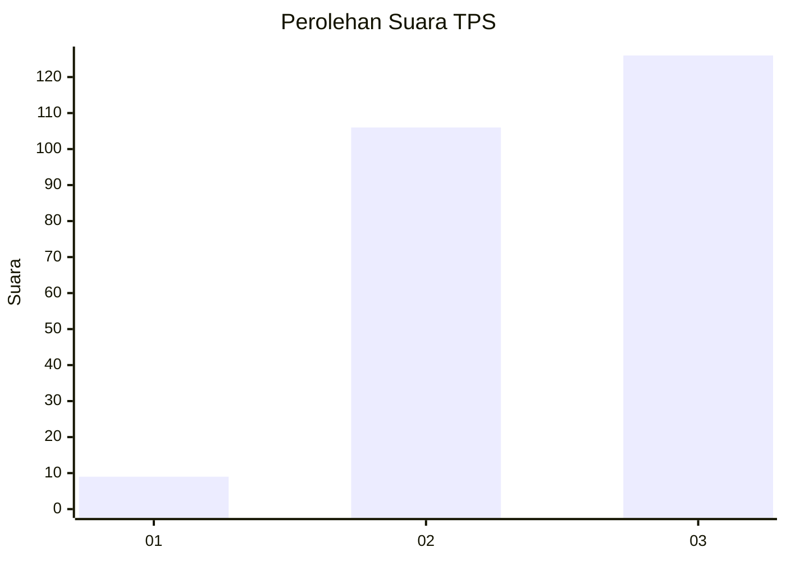
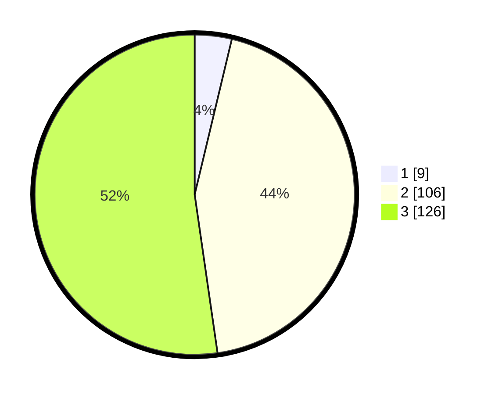

# Hasil

## Grafik

## Tabel

| No. | Nama Paslon    | Suara | Suara (raw) | Persentase |
|:--- |:-------------- | -----:| -----------:| ----------:|
| 1   | ANIES MUHAIMIN | 9     | [9][p-1]    | 3,73       |
| 2   | PRABOWO GIBRAN | 106   | [106][p-2]  | 43,98      |
| 3   | GANJAR MAHFUD  | 126   | [126][p-3]  | 52,28      |

[p-1]: https://github.com/gigit-pemilu/pemilu-2024-33-jawa-tengah/blob/main/pilpres/hitung-suara/sub/33-jawa-tengah/sub/74-kota-semarang/sub/15-ngaliyan/sub/1001-gondoriyo/sub/003-tps/sub/paslon-1.txt
[p-2]: https://github.com/gigit-pemilu/pemilu-2024-33-jawa-tengah/blob/main/pilpres/hitung-suara/sub/33-jawa-tengah/sub/74-kota-semarang/sub/15-ngaliyan/sub/1001-gondoriyo/sub/003-tps/sub/paslon-2.txt
[p-3]: https://github.com/gigit-pemilu/pemilu-2024-33-jawa-tengah/blob/main/pilpres/hitung-suara/sub/33-jawa-tengah/sub/74-kota-semarang/sub/15-ngaliyan/sub/1001-gondoriyo/sub/003-tps/sub/paslon-3.txt

## Foto C Plano

https://sirekap-obj-formc.kpu.go.id/3a69/pemilu/ppwp/33/74/15/10/01/3374151001003-20240215-010453--49ae8bf3-a9a3-4c7f-8ae6-51ef1858612e.jpg

https://sirekap-obj-formc.kpu.go.id/3a69/pemilu/ppwp/33/74/15/10/01/3374151001003-20240215-021617--3c7e2dde-1e1b-49a5-8390-4e55ff698736.jpg

https://sirekap-obj-formc.kpu.go.id/3a69/pemilu/ppwp/33/74/15/10/01/3374151001003-20240215-010641--48970d7b-a6cf-4215-9c57-6cd7d78fd9f5.jpg

## Metadata

| Key        | Value               |
| ---------- | ------------------- |
| Time Stamp | 2024-02-15 12:00:28 |

