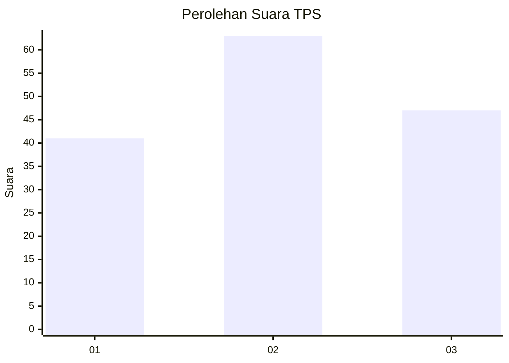
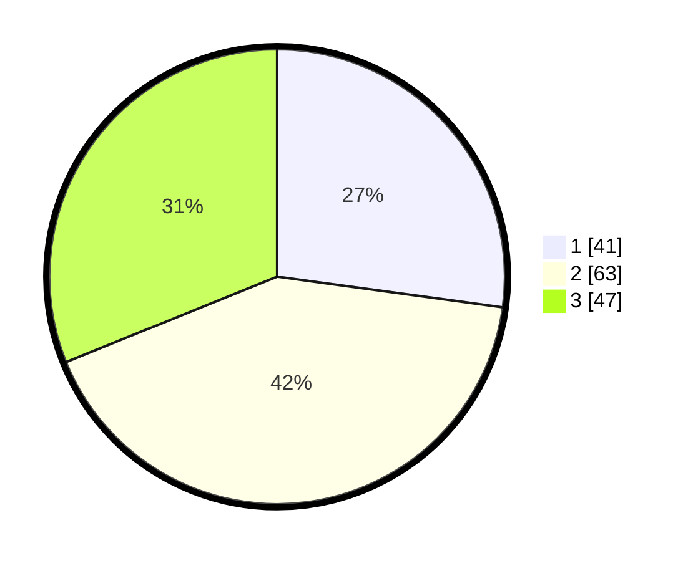

# Hasil

## Grafik

## Tabel

| No. | Nama Paslon    | Suara | Suara (raw) | Persentase |
|:--- |:-------------- | -----:| -----------:| ----------:|
| 1   | ANIES MUHAIMIN | 41    | [41][p-1]   | 27,15      |
| 2   | PRABOWO GIBRAN | 63    | [63][p-2]   | 41,72      |
| 3   | GANJAR MAHFUD  | 47    | [47][p-3]   | 31,13      |

[p-1]: https://github.com/gigit-pemilu/pemilu-2024-33-jawa-tengah/blob/main/pilpres/hitung-suara/sub/33-jawa-tengah/sub/74-kota-semarang/sub/15-ngaliyan/sub/1001-gondoriyo/sub/009-tps/sub/paslon-1.txt
[p-2]: https://github.com/gigit-pemilu/pemilu-2024-33-jawa-tengah/blob/main/pilpres/hitung-suara/sub/33-jawa-tengah/sub/74-kota-semarang/sub/15-ngaliyan/sub/1001-gondoriyo/sub/009-tps/sub/paslon-2.txt
[p-3]: https://github.com/gigit-pemilu/pemilu-2024-33-jawa-tengah/blob/main/pilpres/hitung-suara/sub/33-jawa-tengah/sub/74-kota-semarang/sub/15-ngaliyan/sub/1001-gondoriyo/sub/009-tps/sub/paslon-3.txt

## Foto C Plano

https://sirekap-obj-formc.kpu.go.id/cc0a/pemilu/ppwp/33/74/15/10/01/3374151001009-20240214-223121--62aac44c-9e06-46ea-a75a-605aba9acd33.jpg

https://sirekap-obj-formc.kpu.go.id/cc0a/pemilu/ppwp/33/74/15/10/01/3374151001009-20240214-223217--99c3e332-f9fb-45be-adb9-34c259c1cb4f.jpg

https://sirekap-obj-formc.kpu.go.id/cc0a/pemilu/ppwp/33/74/15/10/01/3374151001009-20240214-223323--fa73b512-c31a-427a-ad60-3ba5b1112e07.jpg

## Metadata

| Key        | Value               |
| ---------- | ------------------- |
| Time Stamp | 2024-02-16 09:00:28 |

