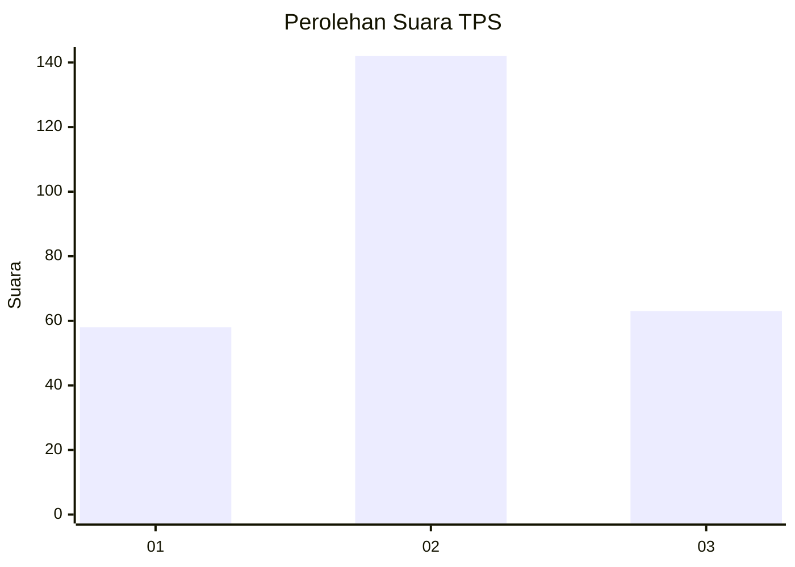
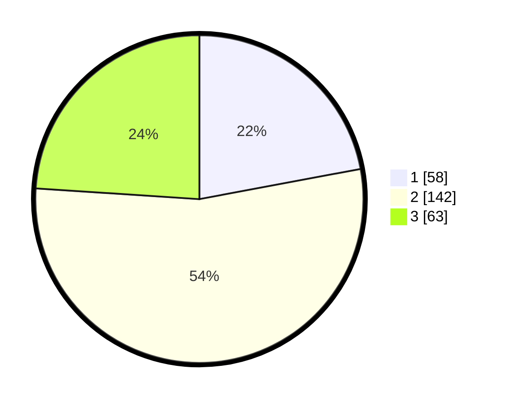

# Hasil

## Grafik

## Tabel

| No. | Nama Paslon    | Suara | Suara (raw) | Persentase |
|:--- |:-------------- | -----:| -----------:| ----------:|
| 1   | ANIES MUHAIMIN | 58    | [58][p-1]   | 22,05      |
| 2   | PRABOWO GIBRAN | 142   | [142][p-2]  | 53,99      |
| 3   | GANJAR MAHFUD  | 63    | [63][p-3]   | 23,95      |

[p-1]: https://github.com/gigit-pemilu/pemilu-2024-33-jawa-tengah/blob/main/pilpres/hitung-suara/sub/33-jawa-tengah/sub/74-kota-semarang/sub/15-ngaliyan/sub/1001-gondoriyo/sub/020-tps/sub/paslon-1.txt
[p-2]: https://github.com/gigit-pemilu/pemilu-2024-33-jawa-tengah/blob/main/pilpres/hitung-suara/sub/33-jawa-tengah/sub/74-kota-semarang/sub/15-ngaliyan/sub/1001-gondoriyo/sub/020-tps/sub/paslon-2.txt
[p-3]: https://github.com/gigit-pemilu/pemilu-2024-33-jawa-tengah/blob/main/pilpres/hitung-suara/sub/33-jawa-tengah/sub/74-kota-semarang/sub/15-ngaliyan/sub/1001-gondoriyo/sub/020-tps/sub/paslon-3.txt

## Foto C Plano

https://sirekap-obj-formc.kpu.go.id/f02a/pemilu/ppwp/33/74/15/10/01/3374151001020-20240215-012832--94b4d06a-bf1e-46ca-ad45-759f6dffb0b1.jpg

https://sirekap-obj-formc.kpu.go.id/f02a/pemilu/ppwp/33/74/15/10/01/3374151001020-20240214-212237--0eea096e-23a5-4f28-898b-822722358130.jpg

https://sirekap-obj-formc.kpu.go.id/f02a/pemilu/ppwp/33/74/15/10/01/3374151001020-20240214-220143--94237516-5ca9-4181-8405-b16b38d4e827.jpg

## Metadata

| Key        | Value               |
| ---------- | ------------------- |
| Time Stamp | 2024-02-15 19:30:26 |

